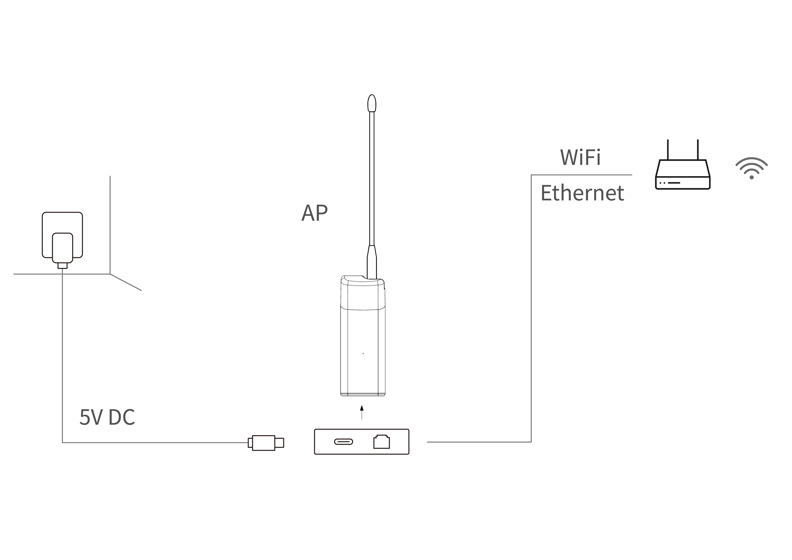
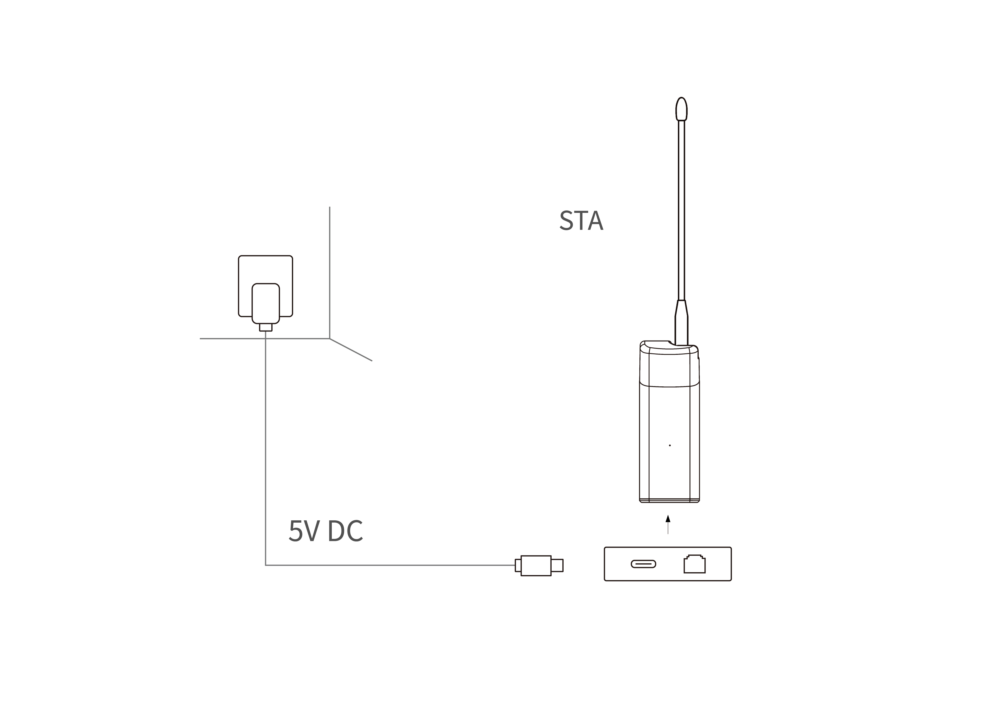
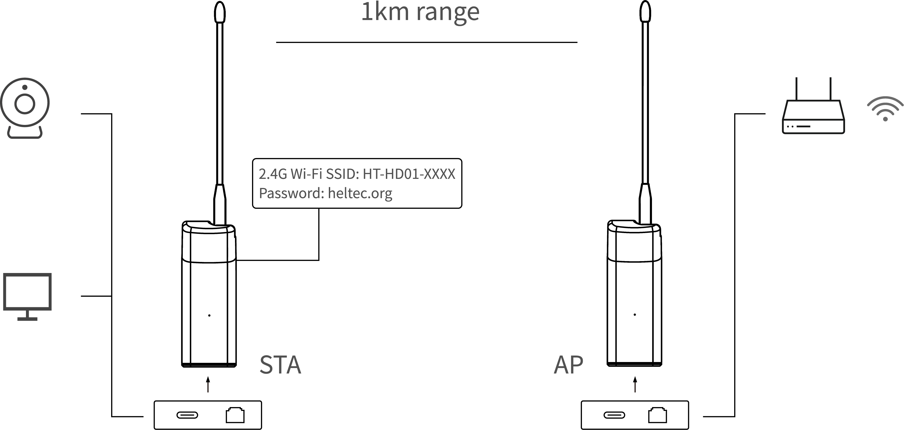
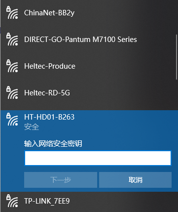

# HaLow Dongle Quick Start

{ht_translation}`[简体中文]:[English]`

We have provided a plug-and-play mode for the HT-HD01 to help you get started more quickly. The devices are pre-paired at the factory, and you can use them directly without any configuration.


## Start Access Point
There are two ways for the Dongle AP to join the network:

- [Via Ethernet cable (Default plug&play)](via_eth)
- [Via Wi-Fi (requires configuration)](via_wifi)

(via_eth)=

### Access the network via Ethernet (Default plug&play)
Connect the Dongle-AP to the upstream router and power it on. 

``` {tip} The RJ45 interface does not support PoE (Power-over-Ethernet) power supply. The USB cable can both supply power and networking.
```



When the device's red light changes to blue or green and stays on, it indicates that the device is functioning properly.

``` {warning} The blue light of the device represents a USB-C cable, and the green light represents an RJ45 cable. If the color of your indicator does not match the type of network cable you are connected to, you need to change the color of the indicator by pressing the button.
```

(via_wifi)=
### Access the network via WiFi-2.4G

The default state of the HaLow Dongle is "Ethernet-Routing" mode. If you want to connect to Wi-Fi, please refer to: [How to Set a HaLow Device into AP Working Mode](https://docs.heltec.org/en/wifi_halow/ht-hd01/ap.html)

When the device's red light changes to blue or green and stays on, it indicates that the device is functioning properly.

----------------------------------------------------------

## Start Station
Power on the Dongle-STA. When the device's red light changes to blue or green and stays on, it indicates that the device is functioning properly.



``` {warning} If your STA device is no longer paired with the AP, you need to reconfigure the STA. Please refer to the ["Dongle STA Setup Guide"](https://docs.heltec.org/en/wifi_halow/ht-hd01/sta.html).
```

-----------------------------------------------------------

## Start Using
Connect your device to the Dongle-STA via ethernet cable or 2.4G WiFi.

- Default 2.4G Wi-Fi SSID:HT-HD01-XXXX
- Default Password:heltec.org



``` {warning} The STA blue light of the device represents a USB-C cable, and the green light represents an RJ45 cable. If the color of your indicator does not match the type of network cable you are connected to, you need to change the color of the indicator by pressing the button.
```

(configuration-page)=

------------------------------------------------

## View and Modify the SSID and password.
You can view or change most settings on a device from its configuration page. How to get to the configuration page is described in the previous section: [Getting to the configuration page](configuration-page)

----------------------------------

## Access configuration page
HD01 has two method to access the configuration page, you can choose either one of them.

### Via AP Remote Access
1. Connect the PC(Laptop) to the Dongle 2.4G AP. The default SSID is **HT-HD01-xxxx**, and the default password is **heltec.org**.



2. Enter “192.168.100.1”(AP) or “10.42.0.1”(STA) in the browser (depending on the mode of operation of the device, if you are not sure which one to enter, you can try both). 


3. Default account "**root**", default password **"heltec.org"**.

-----------------------------------------------------------

### IP-Based Connection
1. Connect the PC(Laptop) to the same LAN as the device, and go to the configration page. Find the IP address of the corresponding device.

In the default configuration:

- The Dongle-AP's IP is provided by the external router.
- The Dongle-STA's IP is provided by the Dongle-AP.
- The terminal device's IP is provided by the Dongle-STA.

If your device has changed the network connection mode, please refer to the ["**Wi-Fi HaLow IP Allocation Rules**"] (https://docs.heltec.org/en/wifi_halow/ht-hd01/ip_rules.html).

2. Go to this address, default account "**root**", default password "**heltec.org**".


----------------------------------

## Reset Up
When you cannot access your configuration page, the **Reset UP mode** can allow you to reconfigure the whole device.

``` {tip} If the configuration hasn't been apply in this mode, the existing configuration will still be retained.
```

1. Press and hold the device button 3 seconds until the orange light turns on, then release the button. Subsequently, orange light and green light (blue light) will flash alternately, indicating that the device has entered reset mode.


2. At this point, the device will provide a dedicated AP hotspot for configuration. The default SSID is **HT-HD01-xxxx**, and the default password is **heltec.org**. Connect your PC(Laptop) to it.


3. Access **192.168.4.1** in your browser. The default username is **root**, and the default password is **heltec.org**.


4. By adhering to the instructions and prompts available on the configuration interface, each stage of the process can be executed methodically.

--------------------------------------

## Factory reset

``` {warning} In this mode, all existing configurations on the device are completely erased. You must reconfigure it anew before use.
```

1. Press and hold the device button 10 seconds until the **white** light turns on, then release the button. Subsequently, orange light and green light (blue light) will flash alternately, indicating that the device has entered reset mode.


2. At this point, the device will provide a dedicated AP hotspot for configuration. The default SSID is **HT-HD01-xxxx**, and the default password is **heltec.org**. Connect your PC(Laptop) to it.


3. Access **192.168.4.1** in your browser. The default username is **root**, and the default password is **heltec.org**.


4. By adhering to the instructions and prompts available on the configuration interface, each stage of the process can be executed methodically.

-------------------------------------------------------

## Related Links
- [Wi-Fi HaLow general user guide](https://docs.heltec.org/en/wifi_halow/halow_guide/index.html)
- [HT-H7608 Wi-Fi HaLow Gateway](https://docs.heltec.org/en/wifi_halow/ht-h7608/index.html)
- Technical Support: support@heltec.cn
- [HD01 Resource station](https://resource.heltec.cn/download/HT-HD01)
