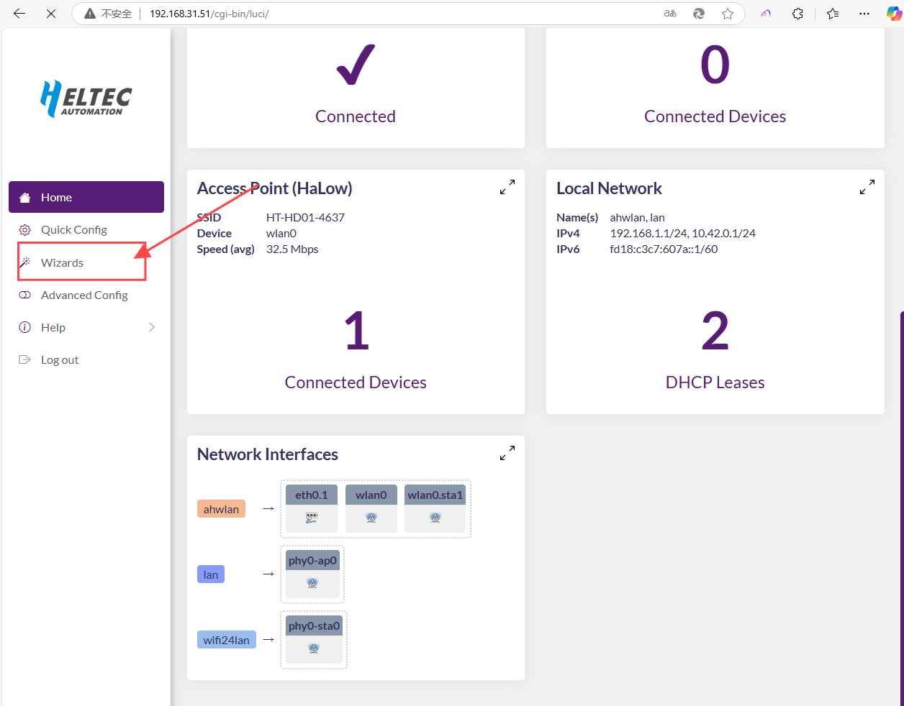
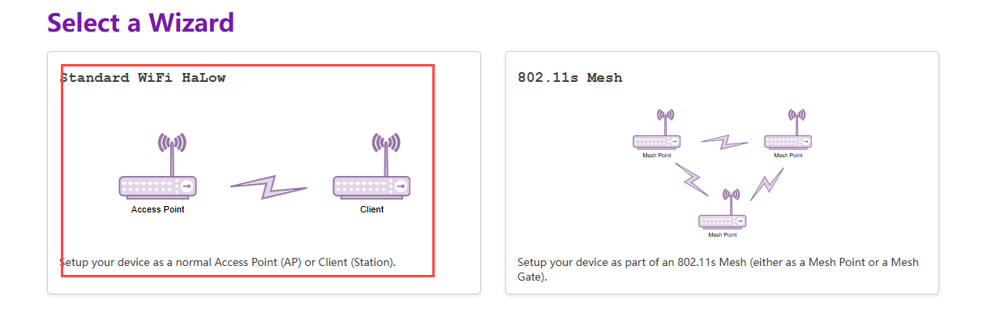
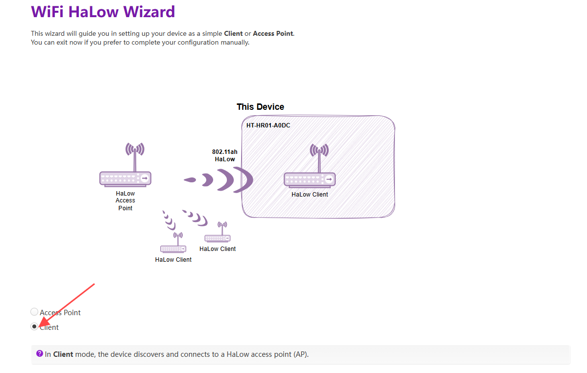
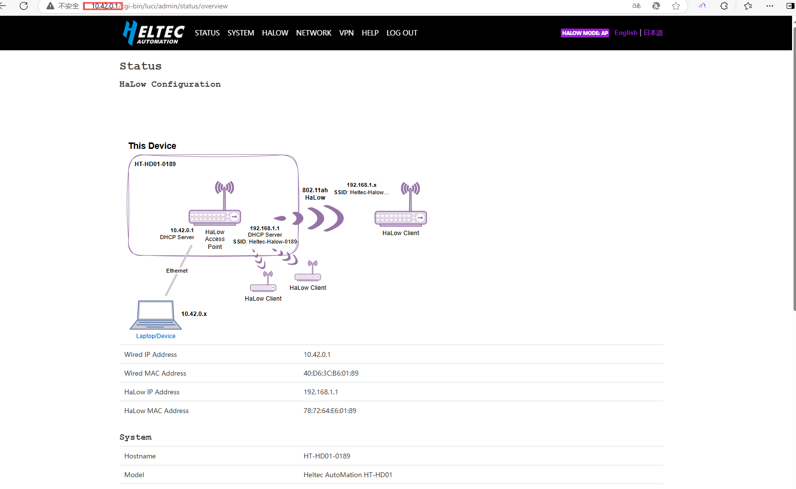

# STA Setup Guide

{ht_translation}`[简体中文]:[English]`

## Summry
This topic describe "**How to Set a HaLow Device into STA Working Mode**". This includes:
- How to connect to the HaLow AP(Gateway)
- How to choose the operating mode
- how to create a 2.4G AP network for device connection

------------------------------------------------------

## Access Wiards Page
Before all, make sure your device is in "Wizards mode".If you don't know how, please refer the flow links:

- Method 1: Via the `Wizards` option in the configuration page, If you're not sure how to enter the configuration page, please refer to: [Quick Start - Access Configuration Page](https://docs.heltec.org/en/wifi_halow/ht-hd01/quick_started.html#access-configuration-page)

 

- Method 2: Via **Reset Up mode**, If you're not sure how to enter the Reset up mode, please refer to: [Quick Start - Reset Up](https://docs.heltec.org/en/wifi_halow/ht-hd01/quick_started.html#reset-up)

-----------------------------------

## Setup
1. The following steps appear when performing a complete reset of the device. If you enter through the configuration page, they will be automatically skipped.

 - `Country`. Please set it according to your region, and ensure that the AP and STA regions are consistent.
 - `Hostname` refers to the hostname of your device in the Wi-Fi HaLow network.
 - `Standard Wi-Fi HaLow`, slect a wizard you need，Standard Wi-Fi HaLow means AP-STA mode.

2. Select `Client` mode and click `Next`.

3. Scan or manually enter the SSID and password of the HaLow-AP, and click `Next`.

4. Click `Enable Access Point` to create a network for WiFi2.4G devices connection.

------------------------------------

## Related Links
- [HaLow Dongle User Guide](https://docs.heltec.org/en/wifi_halow/ht-hd01/index.html)
- [HaLow Dongle STA Setup Guide](https://docs.heltec.org/en/wifi_halow/ht-hd01/sta.html)