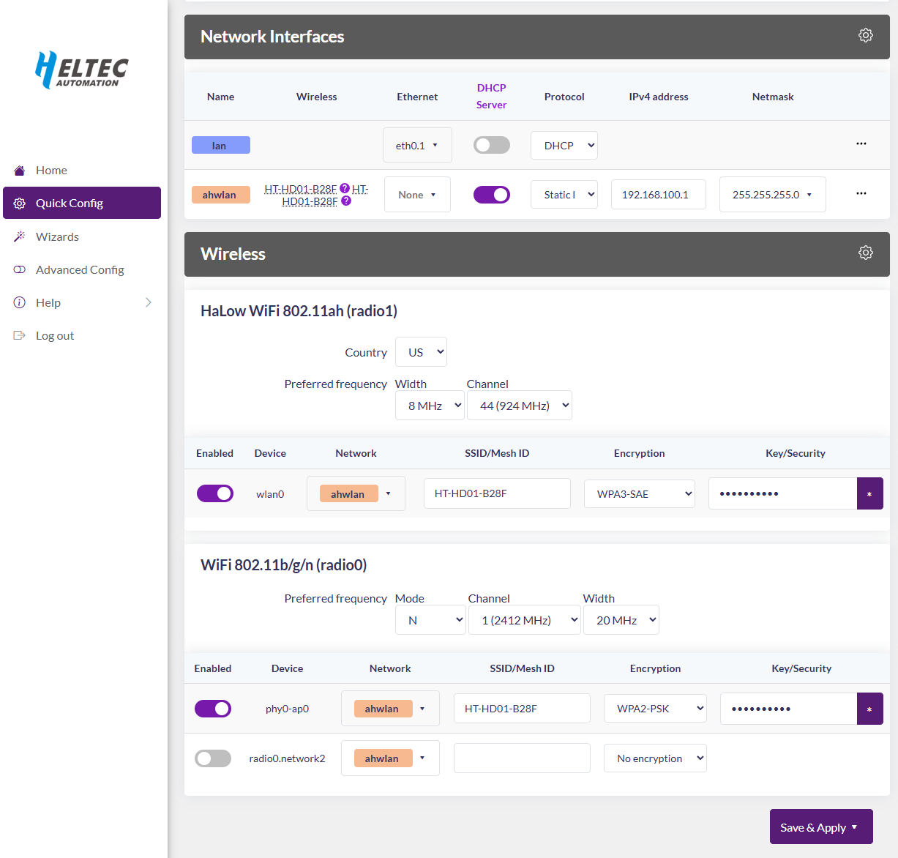
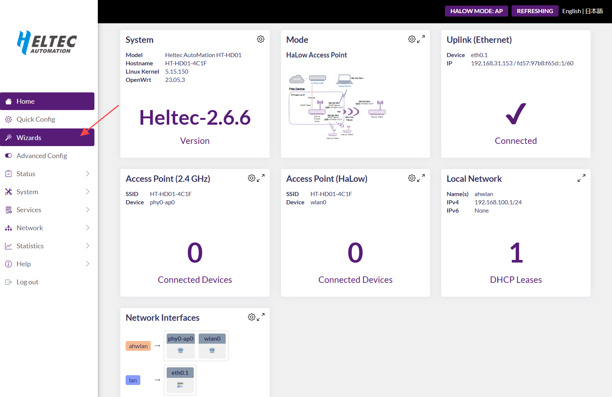

# View and Modify Settings

{ht_translation}`[简体中文]:[English]`

This topic describes how to view information about various devices in the Dongle network and how to modify related settings.

(configuration-page)=
## Enter Configuration Page
HD01 has two method enter the configuration page, you can choose either one of them.

### AP Remote Access
1. Connect the PC(Laptop) to the Dongle 2.4G AP.The default SSID is **HT-HD01-xxxx**, and the default password is **heltec.org**.
2. Enter “192.168.100.1”(AP) or “10.42.0.1”(STA) in the browser (depending on the mode of operation of the device, if you are not sure which one to enter, you can try both). 
3. Default account "**root**", default password **"heltec.org"**.

### IP-Based Connection
1. Connect the PC(Laptop) to the same LAN as the device, and go to the configration page. Find the IP address of the corresponding device.

Here, LAN refers to the network that provides the IP for the device to be viewed, and the configuration page refers to the configuration page of the device that creates this network. In the default configuration:

- The Dongle-AP's IP is provided by the external router.
- The Dongle-STA's IP is provided by the Dongle-AP.
- The terminal device's IP is provided by the Dongle-STA.

If your device has changed the network connection mode, please refer to the ["Wi-Fi HaLow IP Allocation Rules"] <https://docs.heltec.org/en/wifi_halow/ht-hd01/ip_rules.html>`_.

2. Go to this address, default account "root", default password "heltec.org".


3. From this page, you can view the device information or change the relevant Settings.


------------------------------------------

## View device Information
HD01 has two method enter the configuration page, you can choose either one of them.
### Via configuration page
You can check the configuration page for the relevant device information. How to get to the configuration page is described in the previous section: [Getting to the configuration page](configuration-page)
### Via serial tool
You can also connect the device to your computer via a USB cable and use a serial port tool on your computer to view the device's relevant information.

``` {tip} The serial port chip is CP210X. Click here to download the driver: [CP210X Driver](https://resource.heltec.cn/download/tools/CP210x_Universal_Windows_Driver.zip).
```

----------------------

## Modify Settings
You can change most Settings on a device from its configuration page. How to get to the configuration page is described in the previous section: [Getting to the configuration page](configuration-page)

### Basic settings(Quick Config)
In the `Quick Config` section of the configuration page, you can modify some basic settings. Inculde:



- **Country**, Based on your region, AP and STA should remain consistent.

- **SSID**, Please make sure to distinguish between Wi-Fi HaLow and 2.4G.

- **Password**, Please make sure to distinguish between Wi-Fi HaLow and 2.4G.

- **Bandwidth**, different bandwidth configurations affect signal coverage, data transfer rate, and interference resistance. Narrower bandwidths (e.g., 1 MHz) offer better coverage and lower power consumption, while wider bandwidths provide higher data rates but have shorter range and higher power consumption.

- **Channel**, each bandwidth have some specific frequency as its channels, when there are other Wi-Fi HaLow devices in the area, you can reduce interference by setting different channels.

Click `Save&Apply` the configuration.

### Wizards setting

On the "Wizards" option within the configuration page, one can carry out a complete reconfiguration of the device. By adhering to the instructions and prompts available on the configuration interface, each stage of the process can be executed methodically.



----------------------------------

## Reset Up
When you cannot access your configuration page, the **Reset UP mode** can allow you to reconfigure the whole device.

``` {tip} If the configuration hasn't been apply in this mode, the existing configuration will still be retained.
```

1. Press and hold the device button 3 seconds until the orange light turns on, then release the button. Subsequently, orange light and green light (blue light) will flash alternately, indicating that the device has entered reset mode.


2. At this point, the device will provide a dedicated AP hotspot for configuration. The default SSID is **HT-HD01-xxxx**, and the default password is **heltec.org**. Connect your PC(Laptop) to it.


3. Access **192.168.4.1** in your browser. The default username is **root**, and the default password is **heltec.org**.


4. By adhering to the instructions and prompts available on the configuration interface, each stage of the process can be executed methodically.

--------------------------------------

## Factory reset

``` {warning} In this mode, all existing configurations on the device are completely erased. You must reconfigure it anew before use.
```

1. Press and hold the device button 10 seconds until the **white** light turns on, then release the button. Subsequently, orange light and green light (blue light) will flash alternately, indicating that the device has entered reset mode.


2. At this point, the device will provide a dedicated AP hotspot for configuration. The default SSID is **HT-HD01-xxxx**, and the default password is **heltec.org**. Connect your PC(Laptop) to it.


3. Access **192.168.4.1** in your browser. The default username is **root**, and the default password is **heltec.org**.


4. By adhering to the instructions and prompts available on the configuration interface, each stage of the process can be executed methodically.