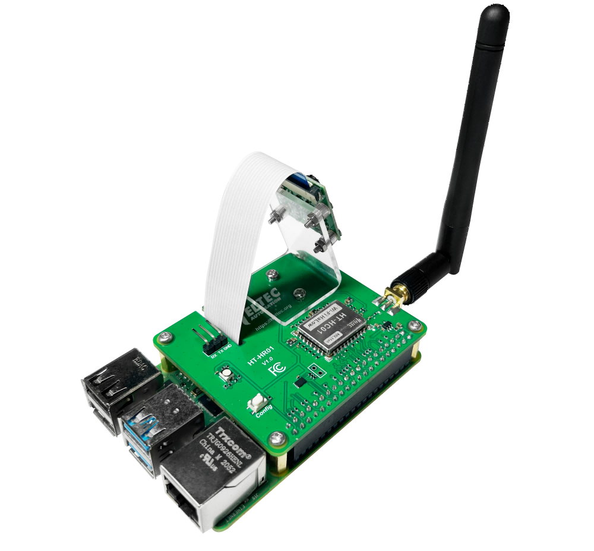
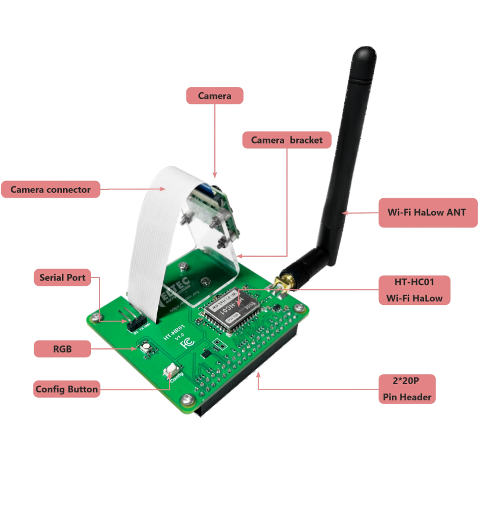
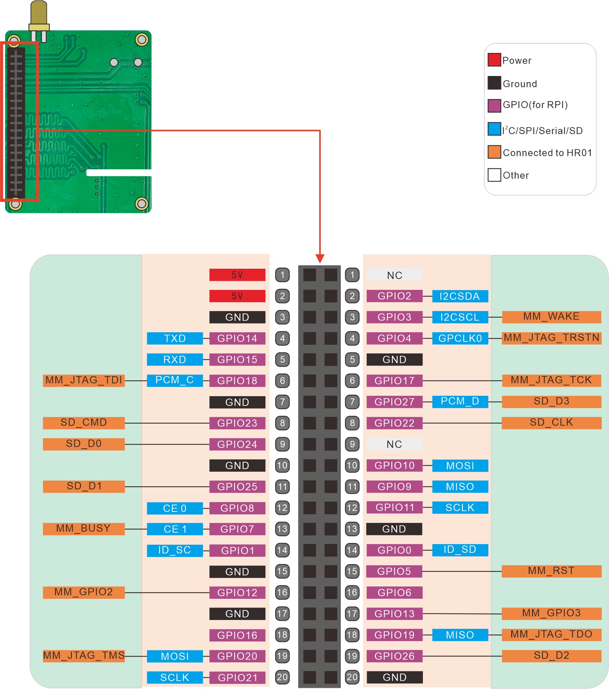
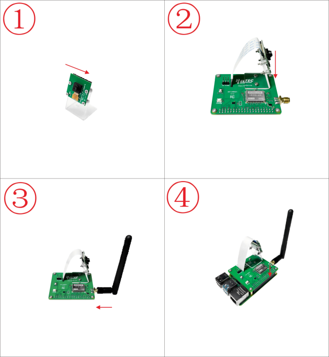
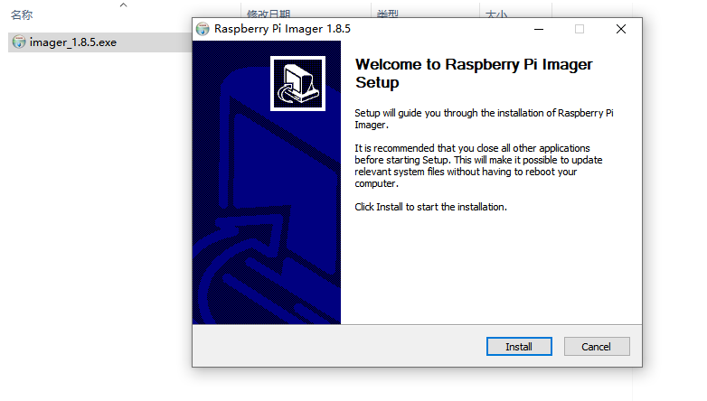
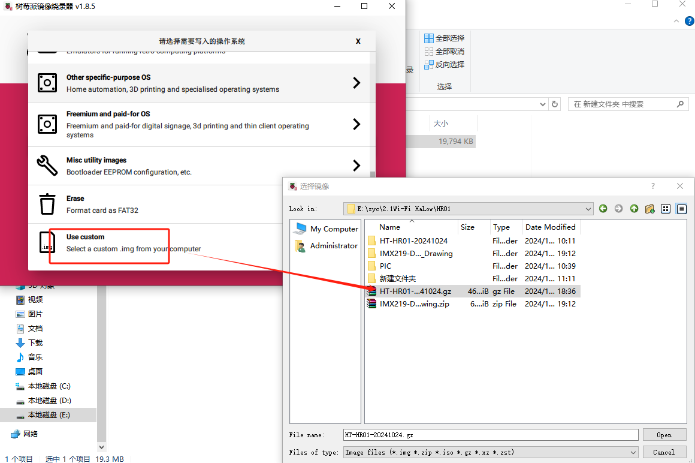
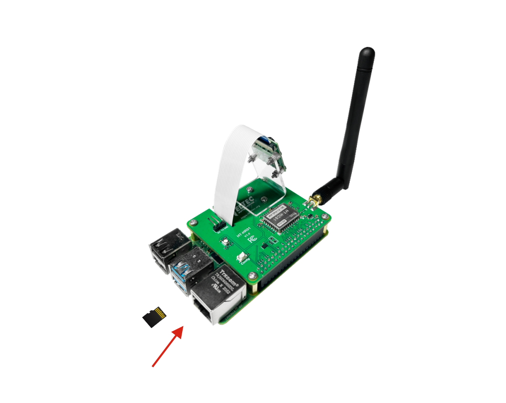

**HT-HR01 Raspberry Pi HAT with Camera and Wi-Fi HaLow**

:ht_translation:`[简体中文]:[Eglish]`

**This document is still under construction and will be completed soon.**

.. warning:: 
   The current firmware version tests are all conducted on Raspberry PI 4B.

Introduction
============

Pi-CamLow is a Raspberry Pi HAT(Hardware Attached on Top) that integrates Wi-Fi HaLow and a camera. Using the firmware we provided, this board allows you to enable various Wi-Fi HaLow functionalities such as AP, node, and Mesh networking on Raspberry Pi.

Feature
-------

- Raspberry Pi HAT, Specifically designed for Raspberry Pi, making integration and installation easy.
- Provides firmware 
- Excellent Wi-Fi HaLow RF performance
- Powerful camera capabilities

Components
----------

-------------------------------------------------------------------

Basic Resources
===============

- `ESP-HaLowCamera Datasheet <https://resource.heltec.cn/download/HT-HR01/Datasheet>`_
- `ESP-HaLowCamera Schematic Diagram <https://resource.heltec.cn/download/HT-HR01/Schematic_diagram>`_
- `HaLow-Camera Firmware <https://resource.heltec.cn/download/HT-HR01/firmware/Pi-CamLow>`_

Pin Mapping
===========

The pins on this HAT are fully compatible with the Raspberry Pi.

---------------------------------------------------------------

Get started
===========

Hardware
--------
Hardware Preparation
^^^^^^^^^^^^^^^^^^^^
- `Pi-CamLow <https://heltec.org/project/ht-hc32/>`_
- `Raspberry Pi 4 Module B <https://heltec.org/project/raspberry-pi4-model-b/>`_
- Micro SD card
- SD card reader
- Computer running Windows, Linux, or macOS

Hardware installation
^^^^^^^^^^^^^^^^^^^^^
Follow the steps shown below to install and connect the device.

Power
^^^^^^
HR01 is powered by Raspberry PI, so it is sufficient to connect the Raspberry PI power supply.

------------------------------------------------------------

Install firmware
----------------
1. Download the `HR01_Firmware <https://resource.heltec.cn/download/HT-HR01/Firmware/HT-HR01-20241024.gz>`_ and `Raspberry Pi Imager <https://www.raspberrypi.com/software/>`_.
2. Insert the SD card into the card reader and connect it to your computer.

3. Install and run the **Raspberry Pi Imager tool**.

4. Select the appropriate Raspberry Pi model. Slect `Use custom`.Select the **HR01_Firmware** you just downloaded.

6. Click `NEXT` and complete the firmware installation.

7. Remove the SD card from the card reader and insert it into the Raspberry Pi.

------------------------------------------------------

Setup and Use
-------------

1. Powering on the device, the red indicator light should turn on, indicating that the device is starting up, which will take approximately dozens of seconds.

2. Connect your Raspberry PI to your computer with an Internet cable.

3. Press and hold the device button for 3 seconds until the yellow light turns on, then release the button. 

4. Open the web browser on your computer and go to '10.42.0.1'. 
   - Default username: root
   - Default password: heltec.org

.. image:: ./img/05.png
   :align: center
   :width: 500px
   
5. Select the mode you want to run and configure it accordingly. For detailed functionality and usage of each mode, please refer to the following link:

- `Wi-Fi HaLow Feature Description and Configuration Guide <https://docs.heltec.org/en/wifi_halow/halow_guide/index.html>`_

FAQs
=====

- `HT-HR01 Frequently Asked Questions <https://docs.heltec.org/en/wifi_halow/ht-hr01/faq/index.html>`_

Heltec General Docs
===================
-->[General Docs]<-- <https://docs.heltec.org/general/index.html>
