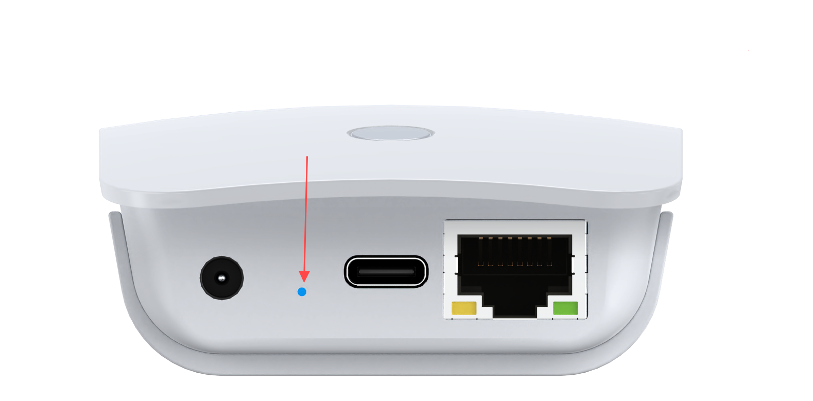
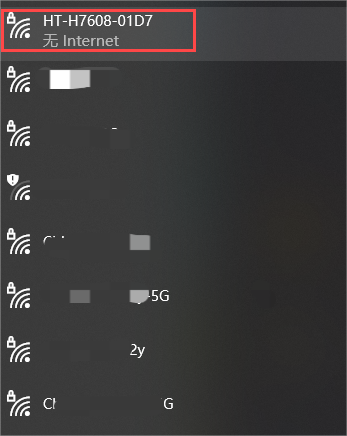

===========================
HT-H7608 Wi-Fi HaLow Router
===========================
:ht_translation:`[简体中文]:[Eglish]`

Summry
------
HT-H7608 is an innovative WiFi HaLow gateway from Heltec Automation designed to meet the needs of long-distance/high-speed data transmission for IoT applications. The gateway uses WiFi HaLow(IEEE 802.11ah) technology that operates in the sub-1 GHz unlicensed band, which has stronger penetration and larger coverage compared with the traditional WiFi standard.

H7608 is equipped with powerful hardware including advanced RF capabilities, high-performance MCU, and flexible interfaces for seamless integration with existing networks. It can be easily configured and OTA upgraded through web UI, and supports the simultaneous connection of a large number of devices, which makeing it a great solution for intelligent manufacturing, intelligent agriculture and smart city, etc.

.. image:: ./img/01.png
   :align: center
   :width: 500x 

Feature
-------

- Wi-Fi and Ethernet supported, WiFi HaLow and 2.4GHz dual-band design.
- Long-distance transmission capability, the range can reach 1km and further within the visual distance.
- Supports access to a large number of devices, more than 4 times that of traditional Wi-Fi access points.
- High transmission speed, it maintains 150Kbps at the limit distance and 32Mbps at close distances.
- Flexible networking methods, including AP, STA, Mesh, etc.
- Easy setup and OTA upgrade via the Web UI.
- Light and stylish wall-mounted, simple to install.
- -40°C to 85°C maximum operating temperature range.

Get Started
-----------
Hardware connection
````````````````````
Connect the device power, the device RGB light is red, indicating that the device is starting, which takes about 1~2 minutes.

.. image:: ./img/02.png
   :align: center
   :width: 500px 

.. warning:: This is a note admonition.
   Do not enter configuration mode while connected to a network cable. If you do this accidentally, disconnect the power and reconnect.

Enter Configuration mode
`````````````````````````
Press the button with the SIM needle for 3 seconds until the yellow light is on and release it.



Using the configuration tool (PC or mobile), find the WiFi named "HT-H7608-xxxx-2G" and connect to it. The default password is "heltec.org".



Enter "10.42.0.1" in your browser to navigate to the configuration page, the default account as "root" and password as "heltec.org".

.. image:: ./img/05.png
   :align: center

Configurantion
```````````````
HT-H7608 has three typical working modes, please configure according to the specific use mode.

.. image:: ./img/06.png
   :align: center

.. toctree::
   :maxdepth: 1

   Wi-Fi HaLow Gateway(AP) <gateway>
   Wi-Fi HaLow Client(STA) <sta>
   Wi-Fi HaLow Mesh <mesh>

Related resource
----------------
You can find most resources related to HT-H7608 at:

`HT-H7608 Resource page <https://resource.heltec.cn/download/HT-H7608>`_

Frequently asked questions
--------------------------
1. After going into configuration mode, I couldn't find the Wi-Fi in configuration mode.
   
   - Do not connect the cable while in configuration mode. If this happens, you will need to unplug the cable and power, and start again without the network cable.
