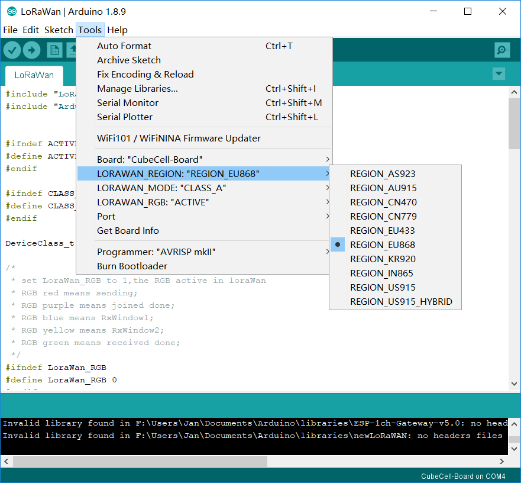
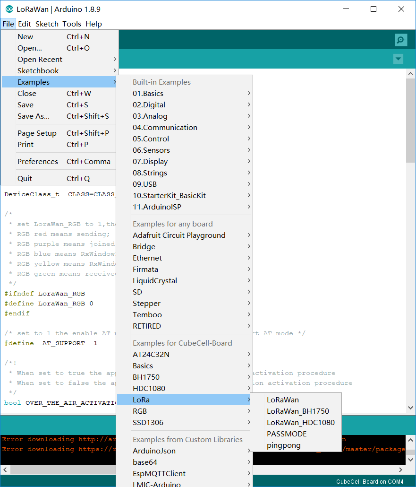

# Connect CubeCell to LoRaWAN Server

In this document, all operations and tests must be performed with a standard [LoRaWAN Gateway](https://heltec.org/proudct_center/lora/lora-gateway/), and at least have 8 channels! In the CubeCell's LoRaWAN library, for each working band, we are strictly follow [LoRaWAN 1.1 Regional Parameters](https://lora-alliance.org/sites/default/files/2018-04/lorawantm_regional_parameters_v1.1rb_-_final.pdf).

## Summary

LoRaWAN protocol is the essence of all lora applications. In our opinion, the most prominent benefits of LoRaWAN are as follows:

- Very friendly for low power applications. For example, your application need send data to server every 10 minutes, then in a cycle, only ~1 second is in the state of sending, other 9 minutes and 59 seconds are in low sleep low power Consuming status.
- A star network can be formed via a [LoRa Gateway](https://heltec.org/proudct_center/lora/lora-gateway/), nodes and gateways from different manufacturers can communicate with each other through LoRaWAN protocols;
- The protocol already includes processing mechanisms such as blocking, automatic frequency modulation, and encryption, which can better ensure the smooth flow of nodes and gateway；
- ADR (Adaptive Data Rate).

``` Tip:: CubeCell LoRaWAN library is migration from LoRaMac-node version v4.3.2

```


## Preparation
- Correctly installed Arduino IDE and [CubeCell Framework](quick_start).
- A standard LoRaWAN gateway with at least 8 channels (based on SX1301/8 base band chip will be OK), and make sure your gateway had already connected to a LoRa server.
  - [How to connect HT-M01 to a LoRa server]()
  - [How to connect HT-M02 to a LoRa server]()
- A [CubeCell Dev-Board](https://heltec.org/project/htcc-ab01/) or [CubeCell-Cupsule](https://heltec.org/project/htcc-ac01/) and a high quality USB cable.

**In this example, we use [HT-M01 Mini Gateway](https://heltec.org/project/ht-m01/) in Windows<sup>®</sup> 10. Test band: EU868, others working band is similar.**

## Connect to TTN

### Configure node information

First we have to create a new CubeCell-Board node in the TTN.


- After installing the CubeCell Arduino IDE development environment, select CubeCell-Board in the Arduino, and the working frequency band, and select LoRaWAN example.

- I need the CubeCell-Board to work in the EU 868 band in Class A mode, which requires:





- 1. Make sure the AT command mode is turned on and the required features are turned on.
```
#define  AT_SUPPORT  1
```
For example, turn on the RGB light.
```
#define LoraWan_RGB 1
```
- 2. Click to download.
- 3. The node access information is configured through the AT command.

Open the serial port (COM4) and reset the CubeCell-Board. After the node is started, you can observe the printing:


#### At the beginning we need to send arbitrary data to the COM to wake up the MCU.


We will see the information returned by CubeCell-Board.
```
ASR is Waked,LowPower Mode Stopped
```


After waking up the MCU, we can start to configure the DevEui, AppEui, AppKey of the registered nodes to CubeCell-Board.

E.g:
```
AT+DevEui=2232330000******
AT+AppKey=888888888888888888888888********
AT+AppEui=70B3D57ED00*****
```

PS: '*' is the actual registered number. We need to be careful to ensure that the interval between each instruction is >100ms as much as possible to avoid some unnecessary bugs.


The node works in Class A mode by default, and the sending period is 15s. By default, ADR is enabled.

For example, I need to modify the send period to 60s and query the EUI of the node:

```
AT+DutyCycle=60000
AT+DevEui=?
```


#### Please note that the configuration of the node's network access information must take effect only when the node is reset or the next time it enters the network. The parameters that have been configured by the node are printed after reset.

The CubeCell-Board can be reset by sending ```AT+RESET=1```.


The CubeCell-Board completes the reset and starts to enter the network.

Return to TTN to view:


CubeCell-Board has successfully connected to TTN!
