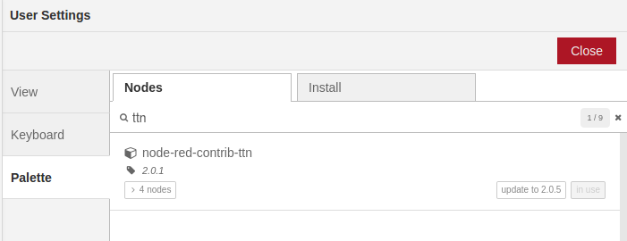
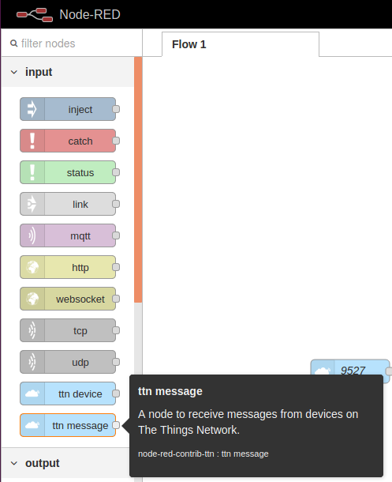
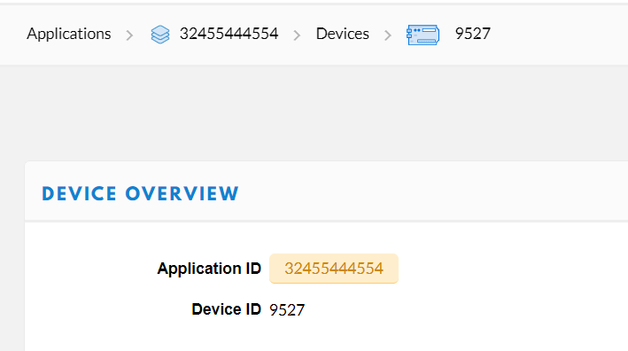
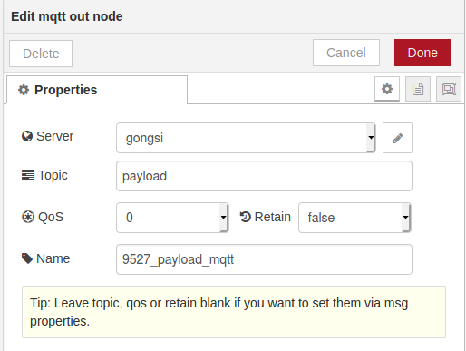

# How to use MQTT to subscribe to messages from TTN nodes
-------------------------------
## CONTENT

1. [Overview](#overview)

2. [Preparation](#preparation)

   2.1 [Download and install Node-red ](#download-and-install-node-red(takes-a-long-wait))

3. [Configure Node-Red](#configure-node-red)
   
   3.1 [Add TTN palettes to Node-red ](#add-ttn-palettes-to-node-red)
   3.2 [Configure MQTT plugin](#configure-mqtt-plugin)
   
4. [View subscription](#view-subscription)

## Overview

The purpose of this article is to subscribe to data messages from TTN nodes using the MQTT plugin in the data flow applicition Node-Red provided by TTN.

The experiment kit used in this experiment is [HT-M02](https://heltec.org/project/ht-m02/), and [CubeCell-board](https://heltec.org/project/htcc-ab01/).

Maybe you don’t have or don’t have a real device. You can still test this solution through the simulation uplink provided by TTN. How to use please see below

----------
## Preparation

- First we need the LoRa node that has been connected to the TTN.(ESP32 series and Cubecell series are both available)

  How to connect nodes to TTN please refer to:

  - **[How to connect HT-M01 to TTN (The-Things-Network)](en/user_manual/how_to_connect_ht-m01_to_ttn-the-things-network)**
  - **[How to connect CubeCell to a LoRa Gateway via LoRaWAN protocol (TTN)](en/user_manual/how_to_connect_cubecell_to_ttn-the-things-network)**

- An Ubuntu with MQTT-Broker and Node-Red installed (The MQTT-Broker I use here is Mosquitto).

- MQTT.fx software is used to test whether it can subscribe to node messages.

  - **About MQTT.fx : http://mqttfx.jensd.de **

### Download and install Node-red(takes a long wait)

If you are on a Raspberry Pi or any Debian-based operating system, including Ubuntu and Diet-Pi, you can use the Pi install script available here.

```Shell
bash <(curl -sL https://raw.githubusercontent.com/node-red/raspbian-deb-package/master/resources/update-nodejs-and-nodered)
```

------------------
## Configure Node-Red

We can view the Node-Red interface by using a browser to access the` localhost:1880` port

Then we need to download the TTN plugin in Node-Red.

### Add TTN palettes to Node-red

  - **Installation via user setting in Node-Red panel**

    

  - **Install from the command line**
```Shell
    npm install node-red-contrib-ttn@2.0.1
```
We need to configure the data source from TTN, such as APP EUI, APP KEY, DevEUI and other parameters...

We select INPUT-> ttn_message palette from the downloaded TTN plugin, which is on the left side of the panel.	Drag it into the Flow panel on the right.



Next, Double-click it fill in the key parameters such as the application EUI, KEY, and Device ID that we registered in TTN.




Click `Update` after configuration.

### Configure MQTT plugin

We need to configure the topic forwarded by the MQTT plugin.

For example, now I want to wrap the upstream message of a node into a topic named `Node_uplink` through the MQTT plugin and forward it to my private MQTT Broker. 

First, select the OUTPUT-> mqtt palette in the left panel. Drag it into the Flow panel on the right.


Next, double-click it to fill in our reposted topic. In the end, you must fill in your target broker.




After filling all the palettes, we must connect them in Flow.


Please don't forget to configure all the plug-ins after you need to click the `Depoly` button in the upper right corner to complete the deployment.


------------------
## View subscription

Then use MQTT.fx software to subscribe to this topic. If it goes well, we will see the default uplink data  `1, 2, 3, 4.`(ASCII: 31 32 33 34) of CubeCell-Board in MQTT.fx software.


We successfully subscribed the payload of the uplink data of the nodes in the TTN through MQTT. 

If you don't have a real device, you can use the SIMULATE UPLINK prepared by TTN for you, which can be used like this:


It's in the Application-> Device page you created.

Click Send to simulate the node's Uplink data.

enjoy.

---------------------