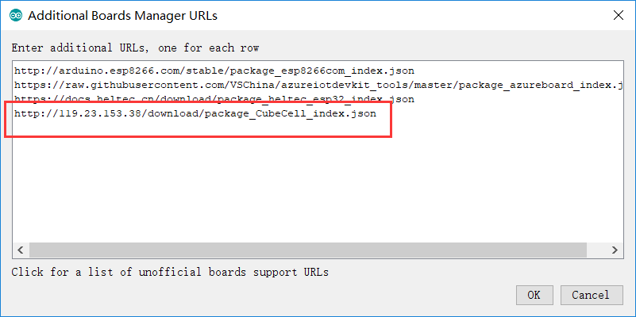

# CubeCell Series Quick Start
[简体中文](https://heltec-automation.readthedocs.io/zh_CN/latest/cubecell/quick_start.html)
## Summary

CubeCell is based on ASR650x series, this page shown how to install and configuration CubeCell Arduino Framework, and how to uploading and running code (examples).

## Install CubeCell Relevant Framework

``` Tip:: Please confirm whether the USB driver, Git and Arduino IDE has been installed correctly.

```

*If not, please view this two articles [establish serial connection](https://heltec-automation-docs.readthedocs.io/en/latest/general/establish_serial_connection.html) and [Install Git and Arduino IDE](https://heltec-automation-docs.readthedocs.io/en/latest/general/how_to_install_git_and_arduino.html).*

**there are two methods to install the CubeCell framework, choose one of them.**

### Use Arduino board manager

Open Arduino IDE, and click `File`->`Peferences`->`Settings`


Input following json url to board manager URLs:

[https://resource.heltec.cn/download/package_CubeCell_index.json](https://resource.heltec.cn/download/package_CubeCell_index.json)



Click `Tools`->`Board:`->`Boards Manager...`, search `Heltec cubecell`in the new pop-up dialog, select the latest `releases` and  click `install`


The source code of Heltec ASR650x series (ASR6501&ASR6502) framework available here: [https://github.com/HelTecAutomation/ASR650x-Arduino](https://github.com/HelTecAutomation/ASR650x-Arduino)

### Via Git

- For Windows: `https://github.com/HelTecAutomation/ASR650x-Arduino/blob/master/InstallGuide/windows.md`
- For MacOS: `https://github.com/HelTecAutomation/ASR650x-Arduino/blob/master/InstallGuide/mac.md`
- For Linux(Ubuntu/Debian): `https://github.com/HelTecAutomation/ASR650x-Arduino/blob/master/InstallGuide/debian_ubuntu.md`

&nbsp;


## Running an Example

Connect your CubeCell board to computer via a **high quality** Micro USB cable *(This is the most common reason we had encountered can’t program software)*. 

### Correctly Config the Tools Menu

In the tools menu, there are following options:

- **Board** -- Choose the right hardware connected to your computer;
- **LORAWAN_REGION** -- LoRaWAN protocol region definition, strictly follow [LoRaWAN™ 1.0.2 Regional Parameters rB](https://resource.heltec.cn/download/LoRaWANRegionalParametersv1.0.2_final_1944_1.pdf);
- **LORAWAN_CLASS** -- Now with Class A and Class C supported;
- **LORAWAN_DEVEUI** -- The source of the LoRaWAN parameter `DevEUI`
  - `CUSTOM -- Use the value defined in the devEui array, which is in the .ino file, Can be any value, but it may conflict with other serial numbers.`
  - `Generate by ChipID -- Generated based on the ASR650x's unique Chip ID`
- **LORAWAN_NETMODE** -- OTAA or ABP;
- **LORAWAN_ADR** -- Turn ON or turn OFF ADR (Adaptive Data Rate);
- **LORAWAN_Net_Reservation** -- This is a feature outside the LoRaWAN protocol, only valid in OTAA mode. If this option is enabled, when system reset does not need join again. Projects such as smart street lights may be useful.
- **LORAWAN_UPLINKMODE** -- LoRa uplink confirmed/unconfirmed messages. Confirmed messages need server send downlink to node, but some LoRa server have downlink limited (such as TTN).
- **LORAWAN_AT_SUPPORT** -- AT command will provide many useful functions, for example, users can use serial port to config LoRa Node's DevEui, AppKey, or make node sleep, reset etc.
- **LORAWAN_RGB** -- RGB light for LoRaWAN status:
  - `Purple -- Join;`
  - `Blue -- First RX window;`
  - `Yellow -- Second RX window;`
  - `Green -- Join done.`
- **LoRaWan Debug Level** -- LoRaWAN relevant messages print by serial port
  - `None -- Default;`
  - `Freq -- Sending/receiving frequency;`
  - `Freq && DIO -- Sending/receiving frequency, and DIO pin interrupt information.`
- **COM Port** -- Device's serial port in your computer.


``` Note:: **LORAWAN_Net_Reservation:** For example, a large-scale power outage in city, when power is restored, thousands of devices are connected to the network at the same time, which may cause the LoRa gateway or server to fail. Enable this feature will avoid this situation. Enable LORAWAN_Net_Reservation must disable Frame counter (fCnt) in LoRa server.

```


### Select an example


### Compile and upload


### New a sketch for CubeCell

In Arduino IDE, click `File --> new` and copy the following code:

```arduino
// the setup routine runs once when starts up
void setup(){

  // Initialize the Heltec ASR650x object


// the loop routine runs over and over again forever
void loop() {

}
```

&nbsp;

## External resources

- **Serial port cannot connected to Linux system?**

In the Linux system, If encounter the serial port cannot be connected. Please refer to this document:
[https://playground.arduino.cc/Linux/All/#Permission](https://playground.arduino.cc/Linux/All/#Permission)

&nbsp;

Enjoy!

