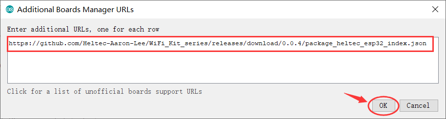
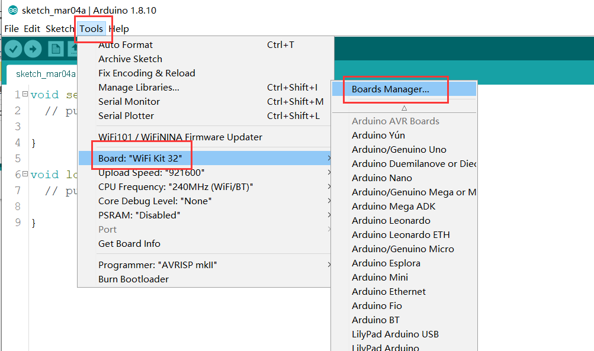

# Heltec ESP32+Arduino Series Quick Start

We suggest you confirm whether the `USB driver`, `Git` and `Arduino IDE` has installed first. If not, please view this two articles [establish serial connection](https://heltec-automation-docs.readthedocs.io/en/latest/general/establish_serial_connection.html) and [Install Git and Arduino IDE](https://heltec-automation-docs.readthedocs.io/en/latest/general/how_to_install_git_and_arduino.html).

## Setting Environment

### Download Arduino-ESP32 Support

- Open Arduino IDE, and click `File`->`Peferences`

**Input the last ESP32 package URL:** [http://resource.heltec.cn/download/package_heltec_esp32_index.json](http://resource.heltec.cn/download/package_heltec_esp32_index.json)

- Click `Tools`->`Board:`->`Boards Manager...`, search `Heltec ESP32` in the new pop-up dialog, then click `install`

The source code of Heltec ESP series (ESP32 & ESP8266) framework available here: [https://github.com/Heltec-Aaron-Lee/WiFi_Kit_series](https://github.com/Heltec-Aaron-Lee/WiFi_Kit_series)

### Download the Heltec ESP32 Library

Open Arduino IDE, then Select `Sketch`->`Include Library`->`Manage Libraries...`
Search `Heltec ESP32` and install it

The source code of `Heltec ESP32` library available here:[https://github.com/HelTecAutomation/Heltec_ESP32](https://github.com/HelTecAutomation/Heltec_ESP32)

## Example

This section is used to verify that Arduino programming can be used and that the environment is configured successfully.

- Select  `Wifi Kit 32`  development board

- Select the corresponding example and upload.

If the screen or serial port has output, it means that the board runs successfully!