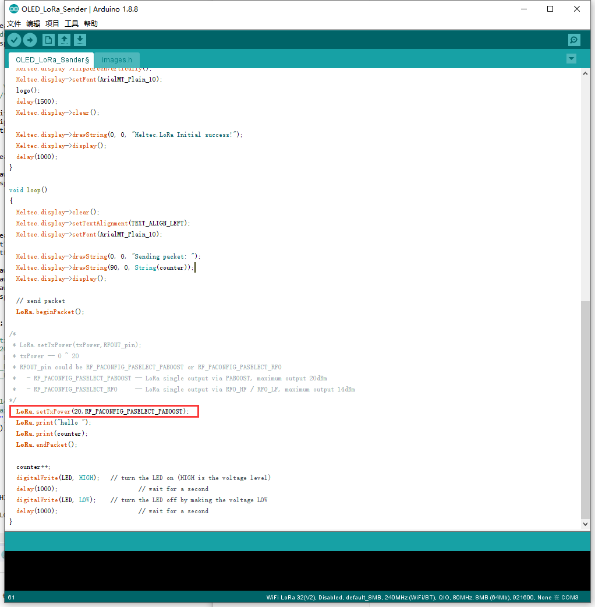

# Maximum LoRa Communication Distance Test
[简体中文](https://heltec-automation.readthedocs.io/zh_CN/latest/esp32/distance_test.html)
## 1.  Preparations
First of all, confirm the [Heltec ESP Development Framework](https://github.com/Heltec-Aaron-Lee/WiFi_Kit_series) and [Heltec ESP32 library](https://github.com/HelTecAutomation/Heltec_ESP32) had been correctly installed. If not, please view this articles [Heltec ESP32 quick start](https://heltec-automation-docs.readthedocs.io/en/latest/esp32/quick_start.html).

- Prepare two ESP32 + LoRa boards;

- Recommend use "*OLED_LoRa_Sender*" and "*OLED_LoRa_Receiver*" example code (you can find in examples);

- Replace BAND to fit your hardware and location. e.g. `433E6, 470E6, 868E6, 915E6` **(it's very important! Wrong working band will damage hardware and may illegal for your location law)**

  `Heltec.begin(true /*DisplayEnable Enable*/, true /*Heltec.Heltec.Heltec.LoRa Disable*/, true /*Serial Enable*/, true /*PABOOST Enable*/, BAND /*long BAND*/);`

  **Both Sender and Receiver should config to a same BAND.**

- Set 20dBm maximum LoRa output power in your sender (some country or location not allow 20dBm, please refer to local laws):

  `LoRa.setTxPower(20,RF_PACONFIG_PASELECT_PABOOST); //20dB output must via PABOOST`

  

  like this:

  

## 2.  Important Tips

- Antenna is very very important for RF communication, so you must have a good antenna with correctly working frequency.

  E.g. If working BAND in 868, you must have a 868MHz antenna.

- Two antennas remain parallel.

  E.g. If Sender's antenna is vertical to the ground, the Receiver's antenna should vertical to the ground too.

- Enough power supply;
- Sender in a higher place.

