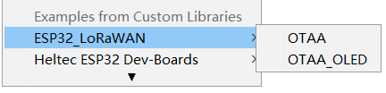
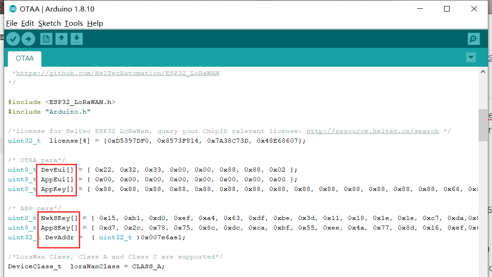
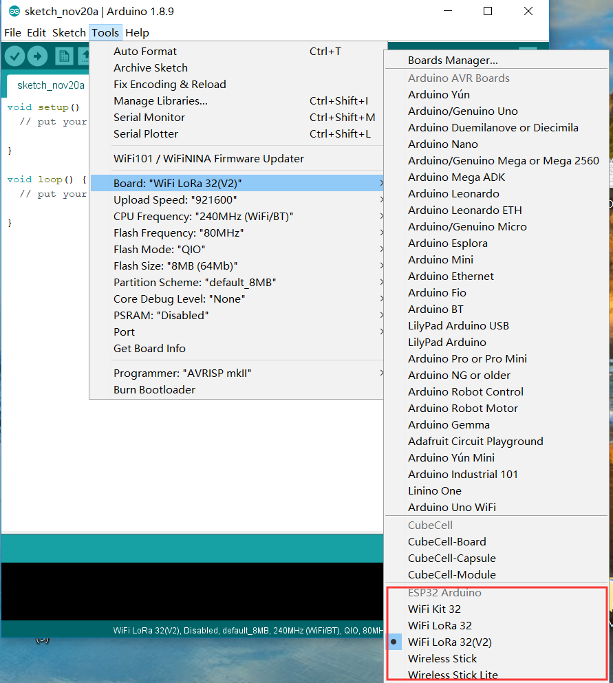

# "ESP32 + LoRa" Preparation & Config Parameters
[简体中文](https://heltec-automation.readthedocs.io/zh_CN/latest/esp32/lorawan/config_parameter.html)
## Preparation
----------
- Arduino IDE.  How to install please click [here](https://docs.heltec.cn/#/en/user_manual/how_to_install_git_and_arduino).
- This library must work with [Heltec WiFi_Kit_series Arduino development framework](https://github.com/Heltec-Aaron-Lee/WiFi_Kit_series). Installation manual  please refer to [here](https://docs.heltec.cn/#/en/user_manual/how_to_install_esp32_Arduino).

- A gateway already connected a LoRa server.
  - [Connect HT-M01 to a LoRa server](https://heltec-automation-docs.readthedocs.io/en/latest/gateway/ht-m01/connect_to_server.html);
  - [Connect HT-M02 to a LoRa server](https://heltec-automation-docs.readthedocs.io/en/latest/gateway/ht-m02_4g/quick_start_4g.html#connect-to-lora-server).
- An ESP32 + LoRa ([WiFi LoRa 32](https://heltec.org/project/wifi-lora-32/), [Wireless Stick](https://heltec.org/project/wireless-stick/), etc.) node and a high quality USB cable.
- In this example, we use [HT-M01 Gateway](https://heltec.org/project/ht-m01/) and drive it through Windows<sup>®</sup> via USB, and use [WiFi LoRa 32 (V2)](https://heltec.org/project/wifi-lora-32/) Board to quickly connect to TTN.

### Installing Library
----------
We provided a ESP32 LoRaWAN library, which migration from the [LoRaMac-node](https://github.com/Lora-net/LoRaMac-node) library:

[https://github.com/HelTecAutomation/ESP32_LoRaWAN](https://github.com/HelTecAutomation/ESP32_LoRaWAN)

Choose one of the following method to install this library:

1. download a zip file from GitHub using the "Download ZIP" button and install it using the IDE ("Sketch" -> "Include Library" -> "Add .ZIP Library..."

2. clone this git repository into your sketchbook/libraries folder.

  For more information, see [https://www.arduino.cc/en/Guide/Libraries](https://www.arduino.cc/en/Guide/Libraries).


## Configure Parameters

No matter what LoRa management platform is used, DevEui, AppKey, etc. parameters are must needed. And ensure that it is consistent with the relevant settings on the server.

- **The following parameters are essential for OTAA mode:**
  - DevEui -- Mote device IEEE EUI (big endian), 8 bytes;
  - AppEui -- Application IEEE EUI (big endian), 8 bytes;
  - AppKey -- AES encryption/decryption cipher application key, 16 bytes;
- **The following parameters are essential for ABP mode:**
  - NwkSKey -- AES encryption/decryption cipher network session key, 16 bytes;
  - AppSKey -- AES encryption/decryption cipher application session key, 16 bytes;
  - DevAddr -- Device address on the network (big endian), uint32_t;

Choose an example from menu `File -- Examples -- ESP32_LoRaWAN -- OTAA`.



The LoRaWAN relevant parameters are in the `.ino` file, fix it in the code directly.



## Choose Frequency Band

There are some options in the Arduino Tools menu:



`Board, Upload Speed, CPU Frequency, Core Debug Level, PSRAM` are ESP32 chip's normal option, just keep default. Special notice the `LoRaWan Region` and `LoRaWan Debug Level`:

- **LoRaWan Region** -- LoRaWAN protocol region definition, strictly follow [LoRaWAN™ 1.0.2 Regional Parameters rB](https://resource.heltec.cn/download/LoRaWANRegionalParametersv1.0.2_final_1944_1.pdf);
- **LoRaWan Debug Level** -- Messages printed via serial.
  - None -- Default;
  - Freq -- Uplink/downlink frequency;
  - Freq && DIO -- Uplink/downlink frequency and DIO interrupt information;
  - Freq && DIO && PW -- Uplink/downlink frequency, DIO interrupt information and low power status.

``` Note:: Print too much messages may cause the system unstable.

```
##  LORAWAN_DEVEUI

The introduce about LORAWAN_DEVEUI;

"LORAWAN_DEVEUI" is a parameter for the node to communicate with the gateway, 
equivalent to the node's ID number, 
and each "LORAWAN_DEVEUI" in each server is unique.
It needs to be stored in both the node and the server, 
and can only be accessed when the node matches the time point "LORAWAN_DEVEUI" in the server.

If you want to know more you can the examples about "LORAWAN_DEVEUI".
