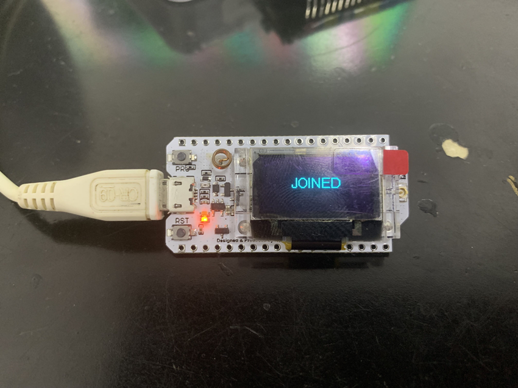
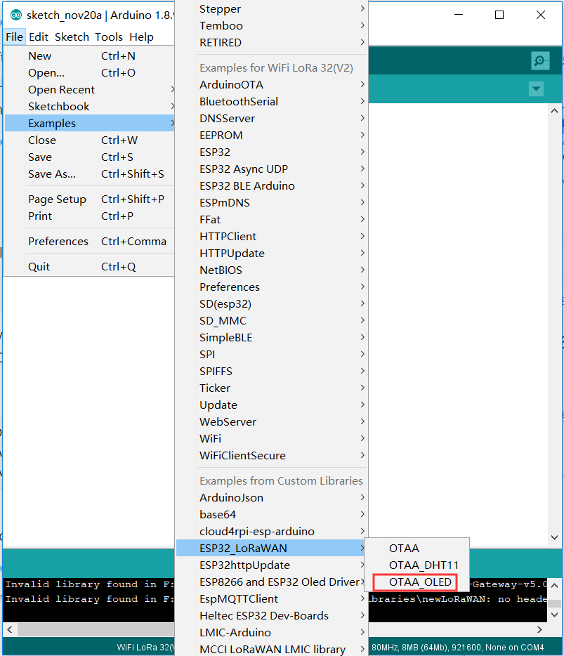
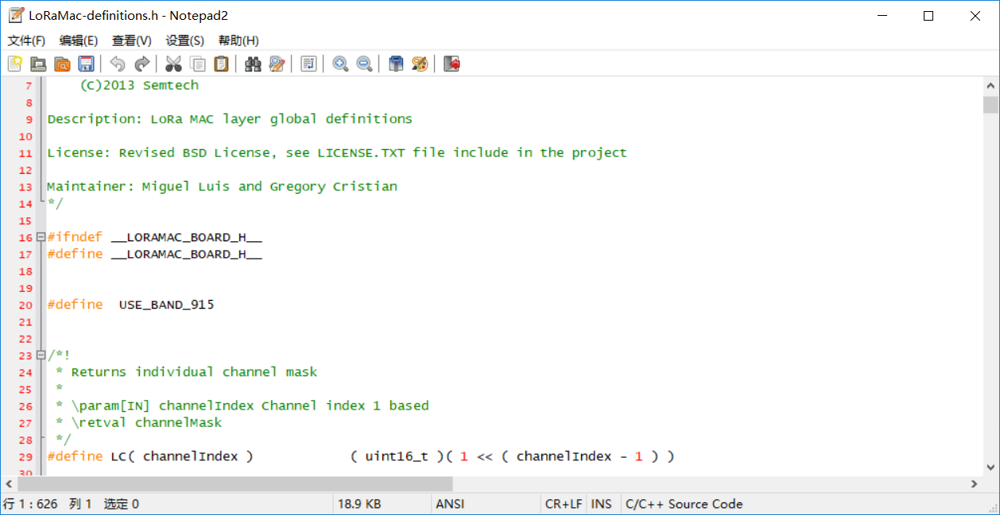
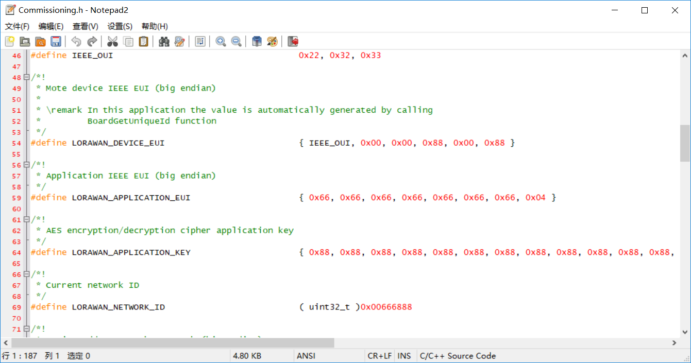
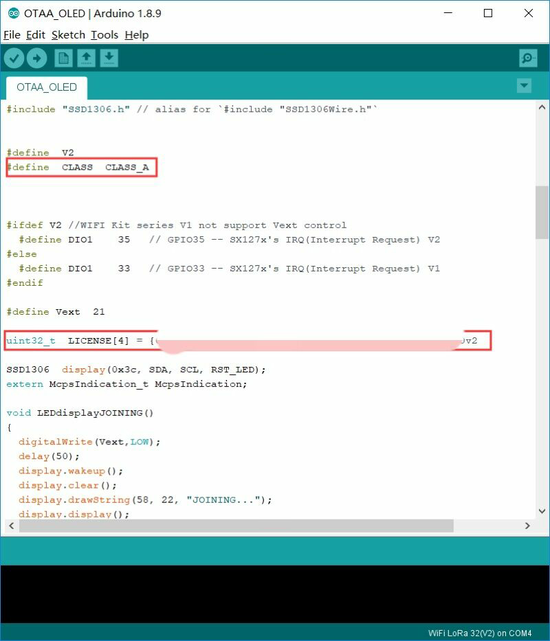
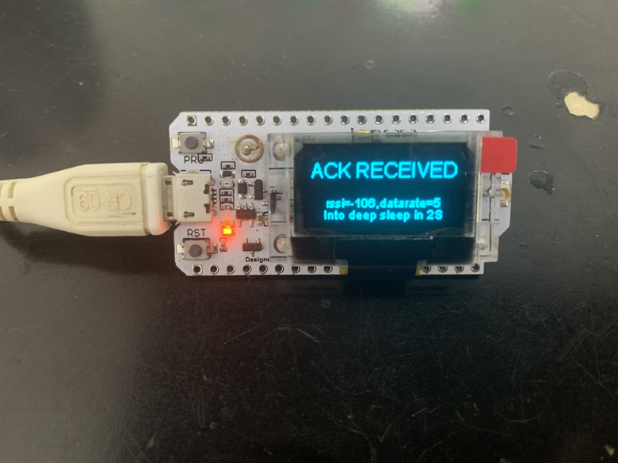

# Connect an "ESP32 + LoRa" node to a LoRa Gateway via LoRaWAN protocol

-------------------------------------------------------------------------------------------------------

## CONTENT

1. [Overview](#overview)

2. [Preparation](#preparation)

   2.1 [Installing Library](#installing-library)

3. [Configure node information](#configure-node-information)

## Overview

​		This article is intended to describe how to use the [ESP32LoRaWAN](https://github.com/HelTecAutomation/ESP32_LoRaWAN) library.

​		This library is make LoRaWAN 1.0.2 protocol running with ESP32. Only support the ESP32 + LoRa series products made by [HelTec Automation(TM)](heltec.org), and a [LoRa gateway](https://heltec.org/proudct_center/lora/lora-gateway/) is must needed.

​		To use this library you need the unique serial number of the device for heltec [WiFi_Kit_series](https://github.com/Heltec-Aaron-Lee/WiFi_Kit_series).

​		This library is transplanted form https://github.com/Lora-net/LoRaMac-node.

**[Heltec LoRa Node Family](https://docs.heltec.cn/#/en/products/lora/lora_node/heltec_lora_node_list_eu).**




----------
## Preparation
----------
- Arduino IDE.  How to install please click [here](https://docs.heltec.cn/#/en/user_manual/how_to_install_git_and_arduino).

- To use this library, you need to install the WiFi_Kit_series Arduino development environment first.How to install please click [here](https://docs.heltec.cn/#/en/user_manual/how_to_install_esp32_Arduino).

  For more : [WiFi_Kit_series](https://github.com/Heltec-Aaron-Lee/WiFi_Kit_series).
  
- How to get the unique serial number of the WiFi_Kit_series device, please check the library README [here](https://github.com/HelTecAutomation/ESP32_LoRaWAN#how-to-use-this-library).

- We need a gateway to connect to the TTN (for example, HT-M01), how to connect the gateway (HT-M01, HT-M02) to the TTN, please refer to [here](https://docs.heltec.cn/#/en/user_manual/how_to_connect_ht-m01_to_ttn-the-things-network).

- A [WiFi_LoRa_32-Board](https://heltec.org/project/wifi-lora-32/) or [Wireless Stick](https://heltec.org/project/wireless-stick/) and a premium USB cable.

- In this example, I use [HT-M01 Gateway](https://heltec.org/project/ht-m01/) and drive it through Windows **®** via USB, and use WiFi_LoRa_32-Board to quickly connect to TTN.

### Installing Library
----------
  To install this library:

  - install it using the Arduino Library manager ("Sketch" -> "Include Library" -> "Manage Libraries..."), or
  - download a zip file from GitHub using the "Download ZIP" button and install it using the IDE ("Sketch" -> "Include Library" -> "Add .ZIP Library..."
  - clone this git repository into your sketchbook/libraries folder.

  For more info, see https://www.arduino.cc/en/Guide/Libraries.


## Configure node information

First we have to create a new WiFi_LoRa_32-Board node in the TTN.


```Tip:: The Device EUI,App Key and App EUI of TTN should be consistent with the node

```


- I need the WiFi_LoRa_32-Board to work in the EU 868 band in Class A mode, which requires:


- And choose OTAA_OLED example.


Next we need to modify the node's access parameters.(Like fqz、DevEui、APPKEY)

1. Frequency setting

   Open the ```\ESP32_LoRaWAN\src\LoRaMac-definitions.h``` file

   Modify the twentieth line, for example ```#define USE_BAND_915```

   

2. Open the ```\ESP32_LoRaWAN\src\Commissioning.h``` file

   Modify the corresponding DevEui、AppKey，parameters.

   ```#define LORAWAN_DEVICE_EUI           { IEEE_OUI, 0x00, 0x00, 0x88, 0x00, 0x88 }```
   
   ```#define LORAWAN_APPLICATION_KEY           { 0x88, 0x88, 0x88, 0x88, 0x88, 0x88, 0x88, 0x88, 0x88, 0x88, 0x88, 0x88, 0x88, 0x88, 0x88, 0x88 }```
   
   
   
3. After modifying the network parameters, return to OTAA_OLED.ino
   
   Fill in the resulting serial number in the box and select the working mode of the device (default works in Class A)
   
   

Click upload, reset the node after the download is complete.


Return to TTN to view:


WiFi_Kit_series-Board has successfully connected to TTN!

Enjoy!