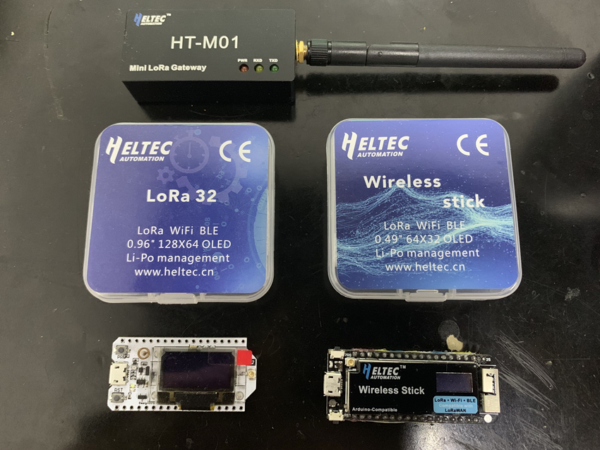

# Connect "ESP32 + LoRa" to LoRaWAN Server
[简体中文](https://heltec-automation.readthedocs.io/zh_CN/latest/esp32/lorawan/connect_to_gateway.html)

Before this operation, please read this document carefully: **[“ESP32 + LoRa” Node Preparation & Config Parameters](https://heltec-automation-docs.readthedocs.io/en/latest/esp32/lorawan/config_parameter.html)**

&nbsp;

## Connect to TTN

Before that, make sure there is a LoRa Gateway active in your TTN's account.

### Register a device

Register a new device in TTN's "Applications" page. The `Device ID`, `Device EUI`, `App Key` can be generated automatically, users need make sure the relevant parameter in ESP32 LoRa node is the same with TTN.

Correctly config LoRaWAN parameters for ESP32 LoRa node, please refer to [this document](https://heltec-automation-docs.readthedocs.io/en/latest/esp32/lorawan/config_parameter.html). If all goes well, we will be able to see Device is alive in "DEVICE OVERVIEW".

## Connect to ChirpStack

Coming soon.

## Important Hints

Please double check the following two things:

1. The LoRaWAN parameters is the same as server!
2. The listening frequency of your LoRa Gateway is the same as ESP32 LoRa node's sending frequency. We strictly follow [LoRaWAN™ 1.0.2 Regional Parameters rB](https://resource.heltec.cn/download/LoRaWANRegionalParametersv1.0.2_final_1944_1.pdf);

