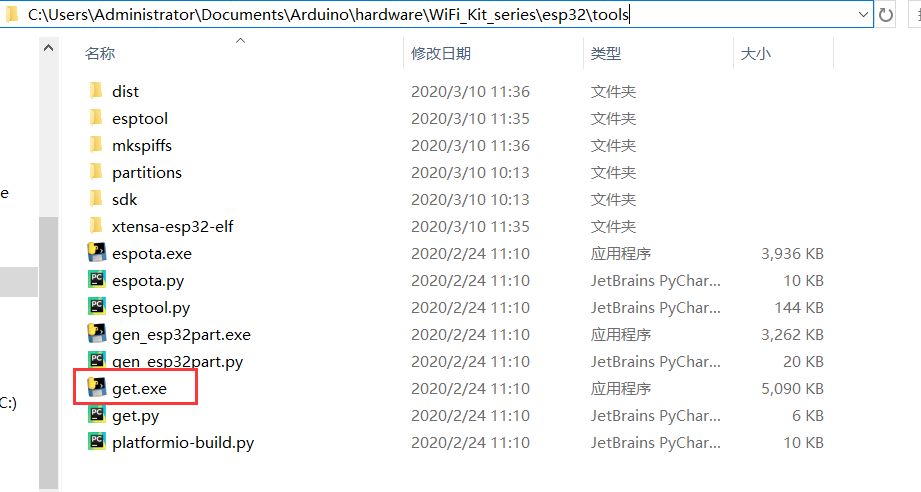
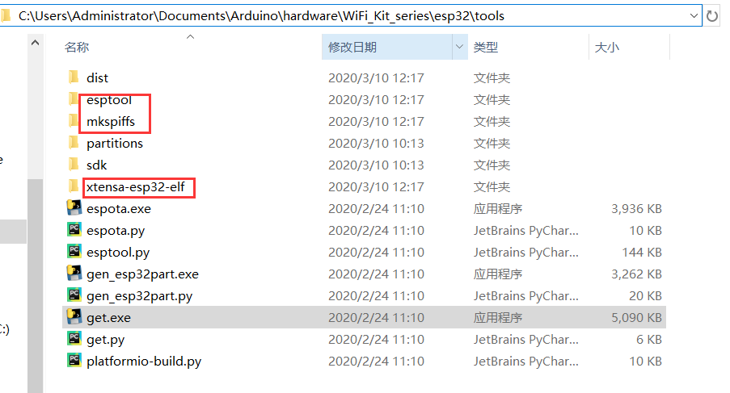

# Heltec ESP32+LoRa Series Quick Start

We suggest you confirm whether the `USB driver`, `Git` and `Arduino IDE` has installed first. If not, please view this two articles [establish serial connection](https://heltec-automation-docs.readthedocs.io/en/latest/general/establish_serial_connection.html) and [Install Git and Arduino IDE](https://heltec-automation-docs.readthedocs.io/en/latest/general/how_to_install_git_and_arduino.html).


## Setting Environment

### Via Arduino IDE

Only two steps to complete setting.

**Step1. Download Arduino-ESP32 Support.**

- Open Arduino IDE, and click `File`->`Peferences` .


&nbsp;


**Input the last ESP32 package URL:** [http://resource.heltec.cn/download/package_heltec_esp32_index.json](http://resource.heltec.cn/download/package_heltec_esp32_index.json)


- Click `Tools`->`Board:`->`Boards Manager...`, search `Heltec ESP32` in the new pop-up dialog, then click `install`


The source code of Heltec ESP series (ESP32 & ESP8266) framework available here: [https://github.com/Heltec-Aaron-Lee/WiFi_Kit_series](https://github.com/Heltec-Aaron-Lee/WiFi_Kit_series)


**Step2. Download the Heltec ESP32 Library**.

- Open Arduino IDE, then Select `Sketch`->`Include Library`->`Manage Libraries...`
  Search `Heltec ESP32` and install it.


The source code of `Heltec ESP32` library available here: [https://github.com/HelTecAutomation/Heltec_ESP32](https://github.com/HelTecAutomation/Heltec_ESP32)

### Via Git

1. Download and install Git from [git-scm.com](https://git-scm.com/downloads).

```Tip:: If you don&#39;t install Git, go to &quot;https://github.com/Heltec-Aaron-Lee/WiFi_Kit_series&quot; and choose &quot;Download ZIP&quot;, Unzip the file to &quot;C:\Users\Administrator\Documents\Arduino\hardware&quot;. Skip step two to step four.

```


2. Enter the path of `C:\Users\Administrator\Documents\Arduino\hardware  ` , Right click and Start ```Git Bash``` .

3. Input `git clone https://github.com/Heltec-Aaron-Lee/WiFi_Kit_series.git` and wait for it to download properly.


4. Open`C:\Users\Administrator\Documents\Arduino\hardware\WiFi_Kit_series\esp32\tools` and double-click `get.exe` .



5. When ```get.exe``` finishes, you should see the following files in the directory.



```Tip:: If the download fails, you need to run &quot;get.py&quot; again.

```

The Heltec ESP32 Library has been downloaded through the above steps, you can see it in the `esp32` folder.


&nbsp;

## Example

This section for verifying whether you can program with Arduino or not. Now, The USB cable connects to Heltec ESP32 board, then select your serial port which is connected to Heltec ESP32 board.

Select a demo example, compile and upload.

### 1. Execute a example likes `FactoryTest.ino`

- Correct select the board you had connected to computer and the specified serial port: e.g.Wireless Stick, WiFi LoRa 32, COM3(my PC is `COM3`)


- Then select an example likes `XXXXXX_FactoryTest.ino`


- Upload it


### 2. New a Heltec ESP32 program

Open Arduino IDE, create a new  `.ino` file, then copy the below code.

```arduino
#include <heltec.h>

// the setup routine runs once when starts up
void setup(){

  // Initialize the Heltec ESP32 object
  Heltec.begin(true /*DisplayEnable Enable*/, true /*LoRa Disable*/, true /*Serial Enable*/, true /*PABOOST Enable*/, 470E6 /**/);
}

// the loop routine runs over and over again forever
void loop() {

}
```

compile it and upload, the  screen (if this board has a screen) will show and Arduino's serial monitor will print something, it means Heltec ESP32 board is running successfully!

## Relevant Offical Resources

- ESP32 repository:[https://github.com/HelTecAutomation/Heltec_ESP32](https://github.com/HelTecAutomation/Heltec_ESP32)