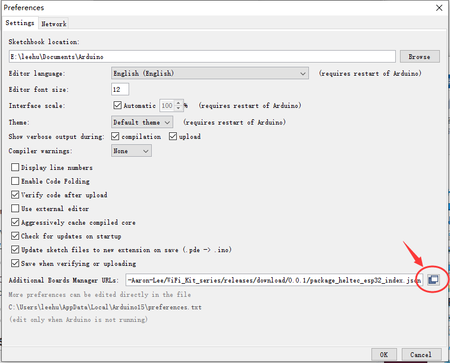
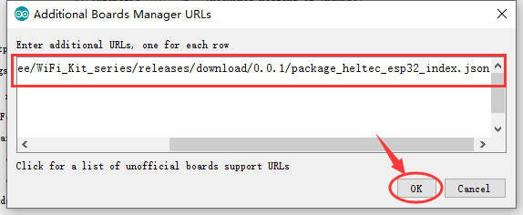
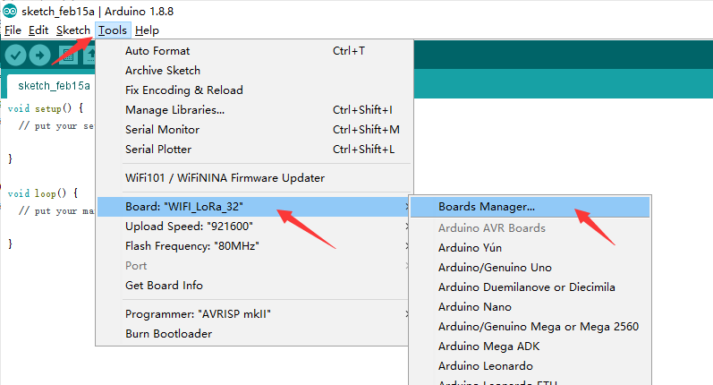
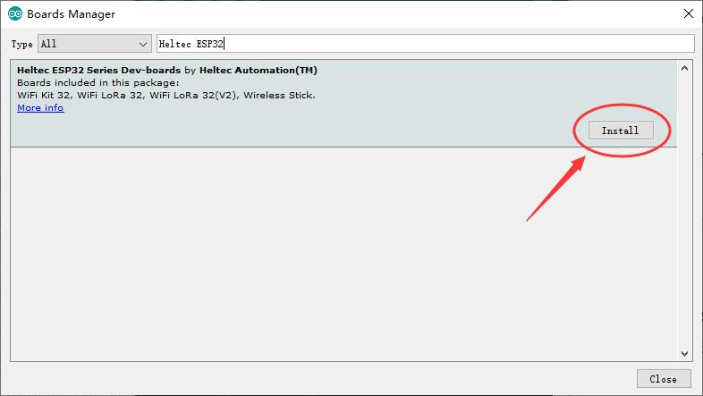
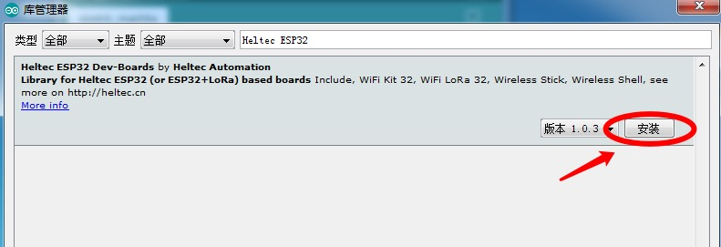
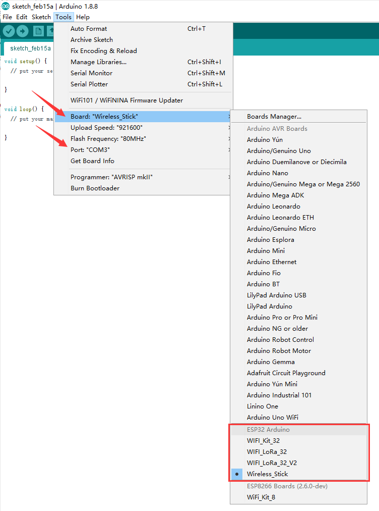
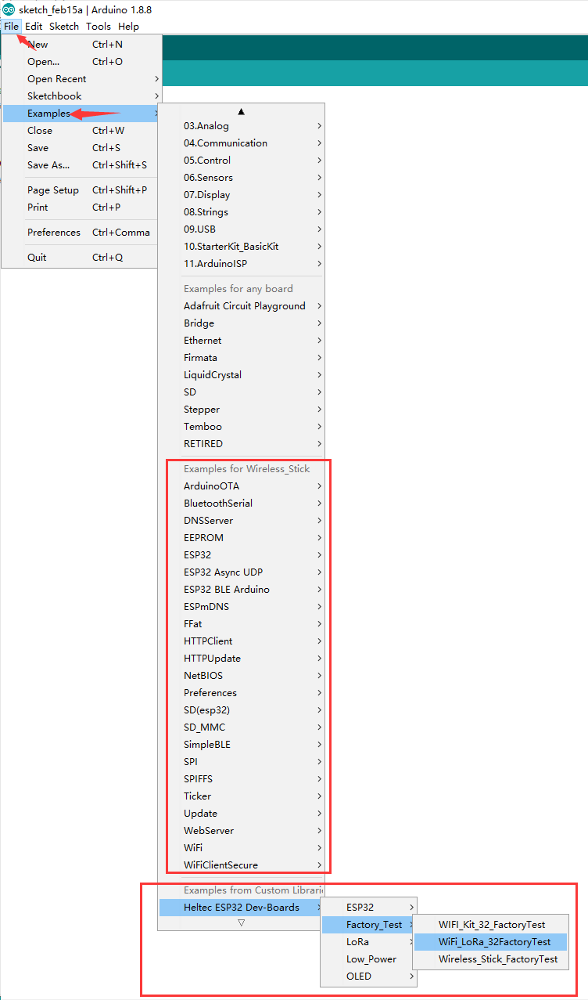

# Heltec ESP32+LoRa Series Quick Start

We suggest you confirm whether the `USB driver`, `Git` and `Arduino IDE` has installed first. If not, please view this two articles [establish serial connection](https://heltec-automation-docs.readthedocs.io/en/latest/general/establish_serial_connection.html) and [Install Git and Arduino IDE](https://heltec-automation-docs.readthedocs.io/en/latest/general/how_to_install_git_and_arduino.html).

**There are two method to install the development framework, choose on of they:**

- [Via Arduino Board Manager](#via-arduino-board-manager)
- [Via Git](#via-git)

&nbsp;

## Via Arduino Board Manager

### Step1. Download Arduino-ESP32 Support

- Open Arduino IDE, and click `File`->`Peferences` .


&nbsp;



**Input the last ESP32 package URL:** [http://resource.heltec.cn/download/package_heltec_esp32_index.json](http://resource.heltec.cn/download/package_heltec_esp32_index.json)



Click `Tools --> Board --> Boards Manager...`, search `Heltec ESP32` in the new pop-up dialog, then click `install`





The source code of Heltec ESP series (ESP32 & ESP8266) framework available here: [https://github.com/Heltec-Aaron-Lee/WiFi_Kit_series](https://github.com/Heltec-Aaron-Lee/WiFi_Kit_series)

### Step2. Download the Heltec ESP32 Library

Open Arduino IDE, then Select `Sketch`->`Include Library`->`Manage Libraries...`
Search `Heltec ESP32` and install it.




The source code of `Heltec ESP32` library available here: [https://github.com/HelTecAutomation/Heltec_ESP32](https://github.com/HelTecAutomation/Heltec_ESP32)

&nbsp;

## Via Git

- [For Windows](https://github.com/Heltec-Aaron-Lee/WiFi_Kit_series/blob/master/InstallGuide/windows.md)
- [For MacOS](https://github.com/Heltec-Aaron-Lee/WiFi_Kit_series/blob/master/InstallGuide/mac.md)
- For Linux
  - [Debian/Ubuntu](https://github.com/Heltec-Aaron-Lee/WiFi_Kit_series/blob/master/InstallGuide/debian_ubuntu.md)
  - [Fedora](https://github.com/Heltec-Aaron-Lee/WiFi_Kit_series/blob/master/InstallGuide/fedora.md)
  - [OpenSUSE](https://github.com/Heltec-Aaron-Lee/WiFi_Kit_series/blob/master/InstallGuide/opensuse.md)

&nbsp;

## Example

This section for verifying whether you can program with Arduino or not. Now, The USB cable connects to Heltec ESP32 board, then select your serial port which is connected to Heltec ESP32 board.

Select a demo example, compile and upload.

### Execute an example

Correctly select a board and relevant options in the `Tools` menu:



Then select an example likes `XXXXXX_FactoryTest.ino`



Compile & Upload


### New a Heltec ESP32 program

Open Arduino IDE, create a new  `.ino` file, then copy the below code.

```arduino
#include <heltec.h>

// the setup routine runs once when starts up
void setup(){

  // Initialize the Heltec ESP32 object
  Heltec.begin(true /*DisplayEnable Enable*/, true /*LoRa Disable*/, true /*Serial Enable*/, true /*PABOOST Enable*/, 470E6 /**/);
}

// the loop routine runs over and over again forever
void loop() {

}
```

compile it and upload, the  screen (if this board has a screen) will show and Arduino's serial monitor will print something, it means Heltec ESP32 board is running successfully!
