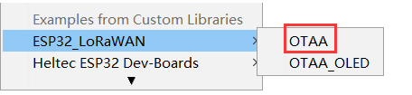
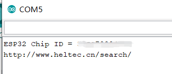

# View Limited Technical Data

## Schematic Diagram

```Tip:: Some schematic diagrams are restrictive technical data,it will become downloadable after purchase.Please refer to the following steps.

```

1.Choose an example from menu `File -- Examples -- ESP32 -- ChipID -- GetChipID`.



&nbsp;

2.Upload the code,open serial port,copy the Chip ID and open this link  [http://www.heltec.cn/search/](http://www.heltec.cn/search/).



You can also use this simple example to get your Chip ID.  [get Chip ID](https://github.com/Heltec-Aaron-Lee/WiFi_Kit_series/blob/master/esp32/libraries/ESP32/examples/ChipID/GetChipID/GetChipID.ino)

&nbsp;

3.Input the Chip ID,click `Confirm` .


&nbsp;

4.You can see some informations about this board,click`Relevant Resource` ，you can see the Pinout diagram,open the `limited` folder,you can see the Schematic diagram.


&nbsp;

**Tip: Because some of the previous product data has not been synchronized to the server, if you cannot succeed in this method, please click this link [https://docs.heltec.cn/](https://docs.heltec.cn/) to view and download.**

