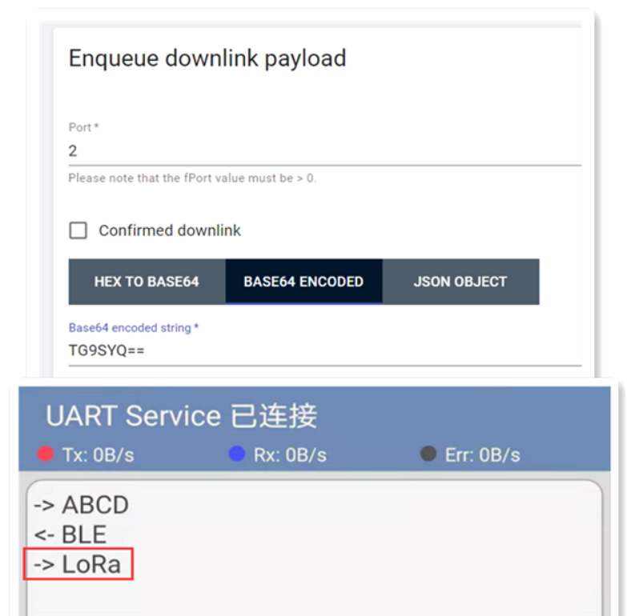

# Wireless Bridge BLE_LoRa Example User Manual

[简体中文](https://heltec-automation.readthedocs.io/zh_CN/latest/esp32/wireless_bridge/ble_lora_user_manual.html)

## Summary

This document will briefly introduce the usage of Wireless_Bridge BLE_LoRa example.

```Tip:: loraWanClass should choose CLASS_C

```

## Usage

Before starting the test, make sure that Wireless_Bridge can communicate with the gateway normally. To view Bluetooth messages, you need the corresponding Bluetooth debugging tools.

- After uploading the program to the development board, open the corresponding Bluetooth debugging tool and connect to the Bluetooth named "UART Service". When connecting, please note that the Bluetooth transmission parameters are consistent with the parameters in the program.


- After the Bluetooth connection is successful, the information sent through the Bluetooth debugging tool will be forwarded to LoRa. The information forwarded to LoRa needs to be decoded accordingly.


- The information sent via LoRa will be forwarded to Bluetooth, and can be viewed in the Bluetooth debugging tool.



- The corresponding decoding of this example is as follows:

```shell
function Decode(fPort, bytes) {
  var charValue1= String.fromCharCode(bytes[0]);
  var charValue2= String.fromCharCode(bytes[1]);
  var charValue3= String.fromCharCode(bytes[2]);
  var charValue4= String.fromCharCode(bytes[3]);
  var charValue= charValue1 + charValue2 + charValue3 + charValue4;
  var result={
    
                                                "char":{
                                                "charValue":charValue,
                                                       }
  }
  return result;
}
```
