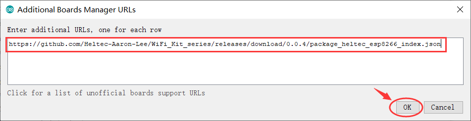
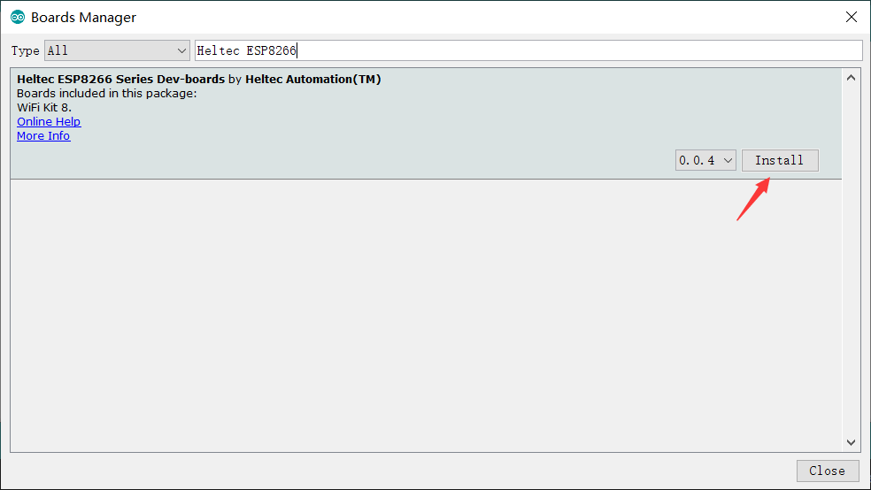
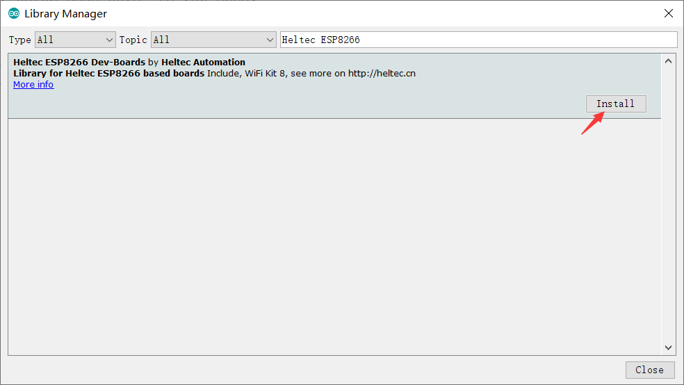

# Heltec ESP8266+Arduino Series Quick Start
[简体中文](https://heltec-automation.readthedocs.io/zh_CN/latest/esp8266+arduino/quick_start.html)

We suggest you confirm whether the `USB driver`, `Git` and `Arduino IDE` has installed first. If not, please view this two articles [establish serial connection](https://heltec-automation-docs.readthedocs.io/en/latest/general/establish_serial_connection.html) and [Install Git and Arduino IDE](https://heltec-automation-docs.readthedocs.io/en/latest/general/how_to_install_git_and_arduino.html).

**There are two methods to install the development framework, choose on of they:**

- [Via Arduino Board Manager](#via-arduino-board-manager)
- [Via Git](#via-git)

&nbsp;

## Via Arduino Board Manager

### Step1. Download Arduino-ESP8266 Support

Open Arduino IDE, and click `File`->`Peferences`.

**Input the last ESP8266 package URL:** [https://github.com/Heltec-Aaron-Lee/WiFi_Kit_series/releases/download/0.0.5/package_heltec_esp32_index.json](https://github.com/Heltec-Aaron-Lee/WiFi_Kit_series/releases/download/0.0.5/package_heltec_esp32_index.json)

Click `Tools`->`Board:`->`Boards Manager...`, search `Heltec ` in the new pop-up dialog, then click `install`.

The source code of Heltec ESP series (ESP32 & ESP8266) framework available here: [https://github.com/Heltec-Aaron-Lee/WiFi_Kit_series](https://github.com/Heltec-Aaron-Lee/WiFi_Kit_series)

### Step2. Download the Heltec ESP8266 Library

Open Arduino IDE, then Select `Sketch`->`Include Library`->`Manage Libraries...`
Search `Heltec ESP8266` and install it.

The source code of `Heltec ESP8266` library available here:[https://github.com/HelTecAutomation/Heltec_ESP8266](https://github.com/HelTecAutomation/Heltec_ESP8266)

&nbsp;

## Via Git

- For Windows: `https://github.com/Heltec-Aaron-Lee/WiFi_Kit_series/blob/master/InstallGuide/windows.md`
- For MacOS: `https://github.com/Heltec-Aaron-Lee/WiFi_Kit_series/blob/master/InstallGuide/mac.md`
- For Linux
  - Debian/Ubuntu: `https://github.com/Heltec-Aaron-Lee/WiFi_Kit_series/blob/master/InstallGuide/debian_ubuntu.md`
  - Fedora: `https://github.com/Heltec-Aaron-Lee/WiFi_Kit_series/blob/master/InstallGuide/fedora.md`
  - OpenSUSE: `https://github.com/Heltec-Aaron-Lee/WiFi_Kit_series/blob/master/InstallGuide/opensuse.md`

&nbsp;

## Example

This section is used to verify that Arduino programming can be used and that the environment is configured successfully.

- Select `Wifi Kit 8` development board.

- Select the corresponding example and upload.

If the screen or serial port has output, it means that the board runs successfully!