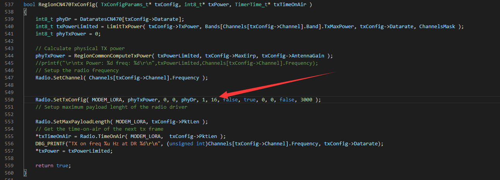

# Heltec<sup>TM</sup> Gateway Series Frequently Asked Questions
[简体中文](https://heltec-automation.readthedocs.io/zh_CN/latest/gateway/frequently_asked_questions.html)

This page contains the most frequently questions from user. If this page's detail can't solve your problem, you can also talk in our forum: [community.heltec.cn](http://community.heltec.cn/)

&nbsp;

## HT-M02 Change Frequency Band

To change the HT-M02 gateway frequency band, just execute the following command.

```shell
sudo cp -f /home/debian/lora/lorasdk/lora_conf_CN470.json /home/debian/lora/packet_forwarder/lora_pkt_fwd/lora_conf.json
```

Among them, "lora_conf_CN470.json" can be replaced with "lora_conf_EU433.json", "lora_conf_EU868.json", and "lora_conf_US915.json", which correspond to the corresponding frequency bands.

&nbsp;

## Fix Preamble Length to Fit HT-M00 Dual-Channel Gateway

Because the HT-M00 use two SX1276 LoRa chips and a digital base band program running in ESP32, so the node must fix preamble length to work with HT-M00.

```Tip::  The preamble length modified node can still work normally with the gateway using SX1301/2/8

```

The LoRaWAN-Node code used by our [node products](https://docs.heltec.cn/#/en/products/lora/lora_node/heltec_lora_node_list?id=heltec-lora-node-products-difference-table), we transplanted the [LoRaMac-Node code from Semtech](https://github.com/Lora-net/LoRaMac-node), usually modified in the RegionXXX.c.

For example, I need fix the preamble length of CN470, so I need first open the RegionCN470.c, in the RegionCN470TxConfig function, and modify that. *The 16 is already modified by us.*



&nbsp;

## How to View the Gateway Logs

The gateway log is very important in many debug situations. Mainly can be used to verify if the gateway had received the LoRaWAN messages from LoRa Nodes correctly.

If the gateways made by [Heltec Automation](https://heltec.org) driven by Linux, there will have a service named `lrgateway`, view the gateway logs via this command:

`journalctl -f -n 100 -u lrgateway`


**The following gateways can use this command:**

- [HT-M01 Evaluation Gateway](https://heltec.org/project/ht-m01/) driven by Raspberry Pi;
- [HT-M02 Edge LoRa Gateway](https://heltec.org/project/ht-m02/).