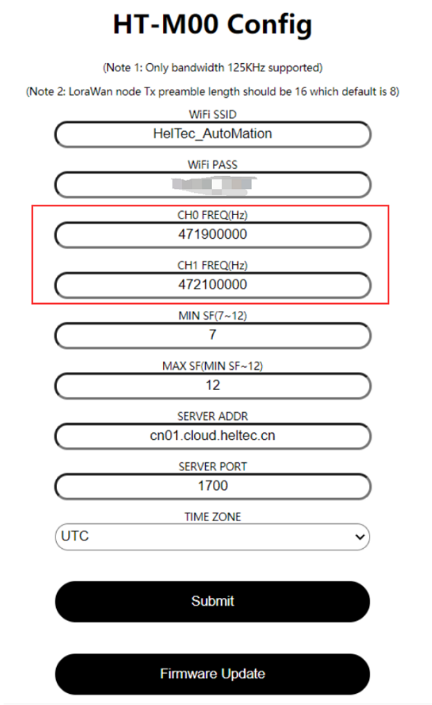

# Connect Nodes to HT-M00

[简体中文](https://heltec-automation.readthedocs.io/zh_CN/latest/gateway/ht-m00/connect_to_server.html)

## Summary

This article aims to describe how to connect nodes to [HT-M00 Gateway](https://heltec.org/project/ht-m00/), which facilitates secondary development and rapid deployment of LoRa devices. HT-M00 is a dual-channel gateway. To ensure good communication between the node and the gateway, the channel used by the node must correspond to that of the HT-M00 gateway. This document takes CN470 as an example.

Before all operation, make sure the HT-M00 and nodes are runing well . If not, please refer to this [HT-M00 Quick Start](https://heltec-automation-docs.readthedocs.io/en/latest/gateway/ht-m00/qucik_start.html) document.

```Tip:: If the node channel is more than the gateway channel and the gateway channel is included, then the node channel can only enter the network when the node channel matches the gateway channel. If the node channel does not include the gateway channel, the node cannot enter the network.

```

&nbsp;

## Channel Frequency


CN470 corresponds to a total of 96 channels from 470.3MHz to 489.3MHz. For every 200kHz increase in frequency, the channel code increases by 1, namely:

freq=470.3+0.2*N（N is the channel coding 0-95）

Let's look at the code: (in the `.ino` file corresponding to LoRaWAN)

Refer to "LoRaWAN" for CubeCell series and refer to "OTTA" for ESP32 series.


This is 6 arrays of all LoRaWAN protocol channels defined for CN470. In userChannelsMask[0], 0x00FF means to use the first 0-7 channels, which are 470.3MHz, 470..5MHz, 470.7MHz...471.7MHz. Converting hexadecimal FF to binary is 11111111. The 11111111 from low bits to high bits correspond to the first 0-7 channels, that is, the last 1 corresponds to channel 0, and the first 1 corresponds to channel 7. When you modify "userChannelsMask[0]=0x0001", it means that the channel is changed to 0, which is 470.3MHz, When you modify "userChannelsMask[0]=0x0080", it means that the channel is changed to 7, which is 471.7MHz, When you modify "userChannelsMask[0]=0xFF00", it means that the channels are changed to 8-15, which are 471.9MHz, 472.1MHz, 472.3MHz...473.3MHz.

&nbsp;

## Instructions for Use

The web configuration interface of HT-M00 is as follows.



In the configuration interface of HT-M00, the two channel frequencies of the gateway will be configured. We need to make the channel used by the node correspond to these two channels, that is, modify the channel mask in the corresponding program.

Take the CubeCell series as an example:


If the gateway configuration channel is 471.9MHz and 472.1MHz, use 9,10 channels. In the LoRaWAN program, you should modify"userChannelsMask[0]=0x0300".