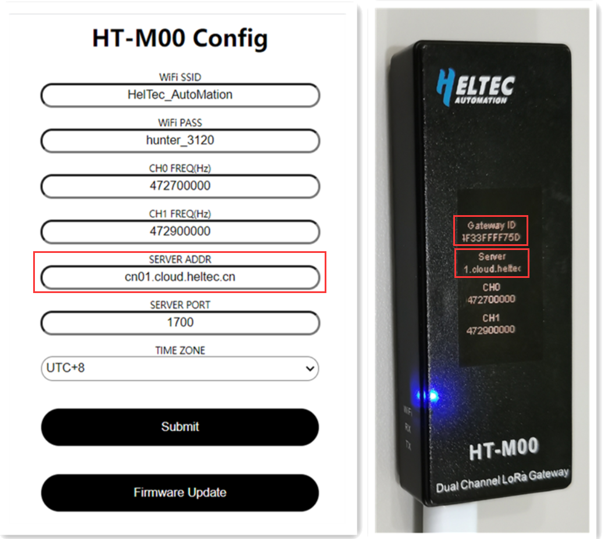
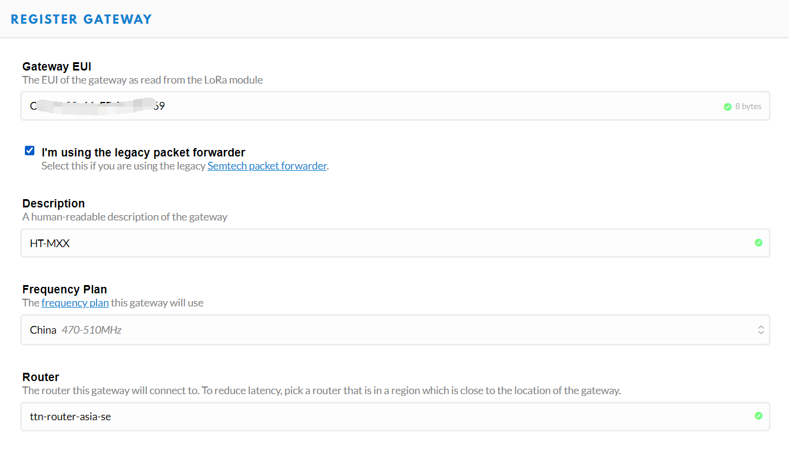

# Connect HT-M00 to a LoRa Server
[简体中文]()

## Summary

This article aims to describe how to connect [HT-M00 Gateway](https://heltec.org/project/ht-m00/) to a LoRa server, such as [TTN](https://www.thethingsnetwork.org/), [ChirpStack](https://www.chirpstack.io/), which facilitates secondary development and rapid deployment of LoRa devices.

Before all operation, make sure the HT-M00 is runing well . If not, please refer to this [HT-M00 Quick Start]() document.

&nbsp;

To connect the HT-M00 gateway to the LoRa server, you only need to add the corresponding gateway on the server after configuring the HT-M00.

- When configuring HT-M00, It should be noted that "SERVER ADDR" is consistent with the server address. When creating a new gateway in the server, it should be noted that "Gateway ID" is consistent with the gateway ID of HT-M00.



```Tip:: The gateway ID of each HT-M00 gateway is different and cannot be changed.

```

&nbsp;

## Connect to TTN

### Register a LoRa gateway in TTN

Create and active an account in TTN. Select ```Gateway``` in the [console](https://console.thethingsnetwork.org/) page.


Fill in the HT-M00 information as shown below and complete the addition.



- **Gateway EUI** -- The unique ID of HT-M00 gateway;
- **I'm using the legacy packet forwarder** -- Must select this;
- **Frequency Plan** -- Must matach the LoRa band configuration in HT-M00.
- **Router** -- Must use the default router allocated by TTN system.

``` Tip:: That four points are the key to success connection with TTN.

```


### Connecting

Users only need config the server address and port in the  HT-M00 gateway. The server address and port are configured in the "HT-M00 Config" interface, Please refer to [HT-M00 Quick Start]() document.

The TTN's router addresses for different region:

[https://www.thethingsnetwork.org/docs/gateways/packet-forwarder/semtech-udp.html#router-addresses](https://www.thethingsnetwork.org/docs/gateways/packet-forwarder/semtech-udp.html#router-addresses)


View gateway status, it is runing:


&nbsp;

## Connect to ChirpStack server

[ChirpStack](https://www.chirpstack.io/) is the most popular LoRa server open source project, widely used in many fields, and also the best choise for a private LoRa server.

- ChirpStack Installation guide: [https://www.chirpstack.io/overview/](https://www.chirpstack.io/overview/)
- ChirpStack support forum: [https://forum.chirpstack.io/](https://forum.chirpstack.io/)

### ChirpStack Gateway Bridge

**One thing need attention!** the ChirpStack need a special service named `Gateway Bridge`, which converts LoRa® Packet Forwarder protocols into a ChirpStack Network Server common data-format(JSON and Protobuf).

the `Gateway Bridge` service can running on the Raspberry Pi or the ChirpStack server.

Install ChirpStack Gateway Bridge: [https://www.chirpstack.io/gateway-bridge/install/debian/](https://www.chirpstack.io/gateway-bridge/install/debian/)

### Register LoRa Gateway in ChirpStack

Fill in the HT-M00 information as shown below and complete the addition.


- **Gateway ID** -- The unique ID of the HT-M00 gateway, view it from the display of HT-M00.

View gateway status, it is runing:


&nbsp;

## Connect to HelTec server

Coming soon.