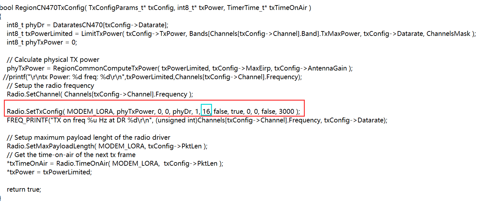
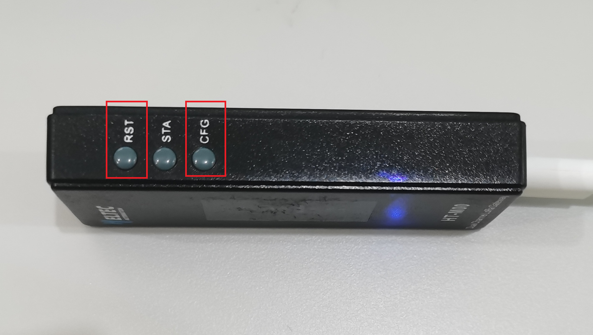
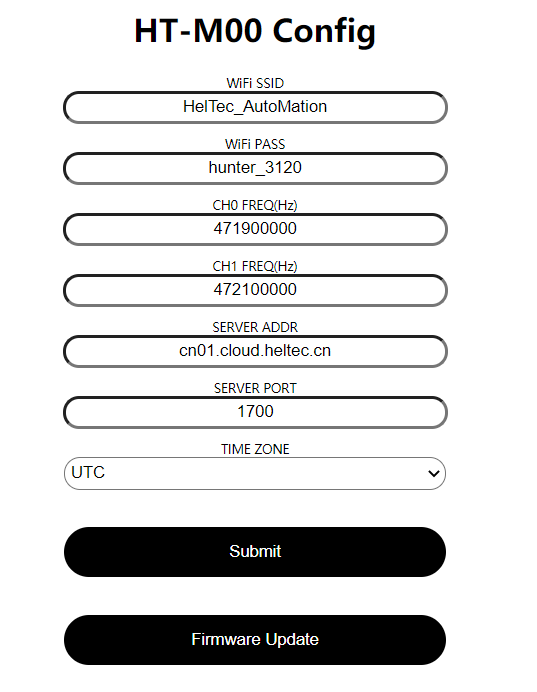
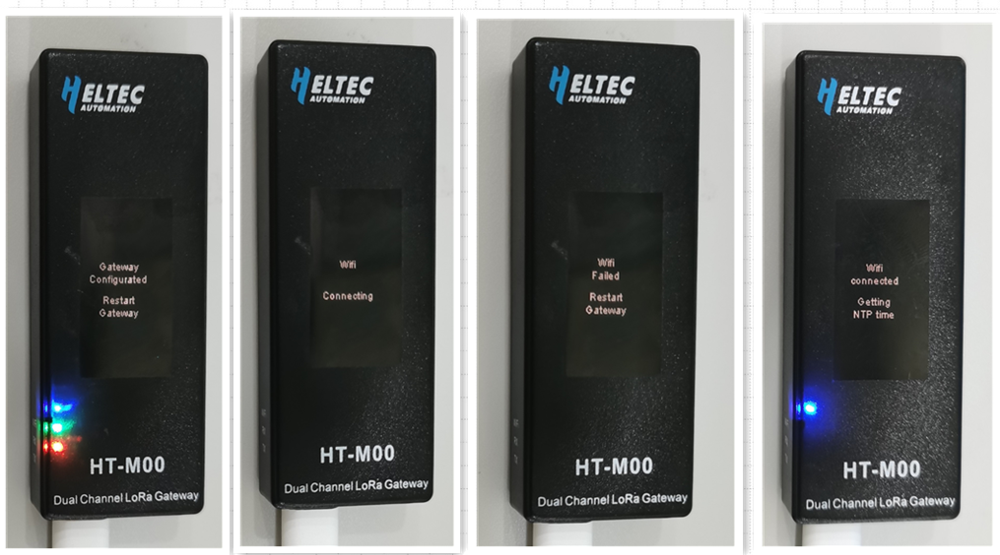
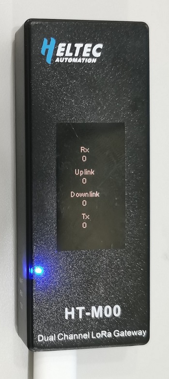
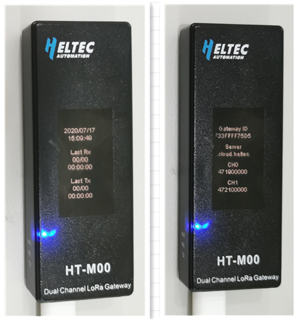

# HT-M00 Dual Channel LoRa Gateway Quick Start
[简体中文](https://heltec-automation.readthedocs.io/zh_CN/latest/gateway/ht-m00/quick_start.html)

## Summary

HT-M00 is a small, low-cost dual-channel LoRa gateway, Use Type-C interface. The HT-M00 gateway drives two SX1276 chips based on ESP32. We have written a software mixer (baseband simulation program) to monitor the spreading factor of 125KHz SF7~SF12. The main function of HT-M00 is to provide LoRaWAN network for large houses of 1500~2000 square meters, or to make up for the blind spots of the signal in the area that the SX1301 gateway signal cannot cover.


```Tip:: When using the HT-M00 gateway, using nodes other than the company's CubeCell series, you need to change the node's preamble length to 16 (default is 8). If the preamble length is 8, the minimum SF and the maximum SF need to be set equal, otherwise only the minimum SF will be received. For example, the length of the node's preamble length is 8, and the gateway sets the minimum SF to 7 and the maximum SF to 12, then only SF7 will be received.

```



Modify the preamble length in this function to 16 as shown in the figure above.

&nbsp;

## Configure the gateway

The HT-M00 gateway has already downloaded the relevant program when it leaves the factory, you can use it with just a few simple operations.



- After powering on the gateway through the Type-C data cable, keep pressing the "CFG" button, press the "RST" button, then release the "RST" button, After the gateway enters the interface as shown in the figure below, release the "CFG" button.


- At this time, find the WiFi named "M00_XXXX", connect to the WiFi with the password "heltec.org", then enter "192.168.4.1" through the browser, enter the gateway configuration page.

  

- In the page shown above, configure the WiFi information that HT-M00 needs to connect to, gateway channel frequency, sf, server address and port, time zone, and click "Submit" after the configuration is complete. At the same time, we will put the relevant firmware of HT-M00 on this webpage, and click "Firmware Update" to update accordingly.
- The gateway will restart after the configuration is completed and submitted. When the gateway is turned on, it will automatically connect to the configured WiFi. If the connection fails, it will restart again until the connection is successful.



- After the WiFi connection is successful, the gateway will enter the interface shown in the figure below.



- Press the "STA" button to switch the display content.

  

- By pressing the "STA" button, you can switch the display content. You can view information such as time, latest sending and receiving time, gateway ID, server address, channel frequency, etc.


