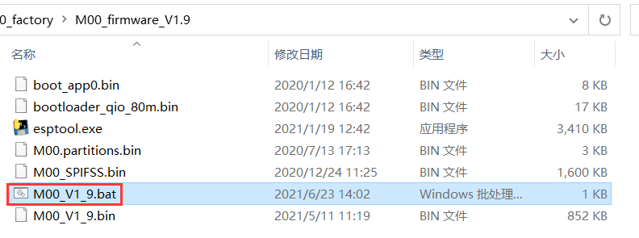
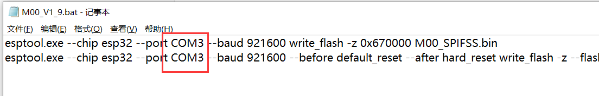

# HT-M00 Firmware Upgrade

[简体中文](https://heltec-automation.readthedocs.io/zh_CN/latest/gateway/ht-m00/update_firmware.html)


## Summary

This article aims to describe how to upgrade the HT-M00 firmware and the processing method of overwriting the HT-M00 firmware.

```Tip:: Since the HT-M00 firmware version V1.8 has updated the gateway activation code algorithm. Therefore, upgrading from V1.7 and below to V1.8 and above requires reactivating the HT-M00 gateway. Please send the gateway ESP32 chip ID to "support@heltec.cn", we will recalculate the activation code for you and upload it to the server.

```

```Tip;; If your gateway ID is occupied, in order to avoid occupying other gateway IDs when modifying the gateway ID, please modify the "FFFF" part in the middle, thank you!

```

&nbsp;

## Firmware Upgrade Logs

- V1.7
  - Add noise floor automatic calibration function;
  - Known bug fix.
- V1.8
  - Timing check SX1276 working status, if the SX1276 chips working not normal, system auto reset.
- V1.9
  - Add preamble length parsing function. If the json package sent by the server has a pream field, HT-M00 will parse and forward it.
- V2.0
  - Add DHCP support in Wi-Fi connection;
  - The upstream and downstream ports can be set separately;
  - Can modify the heartbeat cycle by yourself.
  - Can modify the gateway ID by yourself.

&nbsp;

## Upgrade Firmware

Download [HT-M00 corresponding upgrade firmware](https://resource.heltec.cn/download/HT-M00/firmware)。


Enter the HT-M00 gateway configuration interface by connecting to the HT-M00 WiFi(can refer to [HT-M00 Quick Start](https://heltec-automation-docs.readthedocs.io/en/latest/gateway/ht-m00/quick_start.html))，click "Firmwaer Update"。


Click "Select firmware" to select the corresponding upgrade firmware that has been downloaded, and click "Update" to upgrade.


After the upgrade is complete, a corresponding prompt will pop up and restart the gateway.


&nbsp;

## The Processing Method of Overwriting the HT-M00 Firmware

### Download Firmware

Download [HT-M00 complete Firmware](https://resource.heltec.cn/download/HT-M00/firmware/complete_firmware)。

Open the downloaded file and edit the "M00_Vx_x.bat" file.



Change the COM port to the COM port corresponding to HT-M00.



After the modification is completed, run "M00_Vx_x.bat" to complete the gateway firmware upload.

### Activate the Gateway

After the firmware download is complete, open the serial port corresponding to the HT-M00 and read the corresponding ESP32 chip ID of the gateway.


Enter [https://resource.heltec.cn/search](https://resource.heltec.cn/search), enter the ESP32 chip ID to query the serial number corresponding to the gateway.


Open the serial port corresponding to the HT-M00, and send the command "AT+CDKEY=xxxxxxxxxxxxxxxxxxxxxxxxxxxxxxxx" through the serial port to activate the gateway. Among them, "xxxxxxxxxxxxxxxxxxxxxxxxxxxxxxxx" is the 32-bit license. For example, if the license is 0x12345678, 0x12345678, 0x12345678, 0x12345678, the activation command is AT+CDKEY=12345678123456781234567812345678.


After the screen displays normally, the gateway is activated successfully.


```Tip:: For lower version firmware, the firmware can be upgraded according to the "firmware upgrade" method.

```

