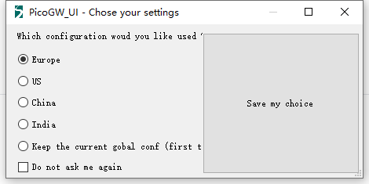
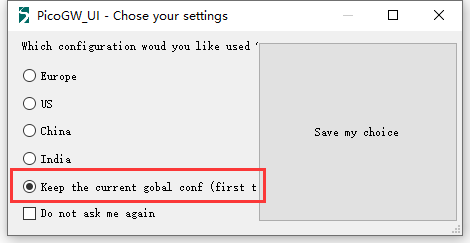

# Add More Region Support on PicoGW UI

## Summary

[PicoGW UI](http://resource.heltec.cn/download/HT-M01/PicoGW_UI_Release_V1.0.3.4.zip) is provided by Semtech®, allow users running a Pico Cell LoRa Gateway ([HT-M01](https://heltec.org/project/ht-m01)) on Windows® with directly UI.

But PicoGW_UI only provided four region support by default.

## Add More Region Support

*Suppose you need to add support for AU915_SB2 ([AU915 Sub-band 2 for TTN](https://heltec-automation-docs.readthedocs.io/en/latest/general/sub_band_usage.html))*

- Clone or download this repository: [https://github.com/HelTecAutomation/lorasdk](https://github.com/HelTecAutomation/lorasdk);
-  Rename `global_conf_AU915_SB2.json` to `global_conf.json`;
- Copy `global_conf.json` to `C:\Users\user name\AppData\Roaming\Semtech\PicoGW_UI` path and replace the current one;
- Reopen PicoGW_UI and choose `Keep the current gobal conf`.

Now, the PicoGW_UI will work on the definition of `global_conf.json`.

&nbsp;

## External resources

- [LoRaWAN regional parameters](https://lora-alliance.org/sites/default/files/2018-04/lorawantm_regional_parameters_v1.1rb_-_final.pdf)