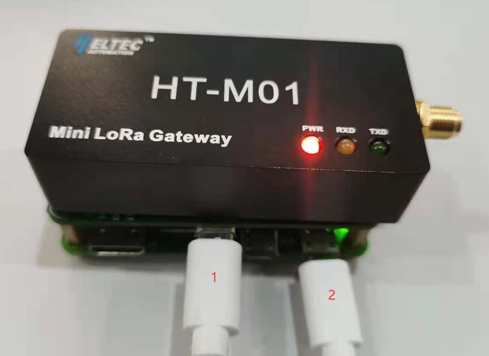
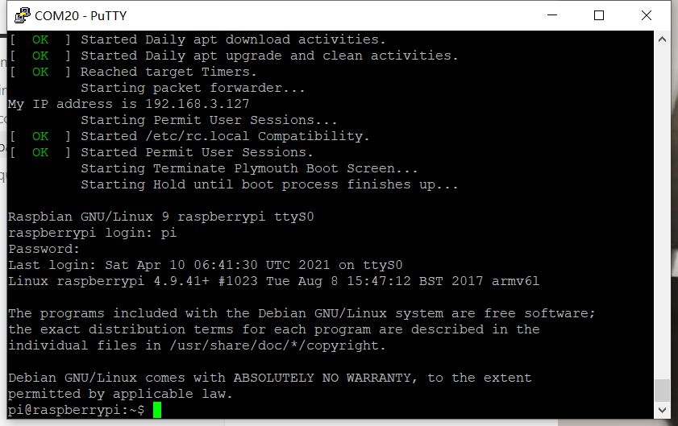
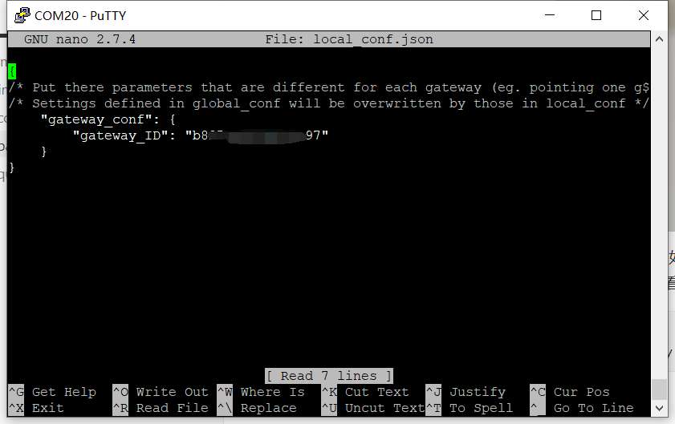
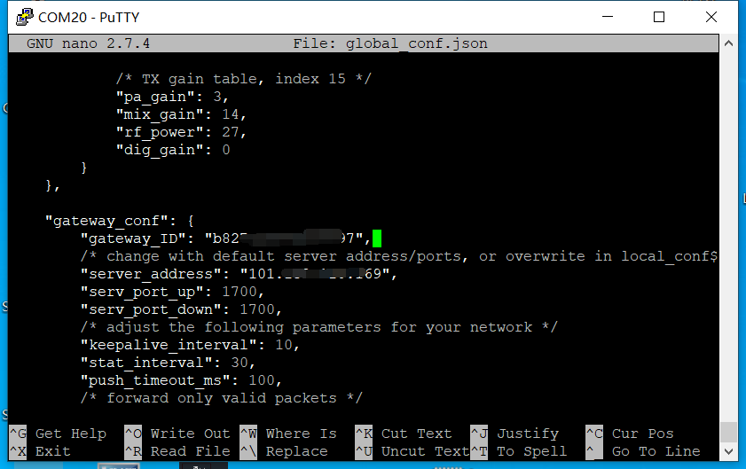

# HT-M01 Package Two User Manual

[简体中文]()

## Summary

After the user purchases the HT-M01 package two, we will configure the corresponding software for the gateway and the Raspberry Pi. After the user obtains the gateway and the Raspberry Pi, they only need to create the corresponding gateway and node on the corresponding server to use it normally. [HelTec server](http://cloud.heltec.org/) is used by default, and users need to log in with a HelTec account, which can be registered on the official website. The user can also modify the server address to use other servers.

&nbsp;

## View and modify gateway information

- Power-on the gateway and Raspberry Pi as shown in the figure below, where "1" is the serial cable and "2" is the power cable. If you use it directly without modifying the Raspberry Pi configuration, you only need to connect the "2" power cable.



- Open the corresponding serial port of the Raspberry Pi through the serial port tool (such as "[putty](https://www.chiark.greenend.org.uk/~sgtatham/putty/latest.html)"), you can see that the serial port will print the startup log information of the Raspberry Pi. And log in with the default user name and password (in the Linux system, there is no change in the process of entering the password through the command line).

```shell
username：pi
password：raspberry
```



- The gateway ID can be viewed in "/home/pi/lora/packet_forwarder/lora_pkt_fwd/local_conf.json".



- The gateway ID and server address can be modified in "/home/pi/lora/packet_forwarder/lora_pkt_fwd/ global_conf.json".



- After creating the corresponding gateway and node in the corresponding server, you can view the uplink and downlink information. If you use the default [HelTec server](http://cloud.heltec.org/), you need to log in with your HelTec account, which can be registered on the official website.

