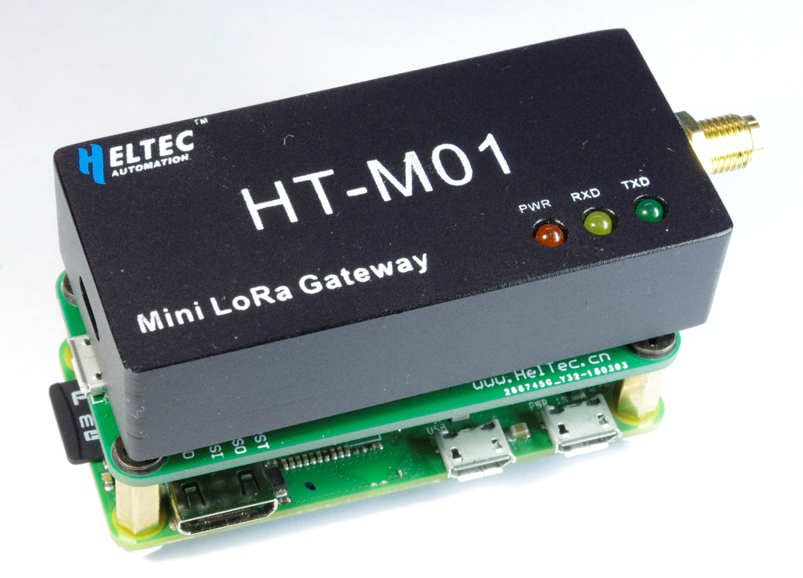
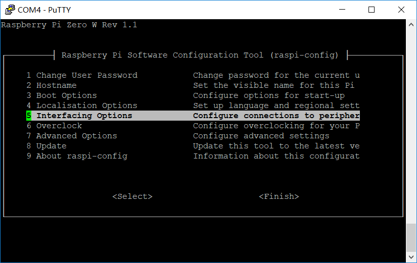

# HT-M01 Mini LoRa Gateway Quick Start

## Summary

The HT-M01 LoRa Gateway supports both USB and SPI mode. The SPI mode can only running with Linux systems (Raspberry PI), the USB mode can be used on Linux and Windows<sup>®</sup>. generally speaking, to make HT-M01 running, just chose one of the following three methods:

- **Linux (Raspberry PI)**
  - [SPI mode](#spi-mode)
  - [USB mode](#usb-mode)
- **Windows<sup>®</sup>**
  - [USB mode for Windows<sup>®</sup>](#usb-mode-for-windows-®)

For Linux user, we highly recommend use

## Use HT-M01 with Linux (Raspberry PI)

Before all operation, make sure you have a Raspberry Pi that works and can connect to WiFi. In this document, we used [Raspberry Pi Zero W](https://www.raspberrypi.org/products/raspberry-pi-zero-w/).

```Tip:: As we tested, Raspberry Pi 2, 3, 3B are also worked.

```

**[Raspberry Pi Configuration]()**

### SPI mode

Have a [PRI to HT-M01 converter](https://heltec.org/product/m01-converter/) will make your operation more easy.



The Raspberry Pi SPI bus is disabled by default. Enter the following command in putty to open the Raspberry Pi configuration interface and enable the SPI bus.

`sudo raspi-config`



Choose `Interfacing Options → SPI → Yes` and may need restart Raspberry Pi.

Install HT-M01 relevant application and services via following commands:

```shell
mkdir lora
cd lora
sudo apt-get update
sudo apt-get install git
git clone https://github.com/Lora-net/lora_gateway.git
# LoRa Gateway drivers
git clone https://github.com/Lora-net/packet_forwarder.git
# packet forwarding software
git clone https://github.com/HelTecAutomation/lorasdk.git
# This package will create a "lrgateway" service in Raspberry Pi
cd /home/pi/lora/lora_gateway
make clean all
cd /home/pi/lora/packet_forwarder
make clean all
cd /home/pi/lora/lorasdk
chmod +x install.sh 
./install.sh
#Run the script. After the script is run, it will create a service named "lrgateway". The purpose is to make the lora driver and data forwarding program run automatically at startup.
sudo cp -f /home/pi/lora/lorasdk/global_conf_EU868.json /home/pi/lora/packet_forwarder/lora_pkt_fwd/global_conf.json
#the "global_conf_EU868.json" may need change to your need.
```

### USB mode

Before proceeding with the following operations, use a high-quality Micro USB cable to connect the HT-M01 Gateway to the Raspberry Pi, otherwise it will cause a lot of problems! Enter the following commands:

```shell
mkdir lora
cd lora
sudo apt-get update
sudo apt-get install git
git clone https://github.com/Lora-net/picoGW_hal.git
git clone https://github.com/Lora-net/picoGW_packet_forwarder.git
git clone https://github.com/HelTecAutomation/picolorasdk.git
cd /home/pi/lora/picoGW_hal
make clean all
cd /home/pi/lora/picoGW_packet_forwarder
make clean all
cd /home/pi/lora/picolorasdk
chmod +x install.sh
./install.sh
#Run this script will create a service named "lrgateway". The purpose is to make the lora driver and data forwarding program run automatically at startup.
sudo cp -f /home/pi/lora/picolorasdk/global_conf_CN470.json /home/pi/lora/picoGW_packet_forwarder/lora_pkt_fwd/global_conf.json
#Put the configuration file on the specified path
```

Confirm Installation

Run `sudo systemctl status lrgateway` in Raspberry Pi, if all goes well, the service is running:


## Use HT-M01 with Windows<sup>®</sup>

### USB mode

Install [PicoGW UI](http://resource.heltec.cn/download/HT-M01/PicoGW_UI_Release_V1.0.3.4.zip) **before** connect HT-M01 to a Windows<sup>®</sup> computer. then with HT-M01 connected, you will see a serial device in Windows<sup>®</sup> device manager.


## Connect to TTN

Select ```Gateway``` in the TTN's console.


Fill in the HT-M01 information as shown below and complete the addition.


- If you are using packet_forwarder_UI in Windows® and forwarding the message to the TTN, you need to:

1. Select the frequency band.
2. Check the box to the contents.
3. Click OK to start forwarding.


- If you are using packet_forwarder forwarding in Raspberry Pi (Linux)
  The global_conf file needs a few changes. To edit it type:

```
  nano /home/pi/lora/packet_forwarder/lora_pkt_fwd/global_conf.json/global_conf.json
```
  At the end of the file make these changes:


  ```
  “gateway_ID”: “YOUR_GATEWAY_ID”,
  “server_address”: “router.eu.thethings.network”,
  “serv_port_up”: 1700,
  “serv_port_down”: 1700,
  ```

  Where **"YOUR_GATEWAY_ID"** fills in the Gateway ID obtained when configuring the Raspberry Pi.

  Restart the forwarding service after the change is complete.

  Going back to TTN, you will get this:


At this point, the HT-M01 has successfully connected to the TTN.