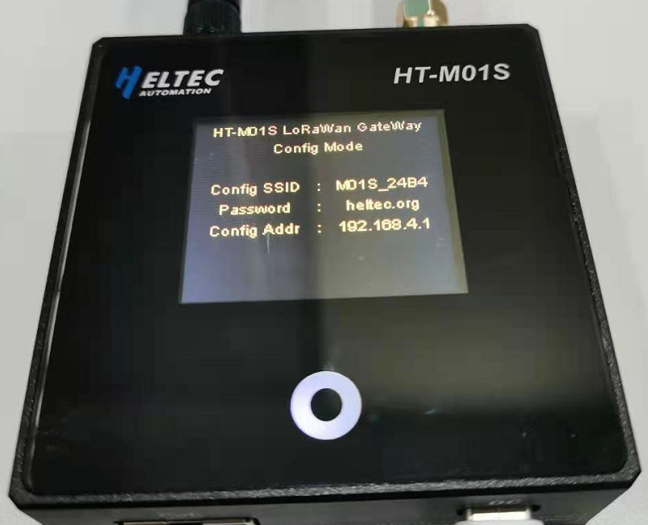

# HT-M01S Indoor LoRa Gateway Quick Start

[简体中文](https://heltec-automation.readthedocs.io/zh_CN/latest/gateway/ht-m01s/quick_start.html)

## Summary

HT-M01S is positioned as a low-cost standard gateway for indoor use. LoRa part based on the SX1308 + 1255/7 structure,  we innovatively use ESP32 as the main control chip, and completely transplant the hardware driver, data forwarding and message queue of SX1308 to the ESP32 platform. There is no need to run the Linux operating system separately. It is simpler and more convenient to use. It can be connected to the cloud server via Wi-Fi or Ethernet, can be powered by Type-C_5V or PoE, and has a 1.8-inch TFT display under the tempered glass panel to display gateway information.

&nbsp;

## Configure the gateway

```Tip:: If your gateway ID is occupied, in order to avoid occupying other gateway IDs when modifying the gateway ID, please modify the "FFFF" part in the middle, thank you!

```

The HT-M01S gateway has already downloaded the relevant program when it leaves the factory, and it can be used with only a few simple operations.

### Firmware version V1.2 and below


- After the gateway is powered on through Type-C or PoE, keep pressing the "+" button, then press the "RST" button, and then release the "RST" button. After the gateway enters the interface shown in the figure below, release the "+" button .

  

- At this time, find the WiFi named "M01S_XXXX", connect to the WiFi with the password "heltec.org", then enter "192.168.4.1" through the browser, enter the gateway configuration page.


- Configure the HT-M01S gateway information on the page shown in the figure above, such as network mode, server address and port, regional frequency band, gateway channel, and time zone. Click "Submit" after the configuration is complete. If "NET MODE" selects "WiFi", you need to configure the corresponding WiFi information, if "NET MODE" selects "Ethernet", the network information will be directly obtained through Ethernet. At the same time, when the gateway has firmware that needs to be updated, you can download the corresponding firmware and click "Firmware Update" to update accordingly.
- The gateway will restart after the configuration is completed and submitted. When the gateway starts, it will automatically connect to the configured WiFi or connect to the Ethernet. If the connection fails, it will restart again until the connection is successful.

### Firmware Version V1.3 and Above

#### First Configuration via WiFi


- After the gateway is powered on through Type-C or PoE, keep pressing the "+" button, then press the "RST" button, and then release the "RST" button. After the gateway enters the interface shown in the figure below, release the "+" button .


- At this time, find the WiFi named "M01S_XXXX", connect to this WiFi, and enter "192.168.4.1" through the browser, and log in to the gateway configuration page with the user name "HT-M01S" and password "heltec.org".


- Configure the HT-M01S gateway information on the page shown in the figure above, such as network mode, server address, uplink port, downlink port, heartbeat period, regional frequency band, gateway channel, time zone, and click "Submit" after the configuration is complete. If "NET MODE" selects "WiFi", you need to configure the corresponding WiFi information, if "NET MODE" selects "Ethernet", the network information will be directly obtained through Ethernet. The user can modify the web login password by himself. At the same time, when the gateway has firmware that needs to be updated, you can download the corresponding firmware and click "Firmware Update" to update accordingly.
- The gateway will restart after the configuration is completed and submitted. When the gateway starts, it will automatically connect to the configured WiFi or connect to the Ethernet. If the connection fails, it will restart again until the connection is successful.

#### First Configuration via Ethernet

- After the gateway obtains the network through Ethernet and works normally, "Local IP" will be displayed on the display.


- Enter the web page through the "Local IP" on the gateway display screen, and log in to the gateway configuration page with the user name "HT-M01S" and password "heltec.org" (the login device must be in the same LAN as the gateway).


- Configure the HT-M01S gateway information on the page shown in the figure above, such as network mode, server address, uplink port, downlink port, heartbeat period, regional frequency band, gateway channel, time zone, and click "Submit" after the configuration is complete. If "NET MODE" selects "WiFi", you need to configure the corresponding WiFi information, if "NET MODE" selects "Ethernet", the network information will be directly obtained through Ethernet. The user can modify the web login password by himself. At the same time, when the gateway has firmware that needs to be updated, you can download the corresponding firmware and click "Firmware Update" to update accordingly.
- The gateway will restart after the configuration is completed and submitted. When the gateway starts, it will automatically connect to the configured WiFi or connect to the Ethernet. If the connection fails, it will restart again until the connection is successful.

```Tip:: After the gateway is connected to the network through WiFi or Ethernet and works normally, you can directly enter the configuration interface through the "Local IP" on the display (the login device must be in the same LAN as the gateway).

```

&nbsp;

## View Gateway Information

- After the network connection is successful, the gateway will enter the interface shown in the figure below. You can view the gateway ID, the server address configured by the gateway, the frequency band, and the latest sending and receiving time.


- By pressing the "+" button, you can control the TFT display switch, and by pressing the "-" button, you can switch the display content.


- By pressing the "-" button, you can switch the display content. Check the sending and receiving situation of the gateway.

