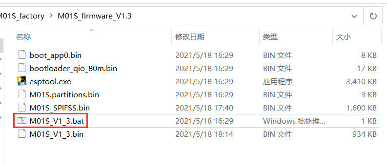
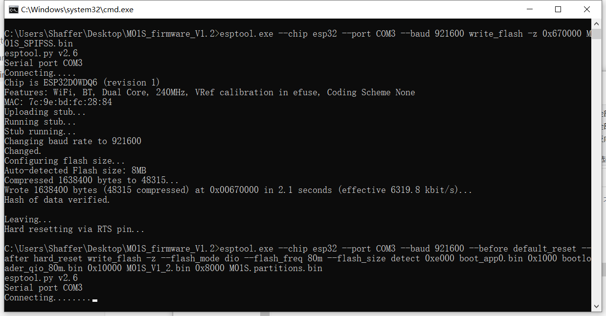
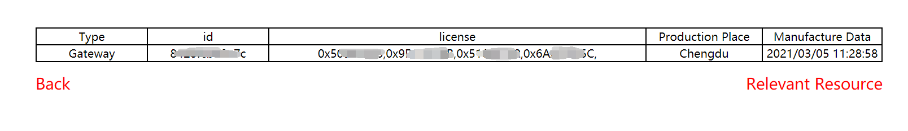

# HT-M01S Firmware Upgrade

[简体中文](https://heltec-automation.readthedocs.io/zh_CN/latest/gateway/ht-m01s/update_firmware.html)


## Summary

This article aims to describe how to upgrade the HT-M01S firmware.

```Tip:: Since the V1.2 version of the firmware has added the HT-M01S to support frequency bands, when V1.1 and below are upgraded to V1.2 and above, the HT-M01S will display incorrect frequency bands in the web configuration interface, but It does not affect normal use. At this time, the frequency band is subject to serial port printing and screen display. For the solution, please refer to "HT-M01S firmware overwrite processing method" below.

```

```Tip:: If your gateway ID is occupied, in order to avoid occupying other gateway IDs when modifying the gateway ID, please modify the "FFFF" part in the middle, thank you!

```

&nbsp;

## Firmware Upgrade Logs

- V1.2

  - Increase EU433 frequency band support.
- V1.3

  - Add DHCP support in both Ethernet and Wi-Fi connection;
  - The upstream and downstream ports can be set separately;
  - Can modify the heartbeat cycle by yourself.
- V1.4
  - Can modify the gateway ID by yourself.

&nbsp;

## Upgrade Firmware

Download [HT-M01S corresponding upgrade firmware](https://resource.heltec.cn/download/HT-M01S/firmware)。


Enter the HT-M01S gateway configuration interface by connecting to the HT-M01S WiFi(can refer to [HT-M01S Quick Start](https://heltec-automation-docs.readthedocs.io/en/latest/gateway/ht-m01s/quick_start.html))，click "Firmwaer Update"。


Click "Select firmware" to select the corresponding upgrade firmware that has been downloaded, and click "Update" to upgrade.


After the upgrade is complete, a corresponding prompt will pop up and restart the gateway.


## The Processing Method of Overwriting the HT-M01S Firmware

### Download Firmware

Download [HT-M01S complete firmware](https://resource.heltec.cn/download/HT-M01S/firmware/complete_firmware)。

Open the downloaded file and edit the "M01S_Vx_x.bat" file.



Change the COM port to the corresponding COM port of HT-M01S.


Open the serial port corresponding to the HT-M01S, press the "-" key -> press the "RST" key -> release the "RST" key -> wait for the serial port to print "waiting for download" -> release the "-" key.


Double-click to run "M01S_Vx_x.bat". When running to the interface shown in the figure below, perform the following operations, press "-" key -> press "RST" key -> release "RST" key -> release "-" key. After the window closes automatically, the firmware programming is complete.



### Activate the Gateway

After the firmware download is complete, open the serial port corresponding to the HT-M01S and read the corresponding ESP32 chip ID of the gateway.


Enter [https://resource.heltec.cn/search](https://resource.heltec.cn/search), enter the ESP32 chip ID to query the serial number corresponding to the gateway.



Open the serial port corresponding to the HT-M01S, and send the command "AT+CDKEY=xxxxxxxxxxxxxxxxxxxxxxxxxxxxxxxx" through the serial port to activate the gateway. Among them, "xxxxxxxxxxxxxxxxxxxxxxxxxxxxxxxx" is the 32-bit license. For example, if the license is 0x12345678, 0x12345678, 0x12345678, 0x12345678, the activation command is AT+CDKEY=12345678123456781234567812345678


After the screen displays normally, the gateway is activated successfully.

