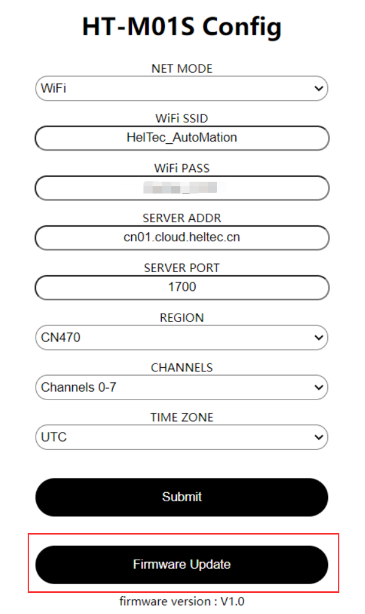

# HT-M01S Firmware Upgrade

[简体中文](https://heltec-automation.readthedocs.io/zh_CN/latest/gateway/ht-m01s/update_firmware.html)

## Summary

This article aims to describe how to upgrade the HT-M01S firmware.

&nbsp;

## Upgrade Firmware

Download [HT-M01S corresponding upgrade firmware](https://resource.heltec.cn/download/HT-M01S/firmware)。

Enter the HT-M01S gateway configuration interface by connecting to the HT-M01S WiFi(can refer to [HT-M01S Quick Start](https://heltec-automation-docs.readthedocs.io/en/latest/gateway/ht-m01s/quick_start.html))，click "Firmwaer Update"。

Click "Select firmware" to select the corresponding upgrade firmware that has been downloaded, and click "Update" to upgrade.

After the upgrade is complete, a corresponding prompt will pop up and restart the gateway.

