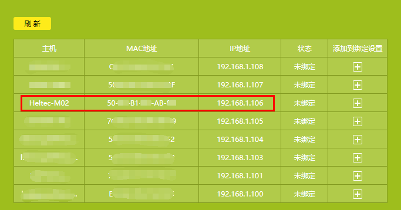
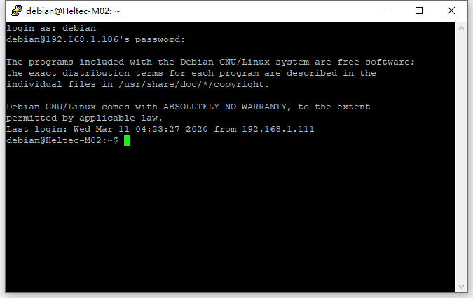
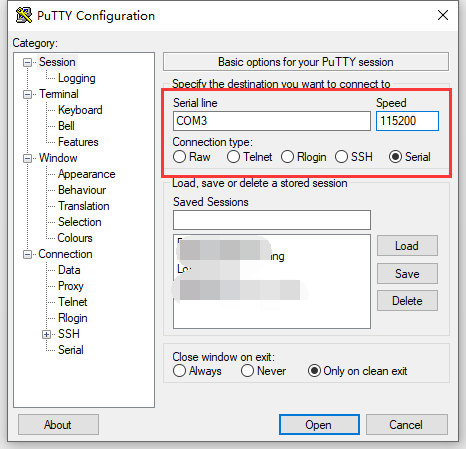

# HT-M02 Edge LoRa Gateway PoE Quick Start

## Summary

HT-M02 has integrated operating system and LoRa related programs, so it can be used directly in applications. HT-M02 has two versions: PoE and 4G(LTE). The purpose of this article is how to use the PoE version.

``` Note:: Before powering up for the first time, make sure the antenna is properly installed in the appropriate location. The standard antenna itself is not water-discharged. If it is necessary to use it outdoors for a long time, it is recommended to use a plastic film to properly block the antenna part.

```

## Power ON for the first time

This version only supports the PoE power supply mode. Connect the cable as shown in Figure 2-1. It is recommended to connect the network cable on the HT-M02 before plugging the PoE adapter into the 220V/110V AC.


If everything goes well, the system will run automatically, and the LED lights will start working. When the system kernel starts successfully, the SYS LED will be on. After the processes and services are started, the TX indicator will flash once and the system will enter the normal working state. The entire startup process lasts approximately 40 seconds.

## Configuration HT-M02

When PoE supplies power to the HT-M02, it will provide Ethernet at the same time. The DHCP service is enabled by default in the HT-M02 system. If the connected router supports DHCP at the same time, it will automatically assign an IP address to the HT-M02. In general, you can query the IP address of the HT-M02 on the DHCP client list of the router.



### Load HT-M02 Configuration Page

Input the IP address of the HT-M02 in the browser to open the configuration page.


- Username: `Heltec-M02`
- Password: `temppwd`


### Options in the Configuration Page

- **Status** -- HT-M02 running status;
- **Gateway_ID** -- The Unique ID of current HT-M02;
- **Band** -- Reginal frequency plans, strictly follow [LoRaWAN 1.1 Regional Parameters](https://lora-alliance.org/sites/default/files/2018-04/lorawantm_regional_parameters_v1.1rb_-_final.pdf);
- **Channels** -- The listening channels of each bands, the [LoRaWAN Regional Parameters](https://lora-alliance.org/sites/default/files/2018-04/lorawantm_regional_parameters_v1.1rb_-_final.pdf) had defined detail uplink/downlink frequency of each channels, here `CN470`, `channels 0-7` means the HT-M02 will listen `470.3 MHz, 470.5 MHz, 470.7 MHz, 470.9 MHz, 471.1 MHz, 471.3 MHz, 471.5 MHz, 471.7 MHz` 8 channels.
- **Server** -- Which LoRa server will be used
  - `Internal Server` -- HT-M02 will forward data to it self's internal LoRa server;
  - `TTN` -- HT-M02 will forward data to TTN's LoRa server;
  - `Custom Server` -- HT-M02 will forward data to a custom server, such as a private servers like ChripStack.
- **Server Addr** -- LoRa server address
  - If use `Internal Server`, the server address must be `127.0.0.1`, can't be fixed;
  - If use `TTN` server, the server address will automatic adaptation to [TTN's router addresses](https://www.thethingsnetwork.org/docs/gateways/packet-forwarder/semtech-udp.html#router-addresses), can't be fixed;
  - If use `Custom Server`, the `Server Addr` and `Uplink/Downlink Port` should match the custom server.

## Establish Serial/SSH Connection

HT-M02 can provide serial/SSH connection if required.

- Default login username: `debian`
- Default login password: `temppwd`

### SSH

Establish SSH connection need make sure the client in a same LAN with HT-M02, SSH use default Port 22.



### Serial

Because of the waterproof design, the UART interface is not directly exposed outside. If need a serial port connection, need to remove the protective board on the side of the HT-M02, and also a UART-USB bridge is required (CP2102, CP2104, CH340G etc.).

- HT-M02 TXD <----> UART-USB bridge RXD

- HT-M02 RXD <----> UART-USB bridge TXD

- HT-M02 GND <----> UART-USB bridge GND


Recommended to use [Putty,](https://putty.org/) configured as shown in the following image. 

