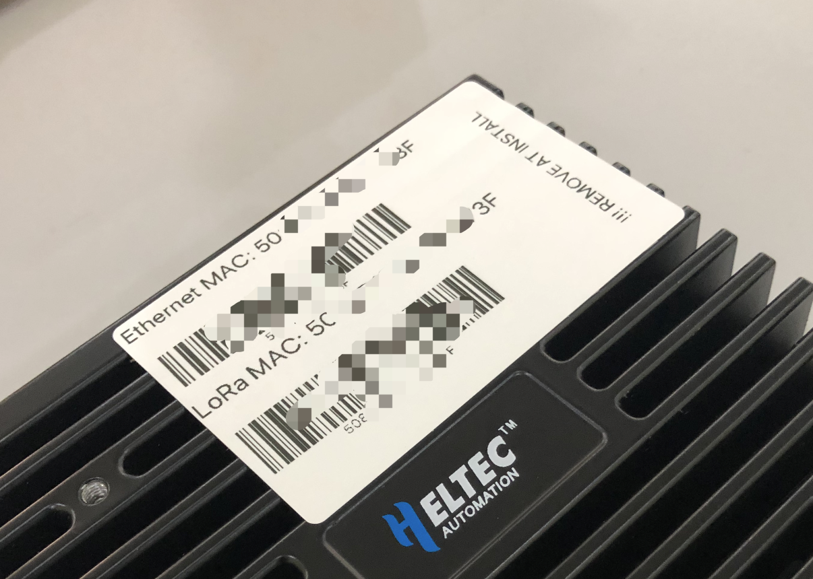
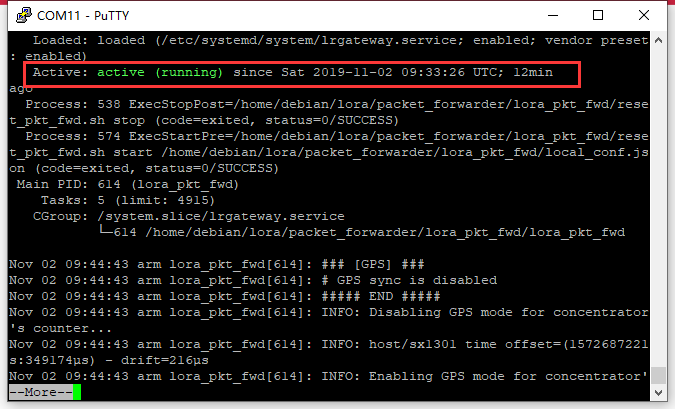

# Connect HT-M02 to a LoRa Server
[简体中文](https://heltec-automation.readthedocs.io/zh_CN/latest/gateway/ht-m02_4g/connect_to_server.html)

## Summary

This article aims to describe how to connect [HT-M02 Gateway](https://heltec.org/project/ht-m02/) to a LoRa server, such as [TTN](https://www.thethingsnetwork.org/), [ChirpStack](https://www.chirpstack.io/), which facilitates secondary development and rapid deployment of LoRa devices.

Before all operation, make sure the HT-M02 is runing well . If not, please refer to this [HT-M02(4G/LTE) Quick Start](https://heltec-automation-docs.readthedocs.io/en/latest/gateway/ht-m02_4g/quick_start_4g.html) document.

&nbsp;

## Get the Gateway EUI

Generally, the EUI of the gateway will be pasted on the surface of the gateway.



The Gateway EUI also can be read via this command:

`cat lora/packet_forwarder/lora_pkt_fwd/local_conf.json`

```Tip:: If need to change the Gateway EUI for some reason, you can directly modify the file, and the modified EUI will take effect after restarting.

```

## Connect to TTN

### Register a LoRa gateway in TTN

Create and active an account in TTN. Select ```Gateway``` in the [console](https://console.thethingsnetwork.org/) page.


Fill in the HT-M02 information as shown below and complete the addition.


- **Gateway EUI** -- The unique ID of HT-M02 gateway;
- **I'm using the legacy packet forwarder** -- Must select this;
- **Frequency Plan** -- Must matach the LoRa band configuration in HT-M02；
- **Router** -- Must use the default router allocated by TTN system.

``` Tip:: That four points are the key to success connection with TTN.

```

### Connect to TTN

In the HT-M02 gateway, only the server address and port need to be configured.

config the `server address` and `port` in `global_conf.json`:

```shell
sudo nano lora/packet_forwarder/lora_pkt_fwd/global_conf.json
```

At the end of this file, make suitable changes:

```json
  “server_address”: “router.cn.thethings.network”, /*The server IP address or domain*/
  “serv_port_up”: 1700,
  “serv_port_down”: 1700,
```


`ctrl + O` to save and `ctrl + X` to exit, and restart the service:

```shell
sudo systemctl restart lrgateway
```

Check whether the system running normally:

```shell
sudo systemctl status lrgateway
```



The TTN's router addresses for different region:

[https://www.thethingsnetwork.org/docs/gateways/packet-forwarder/semtech-udp.html#router-addresses](https://www.thethingsnetwork.org/docs/gateways/packet-forwarder/semtech-udp.html#router-addresses)


View gateway status, it is runing:：


&nbsp;

## Connect to ChirpStack server

[ChirpStack](https://www.chirpstack.io/) is the most popular LoRa server open source project, widely used in many fields, and also the best choise for a private LoRa server.

- ChirpStack Installation guide: [https://www.chirpstack.io/overview/](https://www.chirpstack.io/overview/)
- ChirpStack support forum: [https://forum.chirpstack.io/](https://forum.chirpstack.io/)

### ChirpStack Gateway Bridge

**One thing need attention!** the ChirpStack need a special service named `Gateway Bridge`, which converts LoRa® Packet Forwarder protocols into a ChirpStack Network Server common data-format(JSON and Protobuf).

the `Gateway Bridge` service can running on the Raspberry Pi or the ChirpStack server.

Install ChirpStack Gateway Bridge: [https://www.chirpstack.io/gateway-bridge/install/debian/](https://www.chirpstack.io/gateway-bridge/install/debian/)

### Register LoRa Gateway in ChirpStack

Fill in the HT-M02 information as shown below and complete the addition.


- **Gateway ID** -- The unique ID of the HT-M02 gateway.

### Connect to ChirpStack server

In the HT-M02 gateway, only the server address and port need to be configured.

config the `server address` and `port` in `global_conf.json`:

```shell
sudo nano lora/packet_forwarder/lora_pkt_fwd/global_conf.json
```

At the end of this file, make suitable changes:

```json
  “server_address”: “router.eu.thethings.network”, /*The server IP address or domain*/
  “serv_port_up”: 1700,
  “serv_port_down”: 1700,
```


`ctrl + O` to save and `ctrl + X` to exit, and restart the service:

```shell
sudo systemctl restart lrgateway
```

Check whether the system running normally:

```shell
sudo systemctl status lrgateway
```


View gateway status, it is runing:


&nbsp;

## Connect to HelTec server

### Register LoRa Gateway in HelTec Cloud Server

Fill in the HT-M02 information as shown below and complete the addition.


- **Gateway ID** -- The unique ID of the HT-M02 gateway.

### Connect to HelTec server

In the HT-M02 gateway, only the server address and port need to be configured.

config the `server address` and `port` in `global_conf.json`:

```shell
sudo nano lora/packet_forwarder/lora_pkt_fwd/global_conf.json
```

At the end of this file, make suitable changes:

```json
  “server_address”: “cn01.cloud.heltec.cn”, /*The server IP address or domain*/
  “serv_port_up”: 1700,
  “serv_port_down”: 1700,
```


`ctrl + O` to save and `ctrl + X` to exit, and restart the service:

```shell
sudo systemctl restart lrgateway
```

Check whether the system running normally:

```shell
sudo systemctl status lrgateway
```


The server addresses corresponding to different regions are as follows:

`CN470` --  `cn01.cloud.heltec.cn`

`EU868` --  `eu01.cloud.heltec.org`

`US915` --  `us01.cloud.heltec.org`

`AU915` --  `au01.cloud.heltec.org`

`AS923` --  `as01.cloud.heltec.org`

View gateway status, it is runing:

