# LoRaWAN Frequency Plans and Regulations by Country

[简体中文](https://heltec-automation.readthedocs.io/zh_CN/latest/general/lorawan_frequency_plans_by_country.html)

## Summary

This document is only a summary of radio regulations, and the appropriate frequency plan that should be used in the corresponding countries. This is in no way an official document; gateway owners are still obliged to find, study and adhere to their own country’s regulations. Some countries also expect you to register your gateway, or obtain a license. In that case you are using a “free band”, not a “license free band”. In some countries it is also necessary that the gateway is certified (CE, FCC, …) if you allow other people to also communicate via it.

&nbsp;

## Country

### A

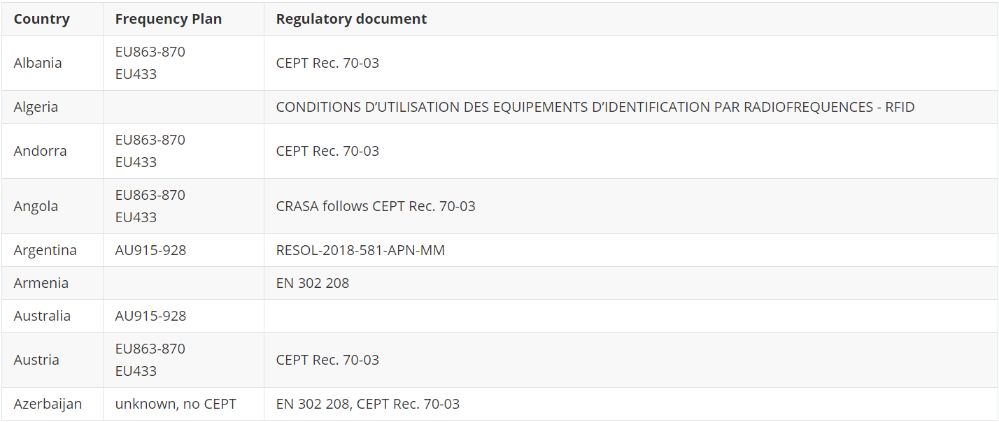

### B

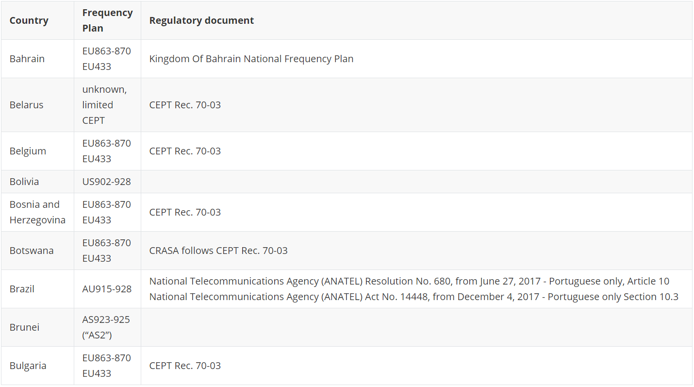

&nbsp;

### C

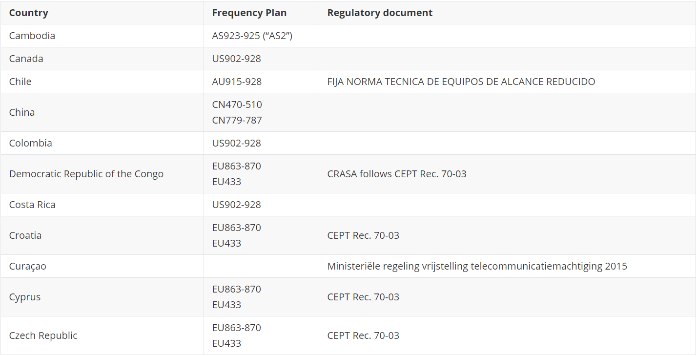

&nbsp;

### D

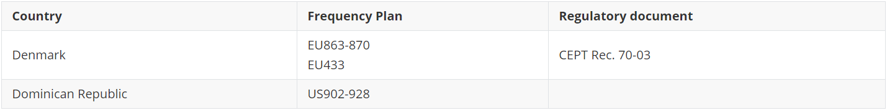

&nbsp;

### E

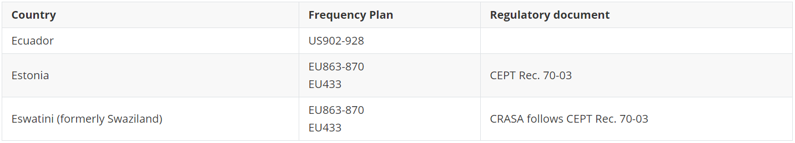

&nbsp;

### F

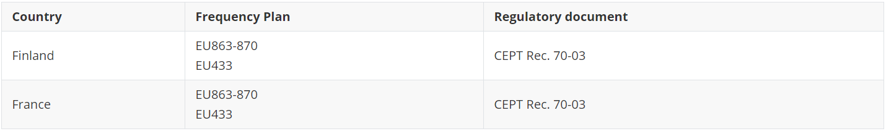

&nbsp;

### G

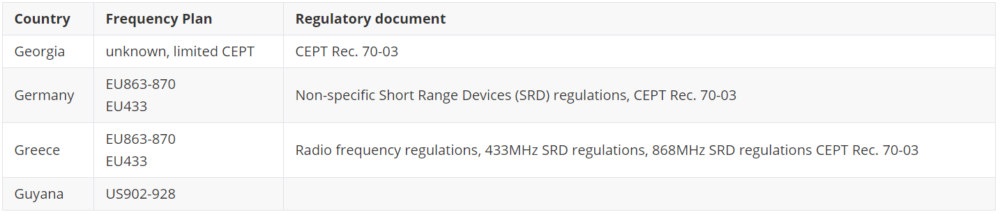

&nbsp;

### H

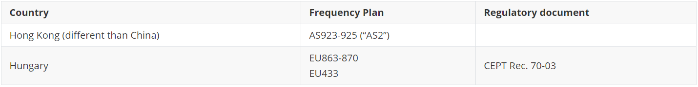

&nbsp;

### I

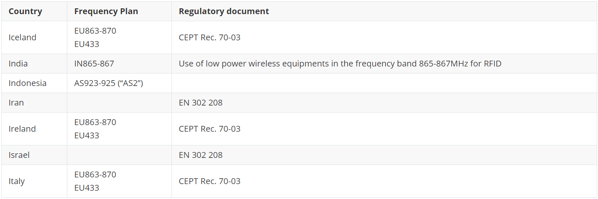

&nbsp;

### J

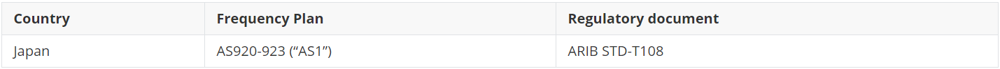

&nbsp;

### L

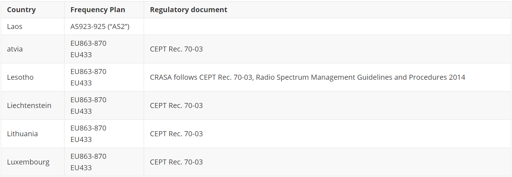

&nbsp;

### M

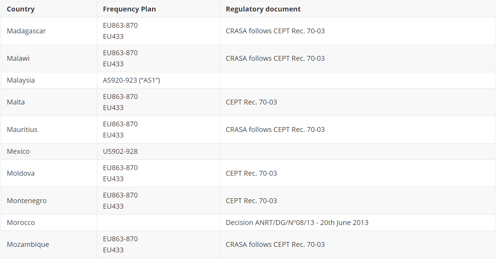

&nbsp;

### N

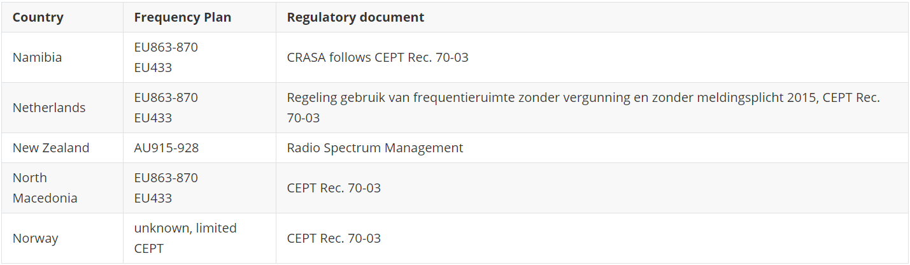

&nbsp;

### O

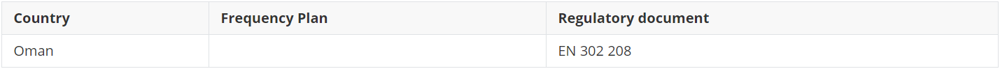

&nbsp;

### P

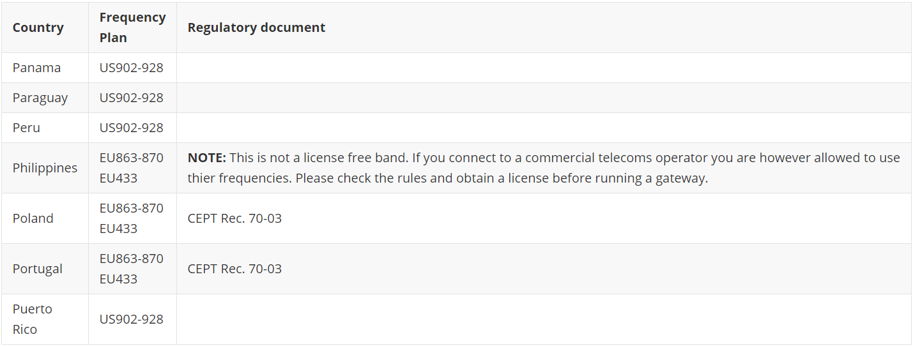

&nbsp;

### R

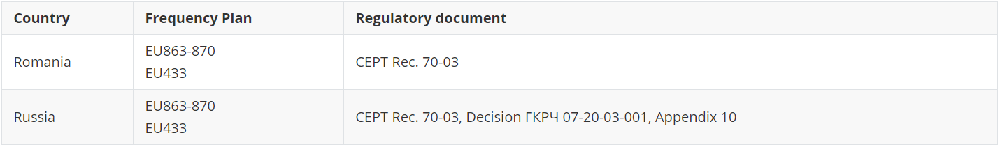

&nbsp;

### S

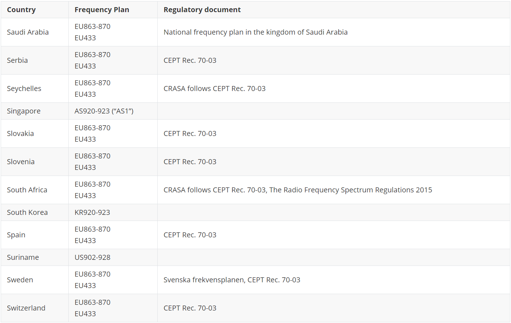

&nbsp;

### T

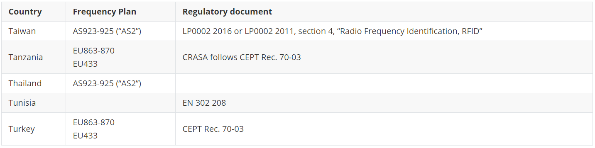

&nbsp;

### U

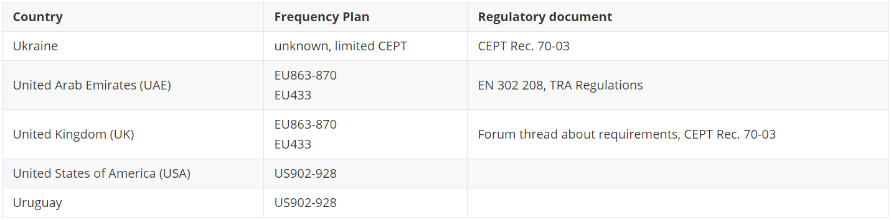

&nbsp;

### V

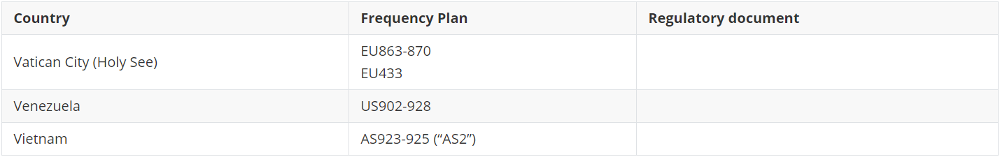

&nbsp;

### Z

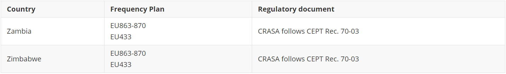

&nbsp;

## Relevant Resources

- [Frequency Plans by Country](https://www.thethingsnetwork.org/docs/lorawan/frequencies-by-country.html)