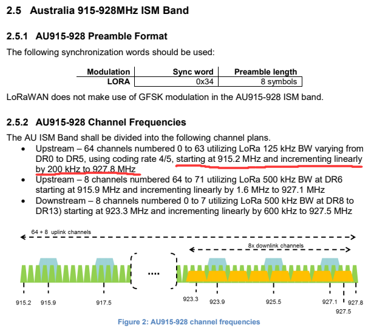
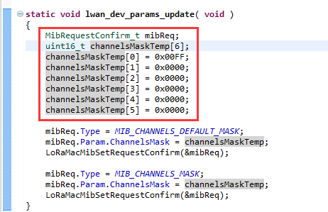

# LoRaWAN example Sub-Band usage (AU915)
[简体中文](https://heltec-automation.readthedocs.io/zh_CN/latest/general/sub_band_usage.html)
## Description

In the LoRaWAN protocol, there are detailed regulations in various countries or regions. These regulations include uplink and downlink Channel Frequency, Bandwidth, Duty cycle etc.

**[LoRaWAN 1.0.2 rvB Regional Parameters](https://resource.heltec.cn/download/LoRaWANRegionalParametersv1.0.2_final_1944_1.pdf)**

Let's take AU915 as an example:

Then, let's look into our code: (In the `.ino` file corresponding to LoRaWAN)

Refer to "LoRaWAN" for CubeCell series，refer to  "OTTA" for ESP32 series.

Here are 6 arrays defined all channels of LoRaWAN protocol for AU915. In the channelsMaskTemp[0], 0x00FF means use the first 0-7 channels, they are 915.2MHz, 915.4MHz, 915.6MHz … 916.6MHz. When you set the value to 0xFF00, it means the upload channels changed to 8-15, they are 916.8MHz, 917.0MHz … 918.2MHz. More detail... see the below picture：

TTN uses 2nd Sub-Band only (channels 8 to 15 and 65) for AU915:
https://www.thethingsnetwork.org/docs/lorawan/frequency-plans.html

## How To?

Generally speaking... To change the channel to 8-15，we just need to change the `channelsMaskTemp[0]=0xFF00;`, then the uplink frequency will be changed to TTN supported.

**BTW. the listening frequency in your LoRa gateway must be the same as the TTN server. it's defined in your gateway's `gloable_conf.json` file.**

