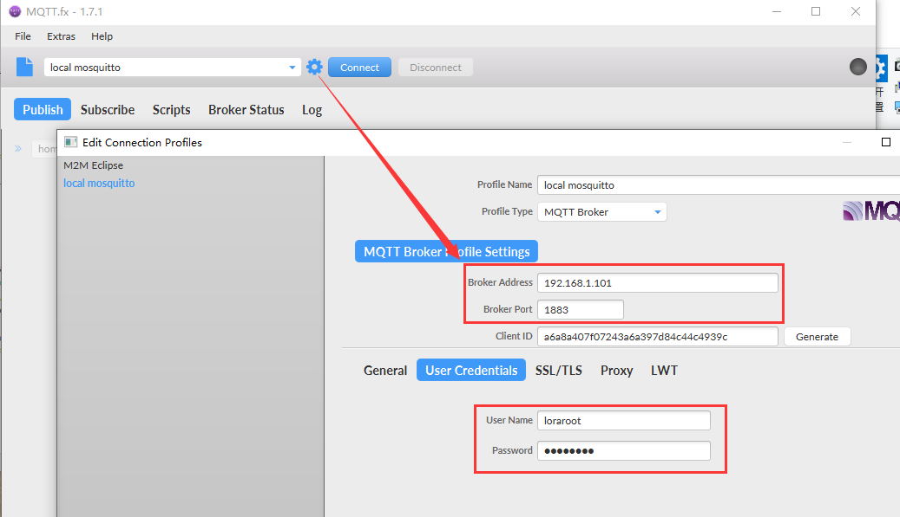
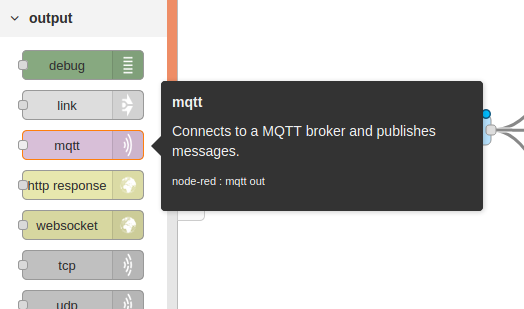
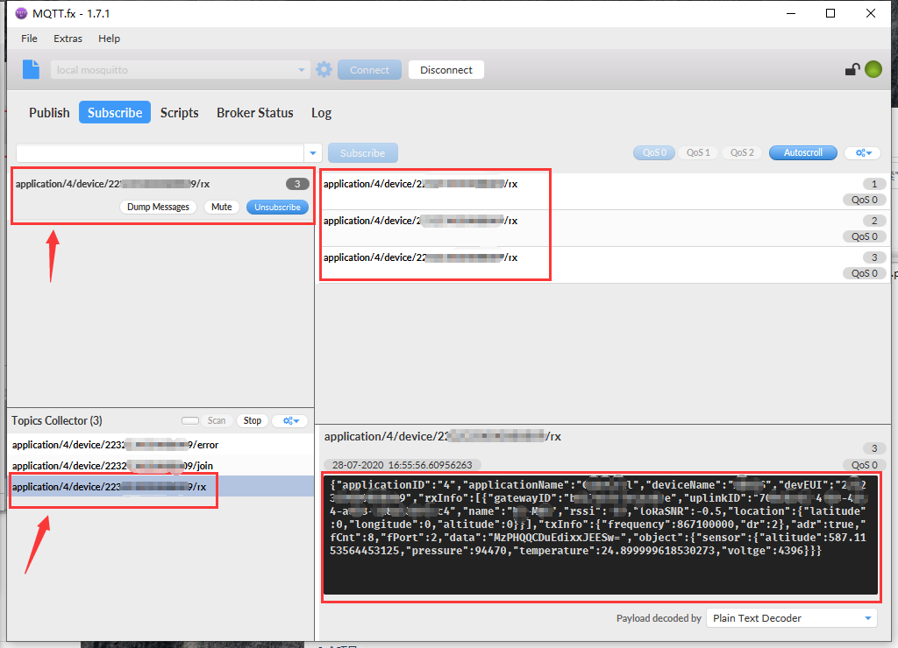

# How to Subscribe MQTT Messages from LoRa Server
[简体中文](https://heltec-automation.readthedocs.io/zh_CN/latest/general/subscribe_mqtt_messages.html)

## Overview

In the LoRaWAN application framework, [MQTT](https://mqtt.org/) is wildly used. For example, your LoRa node devices send sensor data to a gateway and the gateway forward these data to a cloud server, how can we get these sensor data from the cloud server?

The purpose of this article is to provide some examples of how to get MQTT messages from a cloud servers. Hope these examples can provide some reference or make sense to your application.

```Tip:: The four keys to success MQTT subscription: 1. Host address, 2. Host port; 3. user name/pass word, 4. MQTT Topic.

```

- [Via Python](#via-python)
- [Via third party application (MQTT.fx)](#via-third-party-application-mqtt-fx)

----------
## Via Python

Here is a simple python3 example that can be used to subscribe to MQTT messages from the server.

[mqtt-receiver.py](https://resource.heltec.cn/download/tools/mqtt-reciver.py)

In the simple python example, the content in the three red boxes needs to be modified according to your actual situation:


- `username_pw_set` -- The MQTT topic subscribe user name and pass word.
  - For HT-M02 PoE Edge LoRa Gateway, the default user name is `loraroot`, pass word is  `62374838`
  - For [Heltec LoRa Cloud Server](http://cloud.heltec.org/), the login information is the user name and password of the MQTT subscription.
- `subscribe ` -- MQTT topic name, in the example code, the `2` is application ID allocation by server.
- `HOST` and `PORT` -- MQTT server address and communication port.

Run it in a shell with Python3, the content with red line is the data send by node. It's encrypted in BASE64 format 

`python3 mqtt-receiver.py` 


If the example does not run correctly, may be missing related components, install it through the following command.

`sudo pip3 install paho-mqtt python-etcd`

## Via third party application (MQTT.fx)

There are many useful MQTT subscription and push software on the Internet. This article takes [MQTT.fx](https://mqttfx.jensd.de/index.php) as an example.



- Basic communication can be carried out with the above settings. And then click `Connect`.

- Click `Subscribe` -> `Scan` in turn, and wait for the connected node to transmit data.


---------------------

- After the node uploads the data, the information will be scanned in the `Scan` column.



- Select one as the subscription information. When there is matching subscription information uploaded, it will be displayed in the data column. The sample subscription is `application/4/device/22........09/rx`.

