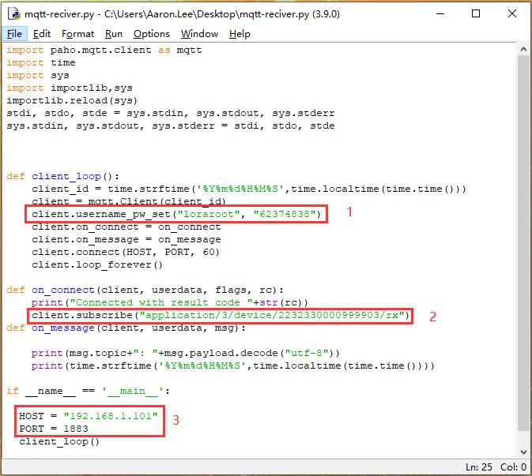

# How to Subscribe MQTT Messages from LoRa Server
[简体中文](https://heltec-automation.readthedocs.io/zh_CN/latest/general/subscribe_mqtt_messages.html)
## Overview

In the LoRaWAN application framework, [MQTT](https://mqtt.org/) is wildly used. For example, your LoRa node devices send sensor data to a gateway and the gateway forward these data to a cloud server, how can we get these sensor data from the cloud server?

The purpose of this article is to provide some examples of how to get MQTT messages from a cloud servers. Hope these examples can provide some reference or make sense to your application.

```Tip: The four keys to success MQTT subscription: 1. Host address, 2. Host port; 3. user name/pass word, 4. MQTT Topic.

```

- [Via Python](#via-python)
- [Via third party application (MQTT.fx)]()

----------
## Via Python

Here is a simple python3 example that can be used to subscribe to MQTT messages from the server.

[mqtt-receiver.py](https://resource.heltec.cn/download/tools/mqtt-reciver.py)

Run it in a shell with Python3, the content with red line is the data send by node. It's encrypted in BASE64 format 

`python3 mqtt-receiver.py` 



If the example does not run correctly, may be missing related components, install it through the following command.

`sudo pip3 install paho-mqtt python-etcd`

## Via third party application (MQTT.fx)

