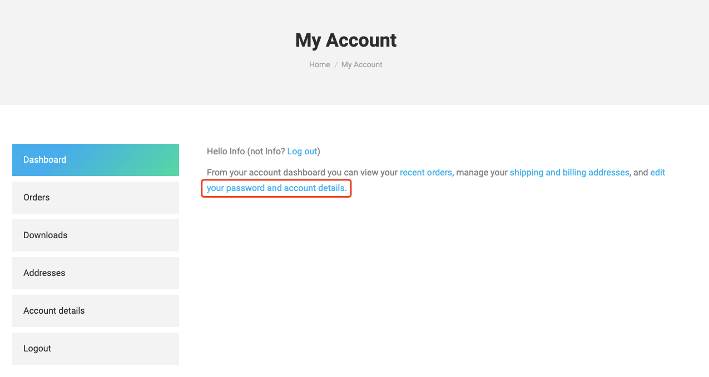
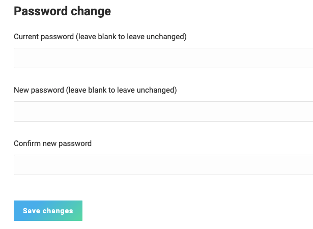

# Heltec LoRaWAN Test Server Login Issue

[简体中文]()

In June 2021, we replaced Heltec Cloud Server with the more scientific TTS V3, which is a permanent free server. It can be used for communication test and production environment of some simple applications.On the basis of the original TTS V3, we have added the user synchronization function. The purpose of this is to allow the Heltec official website account to be used to log in to the Heltec forum and Heltec's LoRaWAN test server at the same time.

However, the user synchronization function seems to have some problems on TTS V3 (Not alway happen). We are actively correcting this bug. Before this bug is fixed, the problem can be solved in the following ways:

1. Login your Heltec Website account in [this page](https://heltec.org/my-account/);

2. In the `My account` page, click the `edit your password and account details`

   

3. Change your password in the `Password change` area:

4. Login the [Heltec LoRaWAN test server](https://lora.heltec.org/) again.