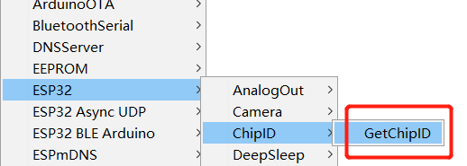

# View Limited Technical Data

## Get the Chip ID of ESP32

Get chip ID of ESP32, please refer to the following steps.

- Choose an example from menu `File -- Examples -- ESP32 -- ChipID -- GetChipID`.

&nbsp;

- Upload the code, open serial port, you can see the Chip ID.

You can also use this simple example to get your Chip ID.  [get Chip ID](https://github.com/Heltec-Aaron-Lee/WiFi_Kit_series/blob/master/esp32/libraries/ESP32/examples/ChipID/GetChipID/GetChipID.ino)

&nbsp;

## Get Schematic Diagram

Some schematic diagrams are restrictive technical data, it will become downloadable after purchase.Please refer to the following steps.

- Copy the Chip ID and open this link  [http://www.heltec.cn/search/](http://www.heltec.cn/search/).

- Input the Chip ID, click `Confirm` .

&nbsp;

- You can see some informations about this board,click`Relevant Resource` ，you can see some open resources,open the `limited` folder, you can see some limited resources.

&nbsp;

**Tip: Because some of the previous product data has not been synchronized to the server, if you cannot succeed in this method, please click this link [https://docs.heltec.cn/](https://docs.heltec.cn/) to view and download.**

