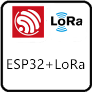
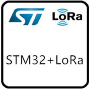
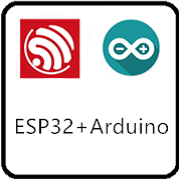
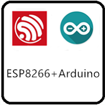

Heltec Automation Docs Page
===========================
[简体中文](https://heltec-automation.readthedocs.io/zh_CN/latest/index.html)
This is the documentation for `Heltec Automation <https://heltec.org>`_ products.
   
==================  ==================  ==================
|CubeCell|_         |ESP32+LoRa|_       |STM32+LoRa|_
------------------  ------------------  ------------------
`CubeCell`_         `ESP32+LoRa`_       `STM32+LoRa`_
------------------  ------------------  ------------------
|ESP32+Arduino|_    |ESP8266+Arduino|_  |General Docs|_
------------------  ------------------  ------------------
`ESP32+Arduino`_    `ESP8266+Arduino`_  `General Docs`_
==================  ==================  ==================

.. _CubeCell: cubecell/index.html

.. _ESP32+LoRa: esp32/index.html

.. _STM32+LoRa: stm32/index.html

.. _ESP32+Arduino: esp32+arduino/index.html

.. _ESP8266+Arduino: esp8266+arduino/index.html

.. _General Docs: general/index.html

.. toctree::
   :hidden:
   :caption: LORA GATEWAY
   
   gateway/index
   gateway/ht-m01/index
   gateway/ht-m02/index
   Frequently Asked Questions <gateway/frequently_asked_questions>
   
.. toctree::
   :hidden:
   :caption: CubeCell

   cubecell/index
   Quick Start <cubecell/quick_start>
   cubecell/lorawan/index
   AT Command List <https://docs.heltec.cn/download/cubecell/CubeCell_Series_AT_Command_User_Manual_V0.2.pdf>
   cubecell/htcc-am01/index
   cubecell/htcc-ab01/index
   cubecell/htcc-ac01/index
   Frequently Asked Questions <cubecell/frequently_asked_questions>

.. toctree::
   :hidden:
   :caption: ESP32 + LoRa

   esp32/index
   Quick Start <esp32/quick_start>
   esp32/lorawan/index
   Maximum Distance Test <esp32/distance_test>
   esp32/wifi_lora_32/index
   esp32/wireless_stick/index
   esp32/wireless_stick_lite/index
   esp32/wireless_shell/index
   Frequently Asked Questions <esp32/frequently_asked_questions>

.. toctree::
   :hidden:
   :caption: STM32 + LoRa

   stm32/index
   Quick Start <stm32/quick_start>
   stm32/lorawan/index
   stm32/lora_node_151/index
   stm32/turtle_board/index
   Frequently Asked Questions <stm32/frequently_asked_questions>

.. toctree::
   :hidden:
   :caption: ESP32 + Arduino
   
   esp32+arduino/index
   Quick Start <esp32+arduino/quick_start>
   esp32+arduino/wifi_kit_32/index
   Frequently Asked Questions <esp32+arduino/frequently_asked_questions>
   
.. toctree::
   :hidden:
   :caption: ESP8266 + Arduino

   esp8266+arduino/index
   Quick Start <esp8266+arduino/quick_start>
   esp8266+arduino/wifi_kit_8/index
   Frequently Asked Questions <esp8266+arduino/frequently_asked_questions>

.. toctree::
   :hidden:
   :caption: General Docs

   general/index
   How to Install Git and Arduino <general/how_to_install_git_and_arduino>
   Establish Serial Connection <general/establish_serial_connection>
   LoRaWAN Example Sub-Band Usage <general/sub_band_usage>
   Subscribe MQTT  Messages <general/subscribe_mqtt_messages>
   Decode LoRaWAN payload <general/decode_payload>
   How To Config Rasberry Pi <general/how_to_config_raspberry_pi>
   Get Limited Technical Resources <general/view_limited_technical_data>