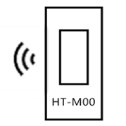
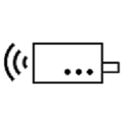
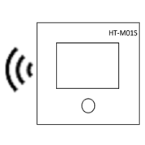
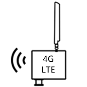
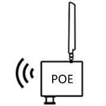

Heltec Automation Docs Page
===========================
`简体中文 <https://heltec-automation.readthedocs.io/zh_CN/latest/index.html>`_

This is the documentation for `Heltec Automation <https://heltec.org>`_ products.
   
Nodes
-----
 
==================  ==================  ==================
|CubeCell|_         |ESP32+LoRa|_       |STM32+LoRa|_
------------------  ------------------  ------------------
`CubeCell`_         `ESP32+LoRa`_       `STM32+LoRa`_
------------------  ------------------  ------------------ 
|ESP32+Arduino|_    |ESP8266+Arduino|_    
------------------  ------------------  ------------------ 
`ESP32+Arduino`_    `ESP8266+Arduino`_  
==================  ==================  ==================

.. |CubeCell| image:: img/01.png
.. _CubeCell: cubecell/index.html

.. |ESP32+LoRa| image:: img/02.png
.. _ESP32+LoRa: esp32/index.html

.. |STM32+LoRa| image:: img/03.png
.. _STM32+LoRa: stm32/index.html

.. |ESP32+Arduino| image:: img/04.png
.. _ESP32+Arduino: esp32+arduino/index.html

.. |ESP8266+Arduino| image:: img/05.png
.. _ESP8266+Arduino: esp8266+arduino/index.html

Gateways
--------

==================  ==================  ==================
|HT-M00|_           |HT-M01|_           |HT-M01S|_
------------------  ------------------  ------------------
`HT-M00`_           `HT-M01`_           `HT-M01S`_ 
------------------  ------------------  ------------------ 
|HT-M02_4G/LTE|_    |HT-M02_POE|_
------------------  ------------------  ------------------ 
`HT-M02_4G/LTE`_    `HT-M02_POE`_
==================  ==================  ==================

.. _HT-M00: gateway/ht-m00/index.html

.. _HT-M01: gateway/ht-m01/index.html

.. _HT-M01S: gateway/ht-m01s/index.html

.. _HT-M02_4G/LTE: gateway/ht-m02_4g/index.html

.. _HT-M02_POE: gateway/ht-m02_poe/index.html

General Docs
------------

==================  ==================  ==================
|General Docs|_
------------------  ------------------  ------------------
`General Docs`_
==================  ==================  ==================

.. |General Docs| image:: img/06.png
.. _General Docs: general/index.html

.. toctree::
   :hidden:
   :caption: Language
   
   简体中文 <https://heltec-automation.readthedocs.io/zh_CN/latest/index.html>

.. toctree::
   :hidden:
   :caption: LORA GATEWAY
   
   gateway/index
   gateway/sx1301module/index
   gateway/ht-m00/index
   gateway/ht-m01/index
   gateway/ht-m01s/index
   gateway/ht-m02_4g/index
   gateway/ht-m02_poe/index
   Frequently Asked Questions <gateway/frequently_asked_questions>
   
.. toctree::
   :hidden:
   :caption: CubeCell

   cubecell/index
   Quick Start <cubecell/quick_start>
   cubecell/lorawan/index
   AT Command List <https://resource.heltec.cn/download/CubeCell/AT_Command_list/CubeCell_Series_AT_Command_User_Manual_V0.6.pdf>
   cubecell/dev-board/index
   cubecell/capsule-sensor/index
   cubecell/module/index
   Frequently Asked Questions <cubecell/frequently_asked_questions>

.. toctree::
   :hidden:
   :caption: ESP32 + LoRa

   esp32/index
   Quick Start <esp32/quick_start>
   esp32/lorawan/index
   Maximum Distance Test <esp32/distance_test>
   esp32/wifi_lora_32/index
   esp32/wireless_stick/index
   esp32/wireless_stick_lite/index
   esp32/wireless_shell/index
   Frequently Asked Questions <esp32/frequently_asked_questions>

.. toctree::
   :hidden:
   :caption: STM32 + LoRa

   stm32/index
   Quick Start <stm32/quick_start>
   stm32/lorawan/index
   stm32/lora_node_151/index
   stm32/turtle_board/index
   Frequently Asked Questions <stm32/frequently_asked_questions>

.. toctree::
   :hidden:
   :caption: ESP32 + Arduino
   
   esp32+arduino/index
   Quick Start <esp32+arduino/quick_start>
   esp32+arduino/wifi_kit_32/index
   Frequently Asked Questions <esp32+arduino/frequently_asked_questions>
   
.. toctree::
   :hidden:
   :caption: ESP8266 + Arduino

   esp8266+arduino/index
   Quick Start <esp8266+arduino/quick_start>
   esp8266+arduino/wifi_kit_8/index
   Frequently Asked Questions <esp8266+arduino/frequently_asked_questions>

.. toctree::
   :hidden:
   :caption: General Docs

   general/index
   How to Install Git and Arduino <general/how_to_install_git_and_arduino>
   Establish Serial Connection <general/establish_serial_connection>
   LoRaWAN Example Sub-Band Usage <general/sub_band_usage>
   LoRaWAN Frequency Plans <general/lorawan_frequency_plans>
   LoRaWAN Frequency Plans and Regulations by Country <general/lorawan_frequency_plans_by_country>
   Subscribe MQTT  Messages <general/subscribe_mqtt_messages>
   Publish MQTT Message <general/publish_mqtt_message>
   Decode LoRaWAN payload <general/decode_payload>
   How To Config Rasberry Pi <general/how_to_config_raspberry_pi>
   Get Limited Technical Resources <general/view_limited_technical_data>
   Connect to Single_channel Gateway <general/connect_to_single_channel_gateway>