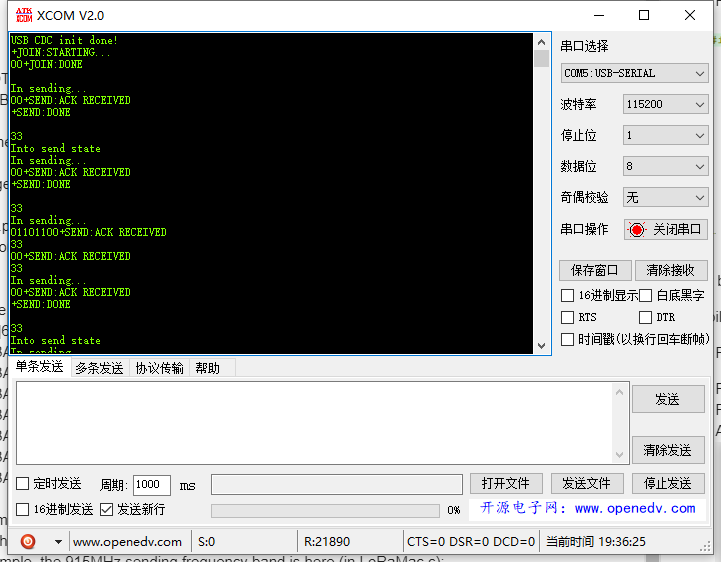

# Establish Serial Connection

The LoRa Node can print debugging information through USB CDC (USB Virtual Serial Poart) or UART, but the USB to UART chip is not integrated on the board. If the debugging information is to be output through the UART, an external USB to UART module is required.

## Use UART

- Add `USE_DEBUGGER` in macro definitions.


```Tip:: The LoRa Node and USB-UART module are connect as below *(if the LoRa Node is powered via USB or battery, the UART mode's 3.3 / 5V pin do not need connect, just need TXD, RXD, GND).

```


```Tip:: When using UART, the TX and RX pins used in the program should be corresponding to the TX and RX pins on the board.In the routine we provide,we use TX-PA9,RX-PA10.Therefore, TX of UART module should be connected to TX(PA9） of board,RX of UART module should be connected to RX(PA10） of board.

```


&nbsp;

## Use virtual serial port

Connect LoRa Node to computer via a Micro USB cable. Add both `USB_VCP` and `USE_DEBUGGER`  in macro definitions.


