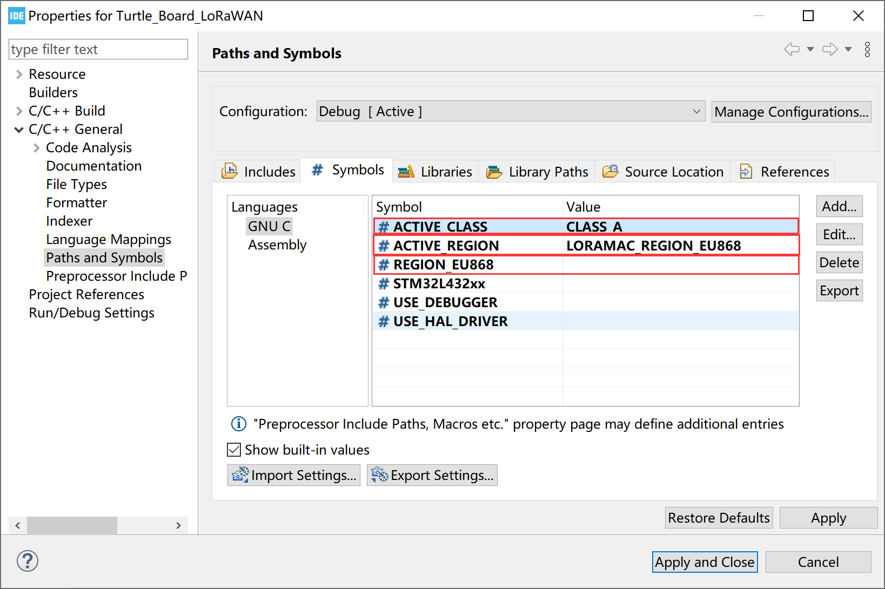

# "STM32 + LoRa" Preparation & Config Parameters

[LoRa Node 151](https://heltec.org/project/lora-node-151/) is based on [STM32L151CCU6](https://www.st.com/resource/en/datasheet/stm32l151cc.pdf), [Turtle Board](https://heltec.org/project/turtle-board/) is based on [STM32L432KC](https://www.st.com/resource/en/datasheet/stm32l432KC.pdf), Our company is gradually replacing the IDE to [STM32CubeIDE](https://www.st.com/en/development-tools/stm32cubeide.html), which is the STMicroelectronics official just launched development tools for their own MCUs. Based on Eclipse, include code tracking, code completion, compilation, download, single-step debugging, and integrated with CubdeMX.

## Summary

No matter what LoRa management platform is used, DevEui, AppKey, etc. parameters are must needed. And ensure that it is consistent with the relevant settings on the server.

- **The following parameters are essential for OTAA mode:**
  - DevEui -- Mote device IEEE EUI (big endian), 8 bytes;
  - AppEui -- Application IEEE EUI (big endian), 8 bytes;
  - AppKey -- AES encryption/decryption cipher application key, 16 bytes;
- **The following parameters are essential for ABP mode:**
  - NwkSKey -- AES encryption/decryption cipher network session key, 16 bytes;
  - AppSKey -- AES encryption/decryption cipher application session key, 16 bytes;
  - DevAddr -- Device address on the network (big endian), uint32_t;

&nbsp;

## Preparation

- Install [STM32CubeIDE](https://www.st.com/zh/development-tools/stm32cubeide.html#get-software) and [STM32CubeProgrammer](https://www.st.com/zh/development-tools/stm32cubeprog.html) correctly.
- A standard LoRaWAN gateway with at least 8 channels (based on SX1301/8 base band chip will be OK), and make sure your gateway had already connected to a LoRa server.
  - [How to connect HT-M01 to a LoRa server]().
  - [How to connect HT-M02 to a LoRa server]().
- A STM32 LoRa node( [LoRa Node 151](https://heltec.org/project/lora-node-151/) , [Turtle Board](https://heltec.org/project/turtle-board/)), a high quality USB cable and an ST-LINK.

&nbsp;

## Config steps

The LoRaWAN example code of LoRa Node is a STM32CubeIDE project, here is the basic config steps.

- Download and install `STM32CubeIDE` and `STM32CubeProgramme` correctly.

- Double click `.project` document, open project

The first time you run, may have the following dialog box will, click Yes and then OK.

&nbsp;

- Modify `DEVICE_EUI`, `APPLICATION_KEY`, `APPLICATION_EUI` in the `Commissioning.h` file according to your needs

- Note this macro definition:

  - OVER_THE_AIR_ACTIVATION -- 1：OTAA mode

  - OVER_THE_AIR_ACTIVATION -- 0：ABP mode

&nbsp;

- Set the working bands in the macro definition.(Right-click the project to open `Properties`)

The content in the red box can only be one of the following bands:

`USE_BAND_433`
`USE_BAND_470`
`USE_BAND_470PREQUEL`
`USE_BAND_780`
`USE_BAND_868`
`USE_BAND_915`
`USE_BAND_915_HYBRID`

- Ensure that the listening frequency of the gateway is the same as the transmitting frequency of the node

The code for the node transmit frequency is in the `LoRaMac.c` file.

Now, if download the program into your board, if everything is normal, it should be able to run.

- You may need: How to Download Firmware into STM32 LoRa Node([LoRa Node 151](https://heltec-automation-docs.readthedocs.io/en/latest/stm32/lora_node_151/download_firmware.html), [Turtle Board](https://heltec-automation-docs.readthedocs.io/en/latest/stm32/turtle_board/download_firmware.html)).
