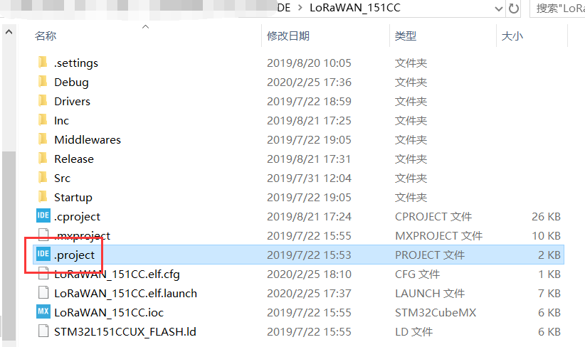
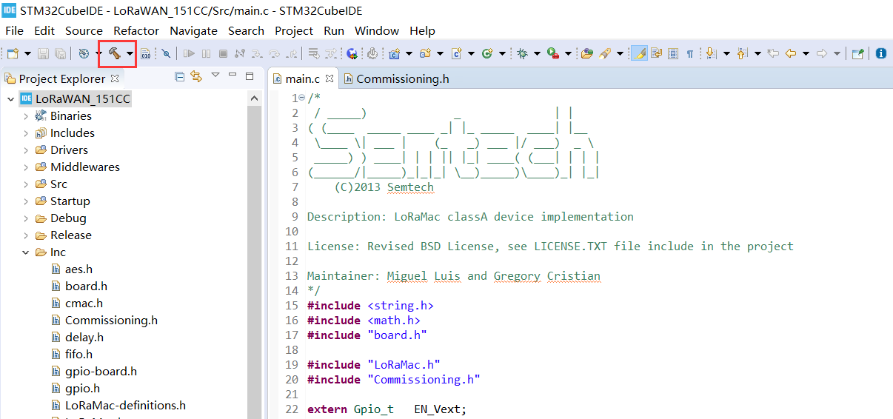
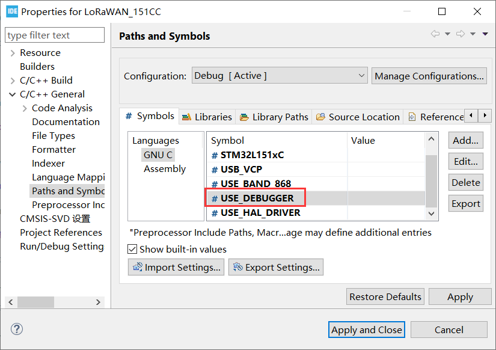
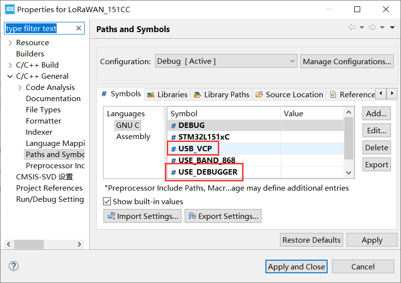

# Heltec STM32+LoRa Series Quick Start

We suggest you confirm whether the `USB driver`, `STM32CubeIDE` and `STM32CubeProgrammer` has installed first. If not, please  [establish serial connection](/en/user_manual/establish_serial_connection) and Install [STM32CubeIDE](https://www.st.com/zh/development-tools/stm32cubeide.html#get-software) and [STM32CubeProgrammer](https://www.st.com/zh/development-tools/stm32cubeprog.html) .

&nbsp;

## Example

This section is used to verify whether the program can be downloaded normally. 

Select a demo example, compile and upload

1. **Open example code,double click to open `.project` .**

2. **Compile this program**

3. **Download Firmware.**

- [Use ST-LINK debugger]()
- [Use Micro USB cable]()

&nbsp;

## Download Firmware

### 1. Use ST-LINK Debugger, Via SW Debug Mode

- To program in this way, you need prepare an ST-LINK debugger. Connect the ST-LINK to the LoRa Node correctly.

- Click on this icon

***The advantage of using the ST-LINK method is that it can be single-stepped debugging with the STM32CubeIDE , but the disadvantage is that the ST-LINK debugger tool is required.***

### 2. Use Micro USB cable, via DUF Mode

STM32L151CCU6/STM32L432KC had already included DFU Bootloader, it means just need a Micro USB cable, users can download .elf/.bin files into the board.

Download and install  [STM32CubeProgrammer](https://www.st.com/zh/development-tools/stm32cubeprog.html) software, which is a software provided by ST official for STM32 programming firmware. All the drivers related to STM32 are included in the installation package.

- **How to Access DFU Mode**

  Choose one of the following ways

  - If the board is not connected to the computer —— Press the “USR” button of the LoRa Node while plugging it to any USB port of the computer *(must keep press the USR key before plug in and release when it's connected USB port)*;
  - If the board had connected to the computer —— Keep press the "USR" button → Click the "RST" button → Release "USR" button.

If enter DFU mode successfully (with the driver is installed correctly), you can see the device named "STM32 BOOTLOADER" in the device manager. In the STM32CubeProg software, select USB and click “Connect” to read the chip information.

&nbsp;

- **Download Firmware**

Open a .hex/.bin file and click the "Download" icon.

After the program is downloaded successfully, press the "reset" button to run.

***The advantage of using the DFU mode is that you can easily find a Micro USB cable. But the disadvantage is that there is no way to simulate online.***

&nbsp;

## Debug Log

The LoRa Node can print debugging information through USB CDC (USB Virtual Serial Poart) or UART, but the USB to UART chip is not integrated on the board. If the debugging information is to be output through the UART, an external USB to UART module is required.

### 1. Via UART

Add `USE_DEBUGGER` in macro definitions.

The LoRa Node and USB-UART module are connect as below *(if the LoRa Node is powered via USB or battery, the UART mode's 3.3 / 5V pin do not need connect, just need TXD, RXD, GND)*:

&nbsp;

### 2. Via USB CDC (Virtual Serial Port)

Connect LoRa Node to computer via a Micro USB cable. Add both `USB_VCP` and `USE_DEBUGGER`  in macro definitions.

&nbsp;

Enjoy!

