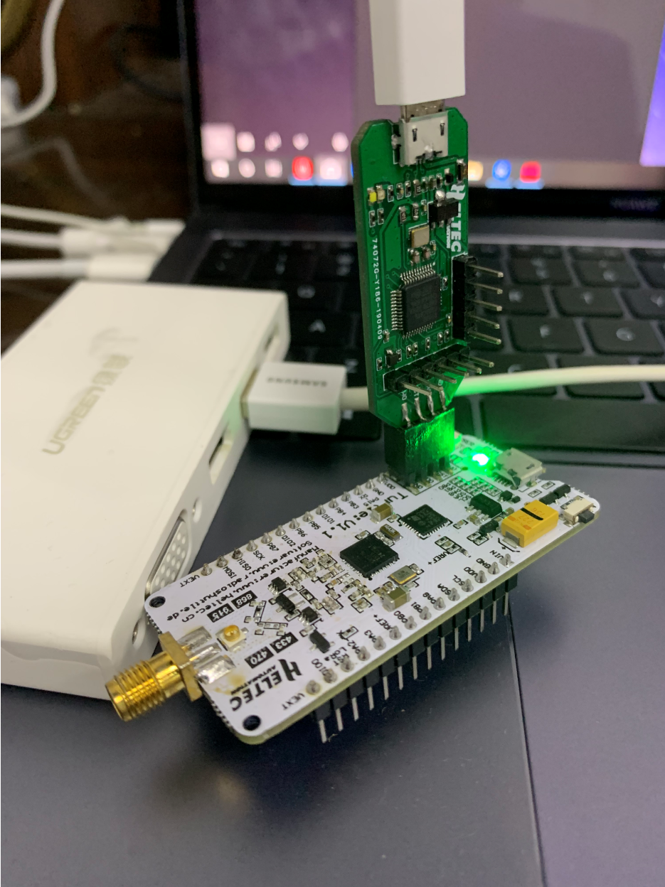

# Download Firmware

## Via DFU Mode

STM32L432KC had already included DFU Bootloader, it means just need a Micro USB cable, users can download .elf/.bin files into the board.

- How to access DFU mode.

  - If the board is not connected to the computer —— press the "USER" button of the Lora node before inserting it into any USB port of the computer (press the “USER"  key all the time before inserting, and release it after connecting to the USB port).
  - If the board had connected to the computer —— Keep the “USER” button pressed → Press the "RST" button → Release the "RST" button → Release the "USER" button.

- Download firmware.

  - If enter DFU mode successfully (with the driver is installed correctly), you can see the STM32 flash in `RadioShuttle STM32 Utility`. 

    

  - Drag the `.bin` file into the window.

  

  ```Warning:: For Turtle Board, if you use "STM32CubeProgrammer" to download firmware, it may damage the bootloader of the Turtle Board, so we recommend using "RadioShuttle STM32 Utility".
  
  ```

  ***The advantage of using the DFU mode is that you can easily find a Micro USB cable. But the disadvantage is that there is no way to simulate online.***

  Know more about `RadioShuttle STM32 Utility` please click [https://www.radioshuttle.de/en/turtle-en/radioshuttle-stm32-utility-en/](https://www.radioshuttle.de/en/turtle-en/radioshuttle-stm32-utility-en/) .

  Download `RadioShuttle STM32 Utility`  please click [https://www.radioshuttle.de/wp-content/uploads/2019/04/RadioShuttle-STM32-Tools-1.1.1.zip](https://www.radioshuttle.de/wp-content/uploads/2019/04/RadioShuttle-STM32-Tools-1.1.1.zip) .

  &nbsp;

## Via ST-LINK

- How to connect to ST-LINK.

  Connect the ST-LINK to the LoRa Node correctly, please refer to this picture.

  

  ```Tip:: ST-LINK can provide power to target device! If the LoRa Node is connected to the computer via the Micro USB interface, the ST-LINK 3.3V can not connect to the VDD! Doing so may damage the development board!
  
  ```

  Use ST-LINK matching the Turtle Board.

  

- Download firmware.

  After connecting ST-LINK correctly, click on this icon.

  

***The advantage of using the ST-LINK method is that it can be single-stepped debugging with the STM32CubeIDE , but the disadvantage is that the ST-LINK debugger tool is required***